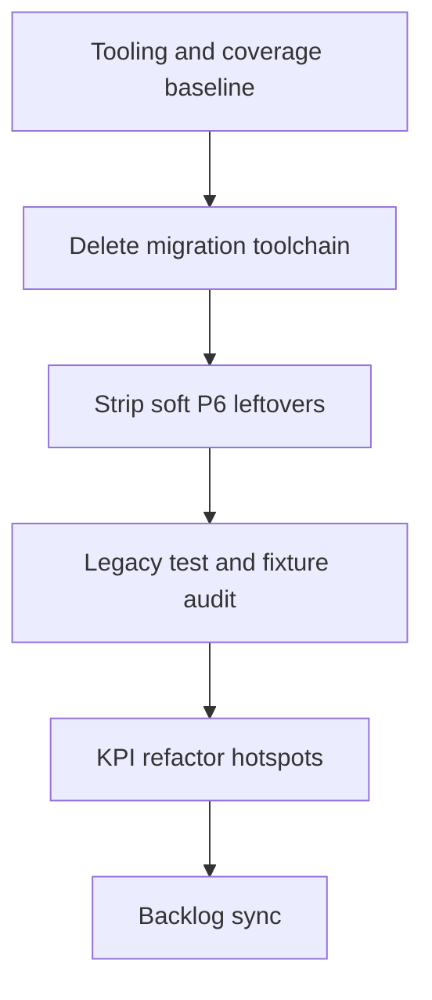

# Version 2.2 — Quality Epic / Post-Migration Cleanup

Scope: backlog lines 31–42 (coverage + legacy audit, KPI refactor, remove migration files). Confirmed: **delete** one-shot V1→2.0 migration toolchain; **keep** runtime `legacy_id` bridging and old dump/history readers.

Current version stays [`version.py`](version.py) `2.1.0-alpha.1` unless you later approve a bump (not part of this work).

## Guardrails (do not remove)

- `legacy_id` / `runtime_consumer_id` / `flex_kw_lookup` paths in [`settings/flexible_consumers.py`](settings/flexible_consumers.py), [`house_config/planning_flex_bridge.py`](house_config/planning_flex_bridge.py), [`runtime_store/history_timeline.py`](runtime_store/history_timeline.py), [`integrations/loxone_client.py`](integrations/loxone_client.py)
- Dump/history readers: [`runtime_store/debug_dump_archive.py`](runtime_store/debug_dump_archive.py), [`runtime_store/optimization_history.py`](runtime_store/optimization_history.py) (legacy CSV), replay/archive scripts
- Fail-fast rejectors in [`config.py`](config.py) (`_reject_legacy_*`) — keep; they enforce 2.0 shape
- Profile normalize helpers still used on load/save (`infer_earnie_role_from_legacy`, `migrate_start_flexibility`, `normalize_pv_system_ids`) — audit only; remove only if callers prove unused after migration delete

## KPIs (refactor gate)

Taken from project structure rules + this epic:

| KPI | Target |
|-----|--------|
| Function body LOC | ≤ 40; must split if > 60 when touched |
| Core package file LOC | ≤ 300 (hard 600) |
| UI file LOC | ≤ 400 (hard 600) |
| Coverage baseline | Package line-rate reported for `optimizer`, `data`, `house_config`, `simulation`, `settings`, `runtime_store`; flag packages &lt; 40% for test gaps (no CI gate yet) |
| Dead code | `vulture` confidence ≥ 80 on core packages + `scripts/` — manual review before delete |
| Migration leftovers | Zero remaining `migrate_runtime_entities` / `migrate_flex_consumers` / silent-migration entry points and tests |
| Soft fallbacks | No root `eauto_milp` / root `appliances[]` soft-read paths in live optimizer/config load |

Manual review only for flagged tests — never auto-delete from [`scripts/test_health_report.py`](scripts/test_health_report.py).

---

## Phase 1 — Tooling + coverage baseline

**Status: done (2026-07-17).**

1. Add to `[project.optional-dependencies] dev` in [`pyproject.toml`](pyproject.toml): `vulture`, `pytest-deadfixtures`.
2. Document commands in [`.cursor/rules/test-health.mdc`](.cursor/rules/test-health.mdc) (and script docstring if needed):
   - `test_health_report run --coverage` → `report`
   - `vulture optimizer data house_config simulation settings runtime_store scripts --min-confidence 80`
   - `pytest --dead-fixtures`
3. Extend `LEGACY_TEST_SYMBOLS` in [`scripts/test_health_report.py`](scripts/test_health_report.py) with migration-specific patterns; demote false positives (`legacy_id`, `subtract_consumer_ids`, `ENERGY_OPTIMIZER_CONFIG_PATH`). Fix per-package coverage aggregation (multi-root Cobertura XML uses package `.`).
4. Run coverage + report once — baseline artifact under `.pytest_cache/` (not committed): 1417 passed / 3 skipped; overall ~79.5% line coverage.

---

## Phase 2 — Remove V1→2.0 migration toolchain

**Status: done (2026-07-17).** Pytest: 1397 passed, 3 skipped.

Delete (and clean imports / entry points / docs links):

**Modules / CLIs**
- [`house_config/migrate_runtime_entities.py`](house_config/migrate_runtime_entities.py)
- [`scripts/migrate_runtime_entities.py`](scripts/migrate_runtime_entities.py) + `earnie-migrate-runtime` / `ernie-migrate-runtime` in [`pyproject.toml`](pyproject.toml)
- [`scripts/migrate_flex_consumers.py`](scripts/migrate_flex_consumers.py)
- [`scripts/migrate_components_sidecar.py`](scripts/migrate_components_sidecar.py)
- [`scripts/setup_silent_migration_test.py`](scripts/setup_silent_migration_test.py)
- [`scripts/deploy_silent_migration_to_nas.py`](scripts/deploy_silent_migration_to_nas.py)
- [`scripts/patch_swimspa_filter_config.py`](scripts/patch_swimspa_filter_config.py) (and callers such as `verify_swimspa_filter_live.py` references)

**Migration-only helper**
- `resolve_legacy_runtime_settings` in [`house_config/scenario_resolution.py`](house_config/scenario_resolution.py) — remove if only used by migrate module

**Tests**
- [`tests/test_migrate_flex_consumers.py`](tests/test_migrate_flex_consumers.py)
- Migration-only cases in [`tests/test_house_config.py`](tests/test_house_config.py) (`test_migrate_runtime_entities_*`, `test_finalize_migration_for_2_0_*`, `test_setup_silent_migration_test_*`)
- [`tests/test_patch_swimspa_filter_config.py`](tests/test_patch_swimspa_filter_config.py)

**Artifacts / docs (German user docs stay German)**
- Committed [`migrated/`](migrated/) draft output if present
- [`docs/einrichtung/silent-migration-test.md`](docs/einrichtung/silent-migration-test.md) + TOC links in [`docs/README.md`](docs/README.md) / [`docs/referenz/streamlit-ports.md`](docs/referenz/streamlit-ports.md)
- [`docs/spec/nas-consumer-migration-1.95-1.99.md`](docs/spec/nas-consumer-migration-1.95-1.99.md) — archive note or delete (spec, English OK)
- Update [`scripts/startup_checks.py`](scripts/startup_checks.py) messages that still point at `deploy_silent_migration_to_nas.py`

**Out of scope for delete:** `build/lib/` copies — remove from tree/tracking only if currently committed; otherwise leave as local build junk.

Verify: full `pytest tests -q` green after deletions.

---

## Phase 3 — Obsolete soft fallbacks / P6 leftovers

**Status: done (2026-07-17).** Pytest: 1399 passed, 3 skipped.

After migration scripts are gone, remove live soft-compat that contradicts 2.0:

- [`optimizer/milp.py`](optimizer/milp.py) `_optional_root_eauto_milp` + `root_milp_fallback` wiring; align [`optimizer/eauto_milp.py`](optimizer/eauto_milp.py) `root_fallback` accordingly (MILP only from `charging_schedule.milp`)
- Dead / unused: `get_swimspa_settings` in [`config.py`](config.py) if still caller-free; `get_eauto_milp_params` if unused; wire `reject_legacy_appliances_block` into load **or** delete warn-only `get_appliances` root path — prefer **hard reject** to match other `_reject_legacy_*` behavior
- Refresh stale [`config/config.json`](config/config.json) / schema leftovers (`eauto_milp`, root `appliances`) so fixtures match rejection rules
- Re-run `vulture` + targeted `rg` on removed symbols; fix any stragglers in UI/dev helpers (e.g. `ui/dev/app_test_data.py` root flex path)

---

## Phase 4 — Legacy test + fixture audit

**Status: done (2026-07-17).**

1. `pytest --dead-fixtures` → delete or wire orphaned fixtures (manual).
2. `test_health_report report` triage queue: for each flagged test decide **keep / rewrite / delete**; protect true regression files already in `PROTECTED_TEST_FILES`.
3. Prefer rewriting tests that still assert useful behavior under the 2.0 model over blank deletion.
4. Optional spike only if time: widen [`mutmut.ini`](mutmut.ini) to one hotspot module from Phase 5 — not a release gate. **Skipped** (deferred to Phase 5 if needed).

### Triage decisions

| Item | Decision | Notes |
|------|----------|-------|
| `fixture_prices_df` in `test_backtesting_single_window.py` | **delete** | Unused; live copy remains in `test_backtesting_offline_fixtures.py` |
| `test_loxone_integration.py` (always skipped without credentials) | **keep** + protect | Intentional `@requires_loxone`; added to `PROTECTED_TEST_FILES` |
| Stale JUnit nodeids (`tests/test_loxone_integration/…`) | **ignore** | Report now skips candidates whose test file is missing |
| Mock-heavy dotenv/env/local_settings/fragment/config tests | **keep** | Heuristic noise — real unit tests of env/config wiring |
| Mock-heavy `test_main_charging_trigger` / `test_main_loxone_writes` | **keep** | Valuable orchestration coverage; rewrite deferred (not auto-delete) |
| Migration-symbol tests | **n/a** | No remaining hits after Phase 2/3 |

Tooling: skip missing test files in `_build_candidates`; protect `test_loxone_integration.py`.

---

## Phase 5 — KPI-driven refactor (bounded)

**Status: done (2026-07-17).** Pytest: 1399 passed, 3 skipped.

Not a whole-repo rewrite. After Phases 1–4, pick the **top offenders** that fail KPIs and were touched by 2.0 / flagged by coverage or vulture — target **≤ 3 files per refactor commit**, diff &lt; ~150 LOC each where practical.

### Done this phase
- Extracted config rejectors → [`settings/legacy_config_gates.py`](settings/legacy_config_gates.py); thin wrappers remain on `Config`
- Split `_load_static_params` (was 69 LOC) into `_load_system_and_ui_params` / `_load_loxone_block_params` / `_load_sim_path_params`
- Removed unused `spa_cfg` from [`optimizer/milp.py`](optimizer/milp.py); `_normalize_runtime_settings_key` → `@staticmethod`

### Explicitly deferred (Phase 6 backlog follow-up)
- Full `config.py` file split — still ~872 LOC (core hard limit 600); needs a dedicated extract epic beyond this bounded step
- Mock-heavy `main_*` test rewrite (see Phase 4 triage)
- `mutmut.ini` widen

Exit criteria: migration toolchain gone; soft root fallbacks gone; health-report legacy queue reviewed; KPI violations on **touched functions** resolved; remaining file-level `config.py` debt deferred explicitly.

---

## Phase 6 — Backlog sync

**Status: done (2026-07-17).**

Moved completed 2.2 quality items to [`backlog/Backlog-Erledigt.md`](backlog/Backlog-Erledigt.md). Left open in [`backlog/Backlog.md`](backlog/Backlog.md) § Version 2.2:
- German user-perspective documentation (unchanged open item)
- Follow-ups: `config.py` LOC split; optional `main_*` rewrite; optional `mutmut.ini` widen

`version.py` left at `2.1.0-alpha.1` — no bump without explicit approval.
