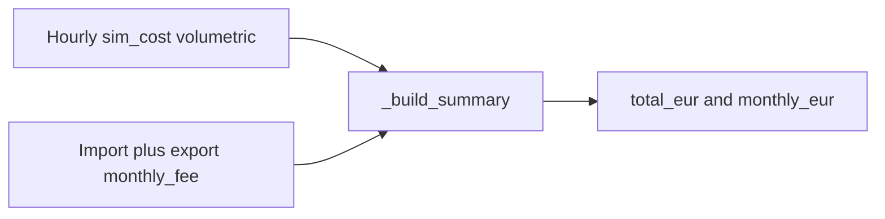

# 2.3.b — Approximate cost model (monthly fees)

## Locked decisions

- **SE only:** add fees in Scenario Explorer summary totals (`total_eur` / `monthly_eur`), not in MILP objective, not in hourly `sim_cost`, not in live online costs.
- **Import + export:** optional fee on both tariff kinds; scenario fee = sum of both when present.
- **No proration:** SE window is month-aligned ([`data/data_loader.py`](data/data_loader.py) `resolve_simulation_window` — complete calendar months from cons_data). Charge **one full** `monthly_fee_eur` per distinct calendar month present in the result (same month keys as today’s `resample("ME")`). `total_eur += N_months × fee`.
- **Catalog:** seed from research below; **omit** when unknown (treated as 0).
- **VAT basis for `monthly_fee_eur`:** same as that tariff’s volumetric fields — **net** when `prices_include_vat: false`, **gross (incl. VAT)** when `true` — so SE totals stay consistent with [`data/tariff_pricing.py`](data/tariff_pricing.py).
- **Good-enough €:** label as approximate; no invoice reconciliation.
- **Volumetric hygiene:** during catalog seed, fix only discrepancies marked **Fix in 2.3.b** below; leave **Investigate later** rows unchanged except notes.

## Current gap

Hourly costs in [`optimizer/simulation.py`](optimizer/simulation.py) and SE aggregation in [`simulation/backtesting_log.py`](simulation/backtesting_log.py) `_build_summary` are volumetric only. Schema/catalog have no standing-charge field; SE UI already warns that Fixkosten are excluded ([`ui/pages/page_scenario_editor.py`](ui/pages/page_scenario_editor.py)).

---

## Web research (2026-07-21) — monthly fees + volumetric audit

Cross-check of public sources vs [`earnie_env/config/tariffs.json`](earnie_env/config/tariffs.json) (Gemini-era catalog numbers). Prefer **official product pages / Tarifblätter**; secondary sites (Selectra, smartmeter-portal, energiedaten.at) noted when they disagree with primary.

### Convention note

Earnie formula: `(EPEX × (1 + markup%/100) + settlement_fee) × VAT-if-needed`. Providers publish either net or gross Aufschlag and often a separate Grundgebühr. Secondary sites sometimes omit Grundgebühr or fold VAT incorrectly — those are called out below.

### Monthly fees — proposed seeds

| Catalog ID | Proposed `monthly_fee_eur` | VAT flag in catalog | Source (primary preferred) | Confidence |
| --- | --- | --- | --- | --- |
| `awattar_at` | **4.79** | `prices_include_vat: false` → store **net** | [awattar.at/tariffs/hourly](https://www.awattar.at/tariffs/hourly): 4,79 € net / 5,75 € gross | High |
| `at_vkw_strom_dynamisch` | **3.00** | false → net | [vkw.at Strom Dynamisch](https://www.vkw.at/produkte/strom/strom-dynamisch): 36,00 €/Jahr net (= 3,00/Monat); 43,20 €/Jahr gross | High |
| `at_smartenergy_smartcontrol` | **2.99** | true → gross | [smartenergy.at/smartcontrol](https://smartenergy.at/smartcontrol): 2,99 € incl. USt (2,49 net) | High |
| `at_spotty_smart_active` | **2.40** | true → gross | Spotty help/AGB + [energiedaten.at comparison](https://energiedaten.at/de/blog/spot-tarif-haetten-sie-gespart): 2,00 net / 2,40 gross (confirm Tarifblatt Smart Active on [spottyenergie.at/agb](https://www.spottyenergie.at/agb)) | Medium–High |
| `at_verbund_v_strom_spot` | **4.79** | true → gross | Selectra / tarife.at Verbund sheets: 3,99 net / 4,79 gross; Verbund marketing confirms Grundpreis exists | Medium (official private Tarifblatt PDF not fully extracted) |
| `de_tibber_tibber_dynamic` | **5.99** | true → gross | [Tibber Support Grund-/Arbeitspreis](https://support.tibber.com/de/articles/12310314-grund-und-arbeitspreis-bei-tibber): 5,99 €/Monat inkl. 19 % MwSt. | High |
| `de_awattar_de_hourly_de` | **4.58** | false → treat as published brutto example | [awattar.de / tado° HOURLY](https://www.awattar.de/tariffs/hourly): “fixer Grundpreis von 4,58 €”; may be **PLZ-dependent** | Medium (regional) |
| Most other import/export rows | **omit** | — | No reliable public standing charge found in this pass | — |
| VKW / aWATTar **export** | **omit** | — | [VKW PV Dynamisch](https://www.vkw.at/pv-einspeisetarif-dynamisch) shows −0,60 ct only; no clear Einspeise-Monatsgebühr | — |

**Secondary-source trap:** [smartmeter-portal aWATTar](https://www.smartmeter-portal.at/dynamischer-stromtarif/awattar/) claims “kein Grundpreis” — **contradicts official aWATTar AT**. Do not trust that page for fees.

### Volumetric numbers — matches vs discrepancies

| ID | Catalog today | Research | Verdict |
| --- | --- | --- | --- |
| `awattar_at` | settlement **1.5**, markup **3%**, `prices_include_vat: false`, legacy `fix_aufschlag_cent: 1.5`, `netzverlust_faktor: 1.03` | Official page example: EPEX + **1,5 ct** + 20% MwSt.; Tarifblatt PDF also has **EPEX × 3%**. Website marketing table often **omits** the 3% | **Match** (catalog richer than simplified web table — keep 1.5 + 3%) |
| `at_vkw_strom_dynamisch` | settlement **1.2**, markup 0, `prices_include_vat: false` | Official: +**1,20 ct netto** (1,44 brutto) | **Match** |
| `at_vkw_pv_dynamisch` | settlement **0.6**, `prices_include_vat: true` | Official: EPEX − **0,60 ct netto**; page states price **ohne USt** | **DISCREPANCY — Fix in 2.3.b:** set `prices_include_vat: false` (and keep settlement 0.6). Applying VAT on a net export deduction is wrong |
| `at_vkw_pv_flex` | settlement **0.6**, `prices_include_vat: true` | Same VKW family; RefMarkt − 0,60 | **DISCREPANCY — Fix in 2.3.b:** same VAT flag fix as Dynamisch export |
| `at_smartenergy_smartcontrol` | settlement **1.44**, include VAT true | Official: Abwicklungsgebühr **1,44 ct inkl. USt** (1,20 net) | **Match** |
| `at_spotty_smart_active` | settlement **1.79**, include VAT true | 1,49 net × 1,2 ≈ **1,79** gross | **Match** |
| `de_tibber_tibber_dynamic` | settlement **2.15**, markup 0, include VAT true | Support: **2,15 ct/kWh** weitere Beschaffungskosten (+ 5,99 € Monat) | **Match** (marketing sometimes says “kein Aufschlag” — ignore; support is authoritative) |
| `at_verbund_v_strom_spot` | settlement **1.3**, markup **4%**, include VAT true | Selectra: flat **1,40 net / 1,68 gross**; Verbund **business** formula: EPEX + \|EPEX\|×**0,04** + Fixanteil. Private product sheet not fully verified | **DISCREPANCY — Investigate later:** formula shape differs (fixed ct vs %); do **not** auto-change in 2.3.b; add `notes` pointing to uncertainty; seed monthly fee only |
| `de_awattar_de_hourly_de` | settlement **2.25**, markup **3%**, include VAT false | tado°/aWATTar DE page: Börse + “weitere Beschaffungskosten”; Tarifblatt sample: **EPEX + 3%**, Grundpreis ~4,58 € — **no** clear fixed 2,25 ct | **DISCREPANCY — Investigate later:** 2.25 may be stale/wrong; leave volumetric as-is in 2.3.b unless a current DE Tarifblatt confirms; seed monthly **4.58** with note “approx / regional” |
| `at_wien_energie_optima_voll_aktiv` | 1.42 + **7%** markup | Not re-verified this pass | **Unverified** — leave |
| High settlement outliers (`at_schlau_pv` 5.4, `at_energie_steiermark_first_energy…` 9.816, etc.) | as catalog | Not re-verified | **Unverified** — leave; omit monthly fee |
| Fixed import `fix_cent_kwh` (Verbund 11.4, Wien 12.83, …) | as catalog | Market-moving; not audited here | **Out of scope** for 2.3.b hygiene |
| OeMAG / RefMarkt shared curves | already cleaned in **2.3.a** | Official OeMAG / E-Control | **No reopen** unless new months |

### Research → implementation mapping

1. **Rewrite** [`docs/referenz/tarife-quellen.md`](docs/referenz/tarife-quellen.md) as a **German user-centric how-to** for understanding/calculating prices in Earnie (see § Doc rewrite below). Keep sources + 2.3.b audit tables as an appendix section, not the lead.
2. Seed `monthly_fee_eur` for High/Medium rows in the monthly-fee table.
3. Apply **only** the two VKW export `prices_include_vat` fixes in this chapter.
4. For Verbund SPOT and aWATTar DE: add catalog `notes` about open volumetric questions; do not change settlement/markup without a follow-up (could be a tiny bugfix item if desired later).

### Doc rewrite — `tarife-quellen.md` (user how-to)

**Audience:** end users checking SE / Scenario Editor tariff parameters, not developers editing JSON.

**Role split:**
- [`docs/referenz/tarife-quellen.md`](docs/referenz/tarife-quellen.md) — **how to calculate / interpret prices** (this rewrite)
- [`docs/konfiguration/preise.md`](docs/konfiguration/preise.md) — stays the **config/reference** page (types, JSON keys, APIs); cross-link to the how-to for the human explanation
- [`docs/referenz/oemag-referenzmarktwert.md`](docs/referenz/oemag-referenzmarktwert.md) — legal distinction OeMAG vs RefMarkt (unchanged)

**Proposed German structure** (title e.g. „Tarife und Preise nachrechnen“):

1. **Was Earnie berechnet (und was nicht)** — energy €/kWh ± Einspeise; SE adds approximate `Monatsgebühr`; not invoice-grade (no full Netzentgelt-Grundpreis / Messstellengebühr stack); live MILP costs remain volumetric only.
2. **Bezugspreis Schritt für Schritt** — plain-language formula matching catalog fields shown in SE preview: Börsenpreis → optional %-Aufschlag (`markup_percent`) → fixer Aufschlag (`settlement_fee_cent_kwh`) → USt if `prices_include_vat` is false. One worked numeric example (e.g. aWATTar AT or VKW Dynamisch).
3. **Einspeisevergütung** — fixed / Spot−Abschlag / Monatspreis (`monthly_table`); short example (VKW PV Dynamisch −0,60 ct).
4. **Monatsgebühr in den SE-Gesamtkosten** — one full fee per calendar month in the SE window; import + export if both set; Näherung; where it appears in UI.
5. **Katalogparameter prüfen** — how to read the Scenario Editor read-only preview; check `prices_include_vat` / Cent vs €; no guarantee of catalog completeness.
6. **Quellen und Herkunft der Katalogwerte** — keep/adapt today’s §§ Day-Ahead, OeMAG, RefMarkt, VKW + attribution.
7. **Audit / Abweichungen (2.3.b)** — research tables (monthly fee seeds + volumetric matches/discrepancies) for transparency.

Update [`docs/README.md`](docs/README.md) TOC blurb from „Quellenverzeichnis …“ to the how-to title. Point Handbuch + Scenario Editor caption at this page for “how costs are calculated”.

Do **not** duplicate large JSON-type tables from `preise.md`; link there for config details.
---

## Implementation

### 1. Schema + store

- Add optional `monthly_fee_eur` (`number`, `minimum: 0`) to `dach_common` in:
  - [`share/config/tariffs.schema.json`](share/config/tariffs.schema.json)
  - [`earnie_env/config/tariffs.schema.json`](earnie_env/config/tariffs.schema.json)
  - greenfield / other mirrored copies as today
- Description: approximate EUR/month standing charge; net or gross matching `prices_include_vat`.
- In [`house_config/tariffs_store.py`](house_config/tariffs_store.py) `_normalize_dach_fields`: copy via `_optional_float`.
- **No** `earnie_data_model` bump.

### 2. Catalog seed + targeted hygiene

- Update [`share/config/tariffs.json`](share/config/tariffs.json) (mirror earnie_env / greenfield / examples as usual):
  - Set `monthly_fee_eur` per research table
  - Fix `at_vkw_pv_dynamisch` / `at_vkw_pv_flex`: `prices_include_vat: false`
  - Notes for Verbund SPOT / aWATTar DE open items
- Document: rewrite [`docs/referenz/tarife-quellen.md`](docs/referenz/tarife-quellen.md) as user how-to (see above); short pointer + monthly-fee note in [`docs/konfiguration/preise.md`](docs/konfiguration/preise.md).

### 3. SE post-aggregation

- Helper (e.g. `simulation/monthly_fees.py`):
  - `monthly_fee_eur_from_specs(import_spec, export_spec) -> float` (sum of present fees)
- Extend `_build_summary` in [`simulation/backtesting_log.py`](simulation/backtesting_log.py) with per-scenario fee from `_import_tariff_spec` / `_export_tariff_spec`.
- For each month key already produced by `sim_cost.resample("ME")`: `monthly_eur[month] += fee`; `total_eur += fee × month_count`.
- No day/hour proration (month-aligned SE span after cons_data horizon change).
- Keep `sim_cost` / hourly CSV unchanged.

### 4. UI / docs copy

- Preview ([`ui/tariff_filter_helpers.py`](ui/tariff_filter_helpers.py)): `Monatsgebühr (ca.): x.xx €/Monat` when present.
- Replace “fließt noch nicht ein” in Scenario Editor + [`docs/user-manual/Benutzer-Handbuch-Earnie.md`](docs/user-manual/Benutzer-Handbuch-Earnie.md); link to the how-to page for Nachrechnen.
- SE Gesamtkosten / monthly chart caption: “inkl. Näherung Monatsgebühren” when any fee &gt; 0.
- [`docs/konfiguration/preise.md`](docs/konfiguration/preise.md): keep as config reference; lead with link to the how-to for end-user calculation steps.
### 5. Tests

- Summary: N calendar months → volumetric + `N × fee`; hourly `sim_cost` sum unchanged before fee add.
- Store accepts optional field; missing → 0.
- Preview shows fee; VKW export VAT flag regression if covered by existing pricing tests.

## Out of scope

- Live online / Chart 2 horizon costs
- Tariff editor UI
- Invoice-grade Netzentgelt-Grundpreis / Messstellengebühr (Tibber lists these separately — Earnie stores **supplier** Monatspauschale only)
- Full re-audit of every Gemini settlement/markup row
- Auto-changing Verbund SPOT or aWATTar DE volumetric formula without a confirmed Tarifblatt
