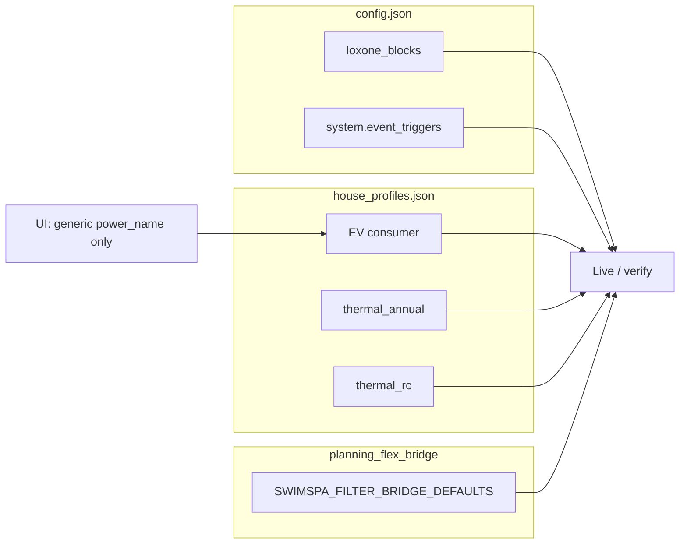

# 2.3.f — Thin marker / data-model prep

## Decisions (locked)

- **Storage:** docs + UI labels + schema descriptions only — **no** key rename, **no** dual-read aliases, **no** config migration (`loxone_inputs`, `loxone_blocks`, `*.loxone` stay).
- **UI:** Hausprofil consumers **+** plant `loxone_blocks` **+** `system.event_triggers` **+** SwimSpa-filter marker overrides (wired through existing `planning_filter_to_milp(bindings)`).
- **Out of scope:** connector framework, MQTT/Matter, Loxone HTTP extraction, device-template library (`2.4`); full nested models (`2.+1`); implementing `_loxone_markers_complete()` readiness truth (stub stays unless trivial later).

## Current state (baseline)

Today only generic `loxone_inputs.power_name` is form-editable ([`ui/house_config_profile_form.py`](ui/house_config_profile_form.py)); EV/WP/thermal markers are passthrough; plant markers only via raw JSON; filter names are hardcoded and `collect_planning_flex_consumers` calls `planning_filter_to_milp()` with **no** bindings.

## 1. Role catalog (docs + schema, no rename)

**Vocabulary (UI/docs):** prefer “Smarthome-Merker” / “Merker” for the address string; keep “Rolle” = config key (`power_name`, `soc_name`, …). Note Loxone remains the sole live backend. Avoid colliding with chart markers / `earnie_role`.

**Canonical role table** — extend German user ref [`docs/referenz/loxone-signale.md`](docs/referenz/loxone-signale.md) with a short “Rolle ↔ Entity” overview (plant / EV / WP / SwimSpa / filter / event triggers). Soften page titles/captions toward Smarthome-Merker where user-facing ([`docs/ui/loxone-kommunikation.md`](docs/ui/loxone-kommunikation.md), captions in UI); leave file/page route ids as-is.

**Schema descriptions only** (sync `earnie_env` + `share`):

- [`house_profiles.schema.json`](earnie_env/config/house_profiles.schema.json): document nested `charging_schedule.loxone` and `thermal_control.loxone` properties (already live in JSON, missing from schema); enrich `loxone_inputs` / `loxone_outputs` descriptions as role catalogs.
- [`config.schema.json`](earnie_env/config/config.schema.json): ensure each `loxone_blocks.*` and `event_triggers[]` field description states role + direction (read/write).

No new top-level config object; no pydantic marker models.

## 2. Hausprofil: editable consumer markers

In [`ui/house_config_profile_form.py`](ui/house_config_profile_form.py):

| Entity | Fields to expose (existing keys) |
|--------|----------------------------------|
| **generic** (`known`/`manual`) | Keep current Leistungsquelle + `power_name`; soften label to “Smarthome-Merker (Leistung)” |
| **EV** | `loxone_inputs.power_name`; `loxone_outputs.power_setpoint_name`, `pv_follow_name`; `charging_schedule.loxone.*` (plugged_in, SOCs, ready_by, capacity, nominal power, charge_immediate, …) |
| **thermal_annual (WP)** | `loxone_inputs.power_name`; `loxone_outputs.enable_name` |
| **thermal_rc (SwimSpa)** | power/enable; `subtract_consumer_ids`; `thermal_control.loxone.*` |

Implementation notes:

- Reuse `_render_power_source_fields` / small helpers for text inputs; merge written marker dicts into saved consumer (stop relying on passthrough-only for fields now edited).
- Keep `_PASSTHROUGH_CONSUMER_KEYS` for any remaining nested keys not shown, so saves still do not wipe unknown extras.
- Follow [`streamlit-ui-state`](.cursor/skills/streamlit-ui-state/SKILL.md) for scoped keys / stale selects after save.

## 3. SwimSpa-filter marker overrides (concrete choice)

Filter stays **bridge-only** (not a new Hausprofil consumer type).

- Add optional nest on each `thermal_rc` consumer, e.g. `swimspa_filter_bindings` (or reuse a documented key already accepted by merge) holding the same shape as `SWIMSPA_FILTER_BRIDGE_DEFAULTS` marker fields: `loxone_target_hours_name`, `loxone_inputs.*`, `loxone_outputs.enable_name`, `filter_schedule.loxone.*`.
- UI expander under SwimSpa: text inputs prefilled from defaults, editable; persist on profile save.
- Change [`collect_planning_flex_consumers`](house_config/planning_flex_bridge.py) to pass bindings into `planning_filter_to_milp(bindings)` when present (defaults unchanged when empty).
- Schema: document the optional nest; docs: one row in `loxone-signale.md`.

## 4. Plant markers + event triggers UI

Home: [`ui/pages/page_loxone_debug.py`](ui/pages/page_loxone_debug.py) / new small module e.g. `ui/loxone_marker_forms.py` (keep debug verify block separate).

- **`loxone_blocks` form:** labeled text inputs for all keys already in example/config (`soc_name`, `pv_power_name`, `battery_power_name`, `grid_power_name`, `pv_counter_name`, targets, `control_cmd_name`, `log_filename`, optional `pv_tuning_log_file`). Save via existing [`_save_config_document`](ui/house_config_io.py) + `config.reinit_config()`.
- **`event_triggers` list editor:** add/remove/reorder rows with `id`, `loxone_name`, `signal_type`, `on_change`, `label`; write `system.event_triggers`.
- Soft labels: “Smarthome-Merker” while captions still say values are Loxone Miniserver names today.
- Raw JSON editor on Konfiguration remains as power-user escape hatch.

## 5. Tests + docs sync

- Unit/UI-adjacent tests: consumer form merge writes marker keys; filter bindings reach `planning_filter_to_milp`; config save round-trip for `loxone_blocks` / `event_triggers` (extend existing house-config / planning tests rather than new generators).
- German user docs only (per `german-user-docs.mdc`): signal ref + Loxone-Kommunikation page; TOC touch only if new page (prefer no new page).
- Do **not** bump [`version.py`](version.py).

## Suggested work order

1. Schema description gaps + role overview in `loxone-signale.md`
2. Consumer marker editors in Hauskonfigurator (+ filter bindings + bridge call)
3. `loxone_blocks` + `event_triggers` forms on Loxone-Kommunikation
4. Tests + UI doc captions
