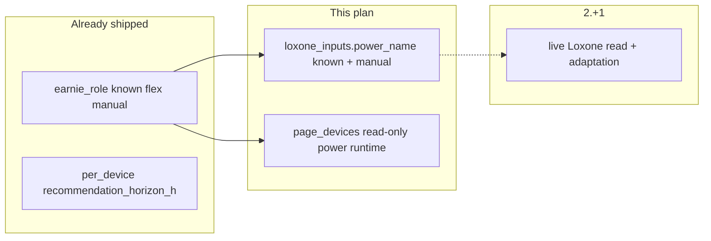

# Consumer roles follow-up (Backlog 52–56)

## Context

The core **`earnie_role`** feature is **done** ([`backlog/Backlog-Erledigt.md`](backlog/Backlog-Erledigt.md) § Generic `earnie_role`, 2026-07-15; plan [`.cursor/plans/earnie_consumer_roles_1dc94070.plan.md`](.cursor/plans/earnie_consumer_roles_1dc94070.plan.md)). What remains in [`backlog/Backlog.md`](backlog/Backlog.md) lines 52–56 are **two follow-ups**, not a re-implementation of roles.

| Follow-up | Status today | This plan |
|-----------|--------------|-----------|
| Loxone **Leistungsquelle** for **`known`** consumers | Not implemented | Optional `loxone_inputs.power_name` on generic `known` |
| **Unify marker field** | `manual` uses `appliance_recommendation.loxone_power_name` | **Both `known` and `manual` use `loxone_inputs.power_name`** |
| **Manuelle Geräte**: no Laufzeit/Nennleistung UI | Page still has editable forms + save | Read-only display from Hausprofil consumer data |
| **Empfehlungshorizont** | **Done** | Doc/caption cleanup only |

**Explicitly out of scope** (deferred to **Version 2.+1** / Adaptation): live Loxone reads; adaptation updating `default_power_kw` from `loxone_inputs.power_name` ([`backlog/Backlog.md`](backlog/Backlog.md) line 118 — update wording to `loxone_inputs.power_name` when touching docs).



---

## Part A — Unified `loxone_inputs.power_name` for `known` and `manual`

### Data model

**Single marker field** on all generic consumers that use a Loxone Leistungsquelle:

```json
"loxone_inputs": { "power_name": "Leistung Waschmaschine" }
```

Reuse the shape from [`config/config.schema.json`](config/config.schema.json) (`power_name`, optional `signal_type`). **No `loxone_outputs`** on `known` or `manual` (not optimizer-controlled via outputs).

#### `earnie_role: known`

```json
{
  "id": "pool_filter",
  "type": "generic",
  "earnie_role": "known",
  "nominal_power_kw": 0.8,
  "schedule": { "runs_per_week": 7, "duration_h": 8.0, "start_hour": 10, "start_shift_h": 0 },
  "loxone_inputs": { "power_name": "Ernie_PoolFilter_P_act" }
}
```

- **No `loxone_inputs`**: overlay uses `nominal_power_kw` + schedule (unchanged).
- **With `loxone_inputs`**: config-only until 2.+1; overlay still uses `nominal_power_kw` until adaptation is live.

#### `earnie_role: manual`

`appliance_recommendation` **retains** recommendation defaults only — **not** the Loxone marker:

```json
{
  "earnie_role": "manual",
  "appliance_recommendation": {
    "power_source": "loxone",
    "default_power_kw": 2.0,
    "default_runtime_h": 2.0
  },
  "loxone_inputs": { "power_name": "Leistung Waschmaschine" }
}
```

- `power_source: manual` → no `loxone_inputs` (or empty → stripped on normalize).
- `power_source: loxone` → **requires** `loxone_inputs.power_name` (not `appliance_recommendation.loxone_power_name`).

#### Remove `appliance_recommendation.loxone_power_name`

- Drop from [`config/house_profiles.schema.json`](config/house_profiles.schema.json) `appliance_recommendation` properties.
- On normalize ([`house_config/profiles_store.py`](house_config/profiles_store.py)): if legacy `appliance_recommendation.loxone_power_name` is present, **migrate** to `loxone_inputs.power_name` and omit `loxone_power_name` from persisted `appliance_recommendation`.
- Update [`settings/appliances.py`](settings/appliances.py) `normalize_appliance_recommendation_block()` and `appliance_from_profile_consumer()`:
  - Validate `power_source=loxone` against `consumer["loxone_inputs"]["power_name"]`, not `rec.loxone_power_name`.
  - Runtime appliance dict: expose marker as `loxone_inputs.power_name` (or derived `loxone_power_name` alias **only** for legacy `config.json` `appliances[]` — profile-sourced appliances use `loxone_inputs`).

#### Legacy `config.json` `appliances[]`

- Keep `loxone_power_name` on legacy block only (unchanged until 2.0 removal); no migration of root `appliances[]` in this follow-up.

### Files to change

1. **[`config/house_profiles.schema.json`](config/house_profiles.schema.json)**
   - Add `loxone_inputs` on generic consumer items.
   - Remove `loxone_power_name` from `appliance_recommendation` definition.

2. **[`house_config/profiles_store.py`](house_config/profiles_store.py)**
   - **`known`**: preserve optional `loxone_inputs` via `_copy_loxone_binding()`; strip `appliance_recommendation`.
   - **`manual`**: when `power_source=loxone`, require `loxone_inputs.power_name`; migrate legacy `appliance_recommendation.loxone_power_name` → `loxone_inputs` on load.
   - **`_serialize_consumer()`** generic branch: persist `loxone_inputs` when present.

3. **[`settings/appliances.py`](settings/appliances.py)**
   - `normalize_appliance_recommendation_block()`: remove `loxone_power_name` handling; accept optional `loxone_inputs` on parent consumer for loxone validation.
   - `appliance_from_profile_consumer()`: pass through `loxone_inputs` (or `power_name` derived field for page display).

4. **[`ui/house_config_profile_form.py`](ui/house_config_profile_form.py)**
   - Extract shared **`_render_power_source_fields()`** → Leistungsquelle selectbox + `loxone_inputs.power_name` text input.
   - Use for **`known`** (when `runs > 0`) and **`manual`** (`_render_manual_appliance_fields` delegates marker UI to shared helper; manual block keeps only `default_power_kw` / `default_runtime_h`).
   - Caption: marker stored for 2.+1 adaptation; no live read yet.

5. **[`config/house_profiles.example.json`](config/house_profiles.example.json)** — migrate Waschmaschine/Trockner examples: move marker to `loxone_inputs`, drop `loxone_power_name` from `appliance_recommendation`.

6. **[`scripts/migrate_flex_consumers.py`](scripts/migrate_flex_consumers.py)** — emit `loxone_inputs.power_name` instead of `appliance_recommendation.loxone_power_name` for migrated manual generics.

7. **Tests** — [`tests/test_earnie_role.py`](tests/test_earnie_role.py), [`tests/test_appliance_config.py`](tests/test_appliance_config.py), [`tests/test_house_config.py`](tests/test_house_config.py):
   - Legacy `loxone_power_name` → `loxone_inputs` migration on normalize.
   - `manual` + `power_source=loxone` requires `loxone_inputs.power_name`.
   - `known` + optional `loxone_inputs` round-trip serialize.

8. **Docs (German)** — [`docs/konfiguration/flexible-verbraucher.md`](docs/konfiguration/flexible-verbraucher.md): single rule — Leistungsquelle Loxone → `loxone_inputs.power_name` for `known` and `manual`; `appliance_recommendation` holds defaults/horizon only.

---

## Part B — Manuelle Geräte: read-only power/runtime

### Target UX

Per manual device on **Betrieb → Manuelle Geräte**:

- **Show** (read-only): Nennleistung, Laufzeit, Empfehlungshorizont from Hausprofil via [`settings/appliances.py`](settings/appliances.py) `appliance_from_profile_consumer()`:
  - `default_power_kw` ← `appliance_recommendation.default_power_kw` (fallback `nominal_power_kw`)
  - `default_runtime_h` ← `appliance_recommendation.default_runtime_h` (fallback `schedule.duration_h`)
  - `recommendation_horizon_h` ← already attached
- **Loxone marker** (if `power_source=loxone`): show `loxone_inputs.power_name` (not `loxone_power_name`).
- **Remove**: editable power/runtime form, save button, `_save_appliance_defaults()`, input-disable logic for power/runtime.
- **Keep**: star-threshold expander, recommendation table, plan checkbox; `config.update_appliance_defaults()` API for legacy `appliances[]` tests only.

### Files to change

1. **[`ui/pages/page_devices.py`](ui/pages/page_devices.py)** — read-only metrics/captions; merker from `appliance.get("loxone_inputs", {}).get("power_name")`; caption “Ändern im Hauskonfigurator”; update module docstring.

2. **[`docs/spec/ui-menu-structure.md`](docs/spec/ui-menu-structure.md)** — per-device Empfehlungshorizont; unified `loxone_inputs.power_name` for Leistungsquelle.

3. **Tests** — [`tests/test_page_devices_display.py`](tests/test_page_devices_display.py): helpers for power/runtime/marker resolution.

---

## Part C — Backlog sync (after implementation)

Move [`backlog/Backlog.md`](backlog/Backlog.md) lines 52–56 to [`backlog/Backlog-Erledigt.md`](backlog/Backlog-Erledigt.md). Optionally update backlog line 118 reference from `loxone_power_name` to `loxone_inputs.power_name`.

**No `version.py` change** without explicit user approval.

---

## Risk notes

- **Migration on normalize**: existing profiles with `appliance_recommendation.loxone_power_name` must auto-migrate to `loxone_inputs` on load/save — no manual review gate.
- **No live read yet**: configured markers have no runtime effect until Adaptation (2.+1) — UI captions must say so.
- **Legacy `config.json` appliances[]**: still uses flat `loxone_power_name`; profile-sourced devices use `loxone_inputs` only.
