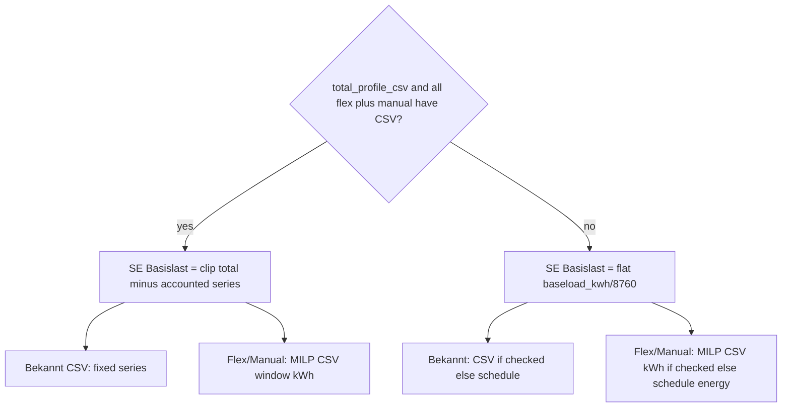
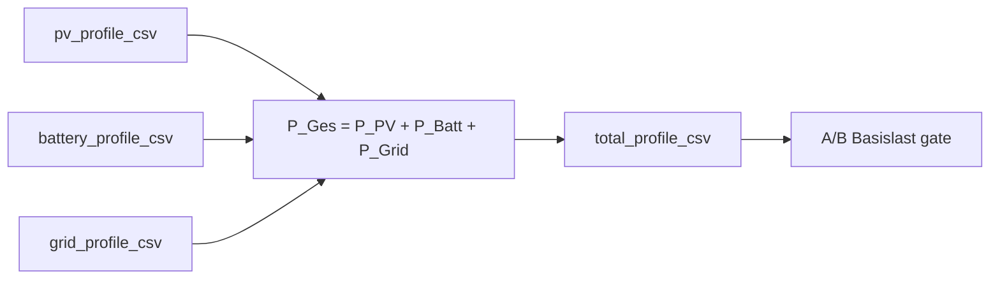

# CSV / Basislast / earnie_role alignment (2.3)

## Agreed conclusions

| Topic | Decision |
|---|---|
| SE Basislast | **Hybrid:** path **B** (hourly meter residual) when `total_profile_csv` exists **and** every controllable **generic** (`flex` + `manual`) has active CSV (`profile_csv` + check); otherwise **A** (flat `baseload_kwh/8760` + role overlays) |
| Controllable for B-gate | **Generic Gesteuert + Manuelles Gerät only.** EV / `thermal_*` keep today’s CSV target/overlay rules and do **not** block B |
| Bekannt under B | CSV consumers: subtract then add as **fixed CSV**; without CSV: energy stays **inside** residual — **no** schedule overlay |
| SE Manual | Always **MILP-flex** (like Gesteuert): CSV window energy if check on, else nominal×schedule. Reverses current fixed-overlay rule |
| Live Manual | User day-plan if active; else **ignore** CSV **and** default schedule (no weekly overlay) |
| Live Gesteuert | Ignore CSV; schedule (unchanged) |
| Live Bekannt | Same as SE: fixed CSV if check on, else schedule |
| EV / thermal | Keep current SE behavior (CSV energy / overlay; re-schedule where already MILP) |
| `runs=0` | Allow **only** for Bekannt+CSV (CSV-only known). Gesteuert/Manual: require `runs≥1` (timing fields). Hint: 0 = inactive / obsolete unless Bekannt+CSV |
| Checkbox | Rename to **„Von Basis-Last abziehen“**; help text explains role×context table |
| Gesamtverbrauch import | Keep direct Verbrauch CSV / Energiemonitor; **add** balance mode: derive load from PV + battery + grid |

## Balance import (Gesamtverbrauch from PV + battery + grid)

**Goal:** Alternative to uploading Gesamtverbrauch directly. User supplies (or Energiemonitor columns for) PV, battery, and grid power; Earnie derives house load and writes the usual `total_profile_csv` so A/B residual logic stays unchanged.

**Power balance (AC bus, user sign convention):**

\[
P_\mathrm{Ges} = P_\mathrm{PV} + P_\mathrm{Batt} + P_\mathrm{Grid}
\]

- **Positive** \(P_\mathrm{Batt}\) / \(P_\mathrm{Grid}\) = power **into** the house electrical system (discharge / grid import).
- **Negative** = out of the system (charge / export).
- \(P_\mathrm{PV}\) = generation into the system (canonical PV series, ≥0 after normalize as today).

**Locked design choices**

| Item | Choice |
|---|---|
| Downstream | Always materialize derived series into `total_profile_csv` (canonical hourly). Path B / Ist-vs-Modell / QC keep using `total_profile_csv` |
| Persist sources | New optional profile keys `battery_profile_csv`, `grid_profile_csv`; reuse `pv_profile_csv` |
| Import mode | New `historical_csv_source`: `balance` alongside `separate` / `energiemonitor` |
| Inputs required | PV + battery + grid (all three). PV upload in this mode is mandatory (cannot derive without it) |
| Alignment | Inner-join / intersect timestamps after hourly normalize; missing hours → fail with clear error or gap policy same as other multi-series QC |
| Negative load | Clip \(P_\mathrm{Ges}<0\) to 0; count clipped hours; show HK warning (sign error / meter noise) |
| Energiemonitor | Same mode can fill the three series from columns `Leistung Produktion`, `Leistung Batterie`, `Leistung Energieversorger` (today ignored for batt/grid), then derive Verbrauch — do **not** require `Leistung Verbrauch` in balance path |
| Sign mismatch | Document expected signs in German docs; if Loxone batt/grid signs differ in practice, add optional per-series “Vorzeichen umkehren” checkboxes in balance UI only (default off = user convention) |
| SOC | Still not imported |

**UI** ([`ui/house_config_historical_csv.py`](ui/house_config_historical_csv.py))

- Radio option: **Bilanz (PV + Batterie + Netz → Verbrauch)**.
- Uploads for PV / Batterie / Netz (canonical or Loxone single-series / counter, same normalizer as today).
- On successful set: write normalized source CSVs + derived `total_profile_csv`; QC plot shows derived Verbrauch (+ optional component traces).
- Caption states the formula and sign convention.

**Code**

- Builder e.g. `derive_total_from_balance(pv, batt, grid) -> list[(ts, kw)]` in [`house_config/consumption_csv.py`](house_config/consumption_csv.py) (or small sibling module).
- Extend Energiemonitor loader ([`data/energiemonitor_csv.py`](data/energiemonitor_csv.py)) to optionally return batt/grid series for balance path.
- Schema / store: [`share/config/house_profiles.schema.json`](share/config/house_profiles.schema.json), [`house_config/profiles_store.py`](house_config/profiles_store.py) — enum + new path fields.

## Implementation

### 1. Shared policy helpers

Add small helpers (prefer [`house_config/consumption_csv.py`](house_config/consumption_csv.py) or new `house_config/profile_csv_policy.py`) so UI/SE/Live share one gate:

- `consumer_uses_profile_csv` (existing)
- `controllable_generics(profile)` → flex + manual
- `se_uses_meter_residual_baseload(profile) -> bool` — Gesamt-CSV resolvable **and** every controllable generic has active CSV
- `accounted_csv_consumers(profile)` — consumers whose series are peeled for residual / fixed CSV overlay

### 1b. Balance import (before / alongside HK UX)

Implement derive + persist + UI mode as above so path B can use a derived Gesamtverbrauch the same way as a direct upload.

### 2. SE / MILP Basislast + overlays

Primary touch points: [`house_config/planning_flex_bridge.py`](house_config/planning_flex_bridge.py), [`simulation/engine.py`](simulation/engine.py) (`profile_spec` branch), [`data/cons_data_house_profile.py`](data/cons_data_house_profile.py), [`data/consumption_profiles.py`](data/consumption_profiles.py).

**Path B**

- Build hourly residual aligned to planning slots from `total_profile_csv − Σ(accounted series)`.
- Accounted: all `use_profile_csv` consumers (known + flex + manual + thermal/EV with CSV as today for peel consistency). Controllable CSVs are peeled so MILP can re-add; known CSV peeled and re-added as fixed series.
- Clip residual at 0; if any hour clips, count + user-visible validation (HK save / SE run banner), not silent-only log.
- Do **not** apply `fixed_generic_hourly_overlay` schedule for known without CSV under B.

**Path A**

- Keep `profile_flat_baseload_kw` + overlays.
- Change `fixed_generic_hourly_overlay` to use `modeled_consumer_kw_at_datetime` (CSV wins) instead of `generic_hourly_kw_for_day` only.

**Manual → MILP**

- `split_planning_generic_consumers`: `manual` joins flex list (not fixed), via `planning_consumer_to_milp`.
- `planning_flex_daily_targets`: if `use_profile_csv` → `_consumer_window_kwh` (CSV sum); else existing schedule window energy.
- Update/replace [`tests/test_earnie_role.py`](tests/test_earnie_role.py) `test_split_planning_treats_manual_as_fixed_overlay` and SE consumption specs/docs that say manual = fixed.

### 3. Live path

- [`data/profile_manager.py`](data/profile_manager.py) `_apply_house_profile_baseload_overlay`: Bekannt with CSV → CSV kW; Bekannt without → schedule; **manual never** in default overlay.
- Manual energy only via existing `apply_appliance_schedules_to_matrix` when user plan active for the day.
- Flex: unchanged (schedule / planning bridge; ignore CSV).

### 4. Hauskonfigurator UX

[`ui/house_config_profile_form.py`](ui/house_config_profile_form.py) + [`ui/house_config_historical_csv.py`](ui/house_config_historical_csv.py):

- Rename checkbox + help to **„Von Basis-Last abziehen“** (role×HK/SE/Live one-liner).
- `Läufe pro Woche`: hint for 0; enforce `runs≥1` for flex/manual (widget min and/or validation); allow 0 for known+CSV; drop “show all params at 0” in favor of this rule.
- When B-gate fails but Gesamt-CSV present and some controllable lack CSV: short caption that SE uses flat Basislast (A) until all controllable have CSV.
- New **Bilanz** historical import mode (PV + Batterie + Netz → derived Verbrauch); remove/adjust caption that says SOC/Batterie/Netz are never imported.

HK residual charts: keep / align with same peel rules; annual `compute_baseload_kwh` unchanged in spirit (CSV annual when check on).

### 5. Docs

- [`docs/konfiguration/verbrauchs-csv.md`](docs/konfiguration/verbrauchs-csv.md) — format stays; add role×context table + A/B Basislast rule; rename checkbox; document Bilanz mode + sign convention + formula.
- [`docs/user-manual/Benutzer-Handbuch-Earnie.md`](docs/user-manual/Benutzer-Handbuch-Earnie.md) — clearer “what happens when CSV imported + check”; mention Bilanz alternative.
- [`docs/spec/scenario-explorer-consumption.md`](docs/spec/scenario-explorer-consumption.md) — reverse “SE always flat / manual fixed”; document hybrid A/B and manual MILP.
- Schema description in [`share/config/house_profiles.schema.json`](share/config/house_profiles.schema.json) for `use_profile_csv`, `historical_csv_source`, `battery_profile_csv`, `grid_profile_csv`.

### 6. Tests (minimum)

- B-gate true/false selection.
- Residual clip + non-negative assertion.
- Known+CSV → fixed CSV overlay (A and B); known without CSV under B → no schedule double-count.
- Manual in `collect_planning_flex_consumers`; targets CSV vs schedule.
- Flex targets use CSV window when check on.
- Live: manual absent from default overlay; known CSV used when check on.
- `runs=0` validation for flex/manual vs known+CSV.
- Balance derive: known formula/sign cases; negative clip; Energiemonitor balance path without Verbrauch column.
- Update [`tests/test_use_profile_csv.py`](tests/test_use_profile_csv.py) / SE invariant tests that currently require flat≡HK metric always.

### 7. Backlog

Rewrite the open bullet in [`backlog/Backlog.md`](backlog/Backlog.md) lines 25–34 to match these conclusions (hybrid A/B, manual MILP in SE, runs=0 rule, Bilanz import); move to Erledigt only after implementation + verification.

## Out of scope

- Changing EV / thermal CSV semantics beyond keeping them.
- Invoice-grade bill reconciliation.
- Inventing meter residual when no `total_profile_csv` (direct or derived).
- Importing SOC / using battery energy for anything other than signed power in the balance formula.
- Using derived `grid_profile_csv` / `battery_profile_csv` as live control inputs (persist for re-derive / QC only in this slice).
