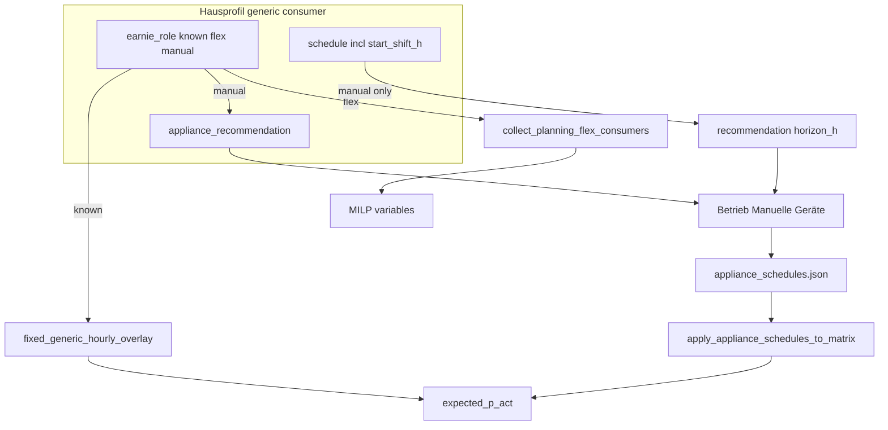

# Earnie consumer roles — consolidated requirements & plan

## Consolidated requirements (from [backlog/Backlog.md](backlog/Backlog.md) lines 52–56)

Two backlog bullets describe **one feature** for `type: generic` (UI label: Allgemein) consumers:

| User concept | `earnie_role` | Optimizer behavior |
|---|---|---|
| **Known by Earnie** | `known` (**default**) | Add scheduled kW to predicted **Grundlast** (`expected_p_act` overlay) — **not** MILP-flex |
| **Controlled by Earnie (flex)** | `flex` | MILP-flex via `generic_flex_window`; **Verschiebung** = optimizer shift window |
| **Controlled by Earnie (manual)** | `manual` | User plans runs on **Betrieb → Manuelle Geräte**; runtime injection via `appliance_schedules.json`; **Verschiebung** = max look-ahead horizon (h) for start-time recommendations on that page |

**No `off` role** — every generic consumer with `runs_per_week > 0` is either known, flex, or manual. Consumers with `runs_per_week = 0` need no role (energy accounting only).

**Explicit removals:**
- Stop using **`start_shift_h = 0`** as the proxy for "known by Earnie" ([docs/konfiguration/flexible-verbraucher.md](docs/konfiguration/flexible-verbraucher.md) § fixe Generic-Verbraucher, [house_config/planning_flex_bridge.py](house_config/planning_flex_bridge.py) `split_planning_generic_consumers`).
- Fix the **dual-path bug** on migrated appliances: `migrate_flex_consumers.py` currently sets both `appliance_recommendation` **and** `start_shift_h: 4.0`, so Waschmaschine/Trockner can enter MILP **and** Manuelle Geräte simultaneously.

**Out of scope:** line 57 (SOC vs BL SOC Ziel explanation). EV / thermal consumers keep implicit "controlled by Earnie" behavior unchanged.

---

## Target data model

Add to generic consumers in [config/house_profiles.schema.json](config/house_profiles.schema.json):

```json
"earnie_role": {
  "enum": ["known", "flex", "manual"],
  "default": "known",
  "description": "Wie Earnie diesen Verbraucher berücksichtigt."
}
```

| `earnie_role` | `appliance_recommendation` | `start_shift_h` semantics |
|---|---|---|
| `known` (default) | absent | ignored for role split; schedule used for fixed Grundlast overlay |
| `flex` | absent | MILP shift window (`generic_flex_window`) |
| `manual` | required (auto-created on save) | **Recommendation look-ahead horizon (h)** on Manuelle Geräte page — **not** MILP |

**Normalization** in [house_config/profiles_store.py](house_config/profiles_store.py):
- Missing `earnie_role` → `"known"` (migration default).
- `manual` → ensure `appliance_recommendation` exists (defaults: `power_source: manual`, `default_power_kw` from `nominal_power_kw`, `default_runtime_h` from `schedule.duration_h`); require `start_shift_h >= 1` (horizon must be meaningful; suggest default `6.0` in UI when switching to manual).
- `known` → persist `start_shift_h: 0`; hide Verschiebung in UI.
- `flex` → require `start_shift_h > 0`.

Central helpers in new module **`house_config/earnie_role.py`** (~40 LOC):

```python
def resolve_earnie_role(consumer: dict) -> str  # known | flex | manual
def is_earnie_known(consumer) -> bool
def is_earnie_flex(consumer) -> bool
def is_earnie_manual(consumer) -> bool
def manual_recommendation_horizon_h(consumer) -> int  # int(start_shift_h), min 1
```

---

## Architecture (after change)



---

## Migration rules (auto, default `known`)

On load or one-time migration script — **no manual review gate**:

| Condition | `earnie_role` |
|---|---|
| `appliance_recommendation` present | `manual` |
| else `start_shift_h > 0` | `flex` |
| else (incl. missing / `start_shift_h <= 0`) | **`known`** |

For `manual` consumers migrated from legacy appliances: keep meaningful `start_shift_h` (e.g. `4.0` or `6.0`) as recommendation horizon; **exclude from MILP** via role, not via zeroing shift.

---

## Manuelle Geräte — per-appliance horizon

Today [optimizer/appliance_recommendation.py](optimizer/appliance_recommendation.py) uses fixed `DEFAULT_HORIZON_H = 6`; [ui/pages/page_devices.py](ui/pages/page_devices.py) passes it globally.

**Change:**
1. When building runtime appliance dict in [settings/appliances.py](settings/appliances.py) `appliance_from_profile_consumer()`, attach `recommendation_horizon_h` from `manual_recommendation_horizon_h(consumer)` (source: `schedule.start_shift_h`).
2. [ui/pages/page_devices.py](ui/pages/page_devices.py) `_render_appliance()` passes `horizon_h=appliance.get("recommendation_horizon_h", DEFAULT_HORIZON_H)` to `recommend_start_times()`.
3. Update page caption/help text: horizon is **per device** from Hausprofil Verschiebung (manual role), not global 6 h.
4. `DEFAULT_HORIZON_H = 6` remains fallback only when horizon missing (should not happen after normalization).

---

## Implementation phases

### Phase 1 — Backend routing (replace Verschiebung proxy)

**Files:**

1. **[house_config/earnie_role.py](house_config/earnie_role.py)** (new) — role resolution + `manual_recommendation_horizon_h()`.
2. **[house_config/planning_flex_bridge.py](house_config/planning_flex_bridge.py)** — replace `is_fixed_start(start_shift_h)` in `split_planning_generic_consumers()` with `is_earnie_known()` / `is_earnie_flex()`.
3. **[data/profile_manager.py](data/profile_manager.py)** — known-only overlay filter.
4. **[settings/appliances.py](settings/appliances.py)** — filter on `is_earnie_manual()`; add `recommendation_horizon_h` to runtime appliance spec.
5. **[house_config/profiles_store.py](house_config/profiles_store.py)** — normalize `earnie_role` (default `known`), validate role/block consistency, apply migration inference on normalize.
6. **[config/house_profiles.schema.json](config/house_profiles.schema.json)** — add `earnie_role` enum (3 values, default `known`).

**Keep** `is_fixed_start()` in [house_config/generic_schedule.py](house_config/generic_schedule.py) for MILP window math when `earnie_role == flex`.

### Phase 2 — Hauskonfigurator UI

**File:** [ui/house_config_profile_form.py](ui/house_config_profile_form.py) `_render_generic_fields()`

Add German UI (when `runs_per_week > 0`):

- **Selectbox:** `Earnie-Berücksichtigung`
  - `Bekannt (Grundlast)` → `known` (default)
  - `Gesteuert (Optimierung)` → `flex`
  - `Manuelles Gerät` → `manual`
- **Conditional fields:**
  - `known` → hide Verschiebung; persist `start_shift_h: 0`
  - `flex` → show **Verschiebung (± h)** as MILP shift window
  - `manual` → show **Verschiebung (± h)** relabeled as **Empfehlungshorizont (h)** (same field, different caption); show power source, default power, default runtime
- Remove `appliance_recommendation` from `_PASSTHROUGH_CONSUMER_KEYS`; manage from manual branch.

### Phase 3 — Migration & examples

1. **[scripts/migrate_flex_consumers.py](scripts/migrate_flex_consumers.py)** — set `"earnie_role": "manual"` on appliance-derived generics; keep `start_shift_h` as recommendation horizon (e.g. `6.0`).
2. **[config/house_profiles.example.json](config/house_profiles.example.json)** — explicit roles on examples.
3. **Existing profiles** — auto-infer on next normalize/save per migration table above.

### Phase 4 — Tests & docs

**Tests:**

| Test file | Focus |
|---|---|
| [tests/test_profile_manager_baseload_overlay.py](tests/test_profile_manager_baseload_overlay.py) | `known` → overlay; `flex`/`manual` → no overlay |
| [tests/test_house_config.py](tests/test_house_config.py) | split by role |
| [tests/test_appliance_config.py](tests/test_appliance_config.py) | manual discovery + `recommendation_horizon_h` |
| [tests/test_appliance_recommendation.py](tests/test_appliance_recommendation.py) | variable `horizon_h` |
| [tests/test_planning_editors.py](tests/test_planning_editors.py) | UI save round-trip |
| New `tests/test_earnie_role.py` | normalization, migration inference, horizon helper |

**Docs (German):**

- [docs/konfiguration/flexible-verbraucher.md](docs/konfiguration/flexible-verbraucher.md) — replace § "fixe Generic-Verbraucher" with `earnie_role` table; document Verschiebung dual meaning (flex window vs manual horizon).
- [docs/spec/scenario-explorer-consumption.md](docs/spec/scenario-explorer-consumption.md) — role-based MILP table.

**Page devices:** update captions/help in [ui/pages/page_devices.py](ui/pages/page_devices.py) for per-device horizon.

---

## Backlog consolidation (after implementation)

Replace lines 52–56 in [backlog/Backlog.md](backlog/Backlog.md) with one item:

> Generic consumers: `earnie_role` (`known` / `flex` / `manual`, default `known`); Hauskonfigurator UI; Verschiebung=0 proxy removed; Manuelle Geräte uses Verschiebung as recommendation horizon.

---

## Risk notes

- **Semantic overload of `start_shift_h`:** same field, different meaning by role — UI labels must differ (`Empfehlungshorizont` vs `Verschiebung`); docs must state clearly.
- **Migration to `known` default:** generics with `start_shift_h > 0` but no `appliance_recommendation` migrate to `flex`, not `known` — only zero/missing shift → `known`.
- **Chart deduplication** ([ui/chart_consumer_stack.py](ui/chart_consumer_stack.py)) — fixing MILP overlap for `manual` role removes double-count risk.

---

## Implementation todos

- [ ] Add `house_config/earnie_role.py` with resolve/is_* helpers and `manual_recommendation_horizon_h()`
- [ ] Extend schema + `profiles_store` normalization (default `known`, migration inference, validation)
- [ ] Replace `start_shift_h` proxy in `planning_flex_bridge`, `profile_manager` overlay, and appliances discovery; add `recommendation_horizon_h` to appliance spec
- [ ] Hauskonfigurator: 3-way role selectbox, conditional Verschiebung/manual fields, relabeled horizon for manual
- [ ] `page_devices.py`: per-appliance `horizon_h` from profile; update help/captions
- [ ] Update `migrate_flex_consumers` + examples; tests + German docs
