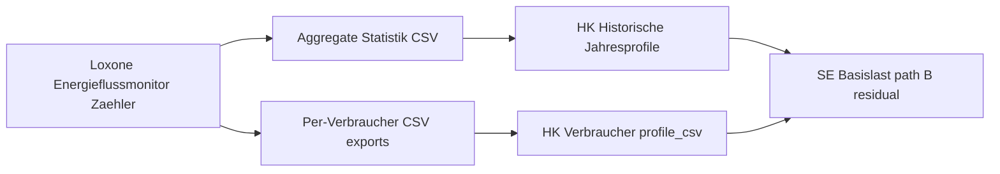

# Energieflussmonitor → Hausprofil process blueprint (Interpretation A)

**Status:** Research concluded — **A is feasible** as a setup/process blueprint (no code required for the blueprint itself).  
**Out of scope here:** Interpretation **C** (auto-create consumers + CSV paths from Loxone structure) — deferred under Version **2.4** MCP item (no official structure export today).  
**Related code/docs (already shipped):** `docs/konfiguration/verbrauchs-csv.md`, `ui/house_config_historical_csv.py`, balance / energiemonitor import, hybrid Basislast A/B.

## Goal

Give a repeatable manual workflow: configure meters in Loxone Energieflussmonitor → export CSVs → map into Hausprofil (house-level + per-Verbraucher) so Ist-vs-Modell and SE path **B** residual work as designed.

---

## 1. Mapping table

| Loxone role (Energieflussmonitor / Zähler) | Earnie Hausprofil target | Fields / notes |
| --- | --- | --- |
| **Netz** / Energieversorger | Grid series | `grid_profile_csv` (stored from Energiemonitor or Bilanz upload). Sign in Bilanz: **+** = Bezug into house, **−** = Einspeisung |
| **Erzeuger** / Produktion (PV sum) | PV yield | `pv_profile_csv`. Canonical ≥0 generation into system |
| **Speicher** / Batterie Leistung | Battery power | `battery_profile_csv`. Sign: **+** = discharge into house, **−** = charge. SOC column ignored by Earnie |
| **Verbrauch** (aggregate house load) | Total consumption | `total_profile_csv` — either column `Leistung Verbrauch [kW]` (Energiemonitor mode) **or** derived via Bilanz \(P_\mathrm{Ges}=P_\mathrm{PV}+P_\mathrm{Batt}+P_\mathrm{Grid}\) |
| **Verbraucher** (each metered device / branch) | Generic consumer | One Hausprofil consumer: `profile_csv` + `use_profile_csv` (UI: **„Von Basis-Last abziehen“**). Prefer `earnie_role` = Bekannt for pure metering; Gesteuert/Manual only if MILP/Live control applies |
| **Rest** (unmetered / unnamed load) | Residual Basislast | Not a separate consumer. With Gesamt-CSV + accounted consumer CSVs → SE **path B** = clip(total − accounted series). Without B-gate → path **A** flat `baseload_kwh/8760` |
| Verteiler / Gruppen (nested tree) | **No 1:1 nesting today** | Flatten: either one consumer per leaf meter **or** one per branch you care about. Full nesting → backlog *Version 2.+1 — nested data models* |

**Import mode chooser (house level only):**

| HK mode `historical_csv_source` | When to use |
| --- | --- |
| `energiemonitor` | One Loxone Statistik file with `Leistung Verbrauch` (+ optional Produktion / Batterie / Energieversorger). Verbrauch taken **directly** — not re-derived |
| `balance` | You have PV + Batt + Grid but no trusted Verbrauch column; Earnie derives `total_profile_csv` |
| `separate` | Hand-built or non-Loxone CSVs for Verbrauch / PV |

Per-Verbraucher CSVs always use the **single-series** Loxone layouts (Datum+Zeit+Wert / combined timestamp / optional kWh counter) — not the multi-column Energiemonitor file.

---

## 2. Step-by-step user workflow

### Phase L — Loxone Config

1. Add **Energieflussmonitor** Baustein; attach **Zähler** for Netz, Erzeuger (PV), Speicher, Gesamtverbrauch (if available), and each important Verbraucher.
2. Prefer **flat** meter list for Earnie (or decide which nest level exports as one series).
3. Let statistics run long enough for **≥8760 h** if SE with imported PV / meter residual is the goal (shorter OK for HK visual QC only).

### Phase E — Export CSVs

1. **Aggregate:** Export Energiemonitor / Statistik multi-column CSV (Verbrauch + optional Produktion, Batterie, Energieversorger).
2. **Per consumer:** Export one CSV per Zähler you will model as a Verbraucher (power kW or energy kWh counter — Earnie converts).
3. Keep originals; Earnie will write `{name}_resampled.csv` under `config/uploads/` on upload.

### Phase H — Hauskonfigurator (house)

1. Open **Historische Jahresprofile (CSV)**.
2. Choose **Loxone Energiemonitor** *or* **Bilanz** *or* **Getrennte CSVs** per mapping table above.
3. Upload; confirm QC power plot covers intended horizon; heed **&lt;12 months → SE falls back / warns** for PV and meter-based SE.

### Phase C — Hauskonfigurator (Verbraucher)

1. For each metered branch: **add generic consumer** (Bezeichnung mirrors Loxone meter name).
2. Upload `profile_csv`; enable **„Von Basis-Last abziehen“**.
3. Set `earnie_role` consciously (Bekannt vs Gesteuert/Manual) — affects SE/Live; see role table in `verbrauchs-csv.md`.
4. Leave unmetered load as Rest (no consumer) so residual stays in Basislast.

### Phase V — Verify path B (optional but recommended for SE)

Path **B** needs: `total_profile_csv` present **and** every **Gesteuert + Manuelles Gerät** generic has active CSV. Bekannt without CSV keeps energy inside residual. If any flex/manual lacks CSV → SE stays on path **A**.

---

## 3. Naming conventions (automation-ready later)

Stable names now make deferred **C** / MCP mapping easier:

| Layer | Convention | Example |
| --- | --- | --- |
| Loxone Zähler Bezeichnung | `{role}_{id}_{label}` ASCII/umlauts OK if consistent | `cons_wp_waermepumpe`, `pv_main`, `grid_main`, `batt_main` |
| Role tokens | `grid` / `pv` / `batt` / `cons` / `total` | Avoid free-text-only names for roles |
| Export filename | Same stem as Bezeichnung | `cons_wp_waermepumpe_2025.csv` |
| Earnie consumer id / Bezeichnung | Same stem as Loxone | Matches MCP structure-scan later |
| Hausprofil CSV paths | Let HK upload rename to `*_resampled.csv`; do not hand-edit mid-flight | — |

Document the convention in the user’s own Loxone notes; optional later: German doc subsection under `verbrauchs-csv.md`.

---

## 4. Gaps & caveats

| Gap | Impact | Mitigation |
| --- | --- | --- |
| Nested Verteiler/Gruppen vs flat Hausprofil | Tree ≠ Earnie consumers | Flatten consciously; nesting epic is separate (`2.+1`) |
| SE needs ≥8760 h for imported PV / meter residual | Short exports only for HK charts | Plan statistics retention before SE demos |
| Rest / double-counting | Metered branch also inside Gesamt → must subtract via checkbox | Always enable „Von Basis-Last abziehen“ for metered consumers used in residual |
| Energiemonitor vs Bilanz Verbrauch | Direct Verbrauch column can disagree with PV+Batt+Grid sum | Prefer one truth source; use Bilanz only if Verbrauch column untrusted |
| Sign convention | Wrong signs → clipped negative \(P_\mathrm{Ges}\) | Follow docs; use HK balance sign toggles if needed |
| Digital 0/1 logs | Not power | HK prompt to scale by Nennleistung on import |
| No official Loxone structure export | Blocks **C** today | Manual blueprint (this plan); revisit with MCP |

---

## 5. Docs-only vs small UX follow-ups

**Docs-only (recommended, not required to “use” the blueprint):**

- Add a short German section to `docs/konfiguration/verbrauchs-csv.md` (and a Handbuch pointer): “Von Loxone Energieflussmonitor zum Hausprofil” — mapping table + workflow phases L→V.
- Cross-link existing Energiemonitor / Bilanz / Verbraucher-CSV sections (no new product behavior).

**Small UX (optional, only if pain shows up in practice):**

- Caption/help in HK historical CSV expander: one-liner “Zähler-Rollen → Netz/PV/Batterie/Verbraucher”.
- Consumer editor hint: “Meter name = Bezeichnung” for later MCP.

**Do not implement for this plan:** auto-parse of meter trees, batch consumer create, or reading Loxone Config structure (that is **C** / 2.4 MCP).

---

## 6. Decision log

| Interpretation | Verdict | Disposition |
| --- | --- | --- |
| **A** Process / setup blueprint | Feasible | This plan |
| **B** Shareable Loxone library / naming | Partial | Naming section above; library work stays under `2.4.c` |
| **C** Auto-create consumers + CSV attach | Not officially feasible now | Deferred under Version 2.4 MCP bullet |

**MCP doc note:** Dedicated file `Entwicklungsplan\MCP-Interfacing-für-Earnie.md` was **not** found in Energy-Optimizer or Earnie-Projekt. Scope lives in `Earnie-Projekt/Entwicklungsplan/Entwicklungs-Plan-Earnie-cons.md` §3.1 (Structure Scan → LLM mapping → config write) — natural home for **C**.
