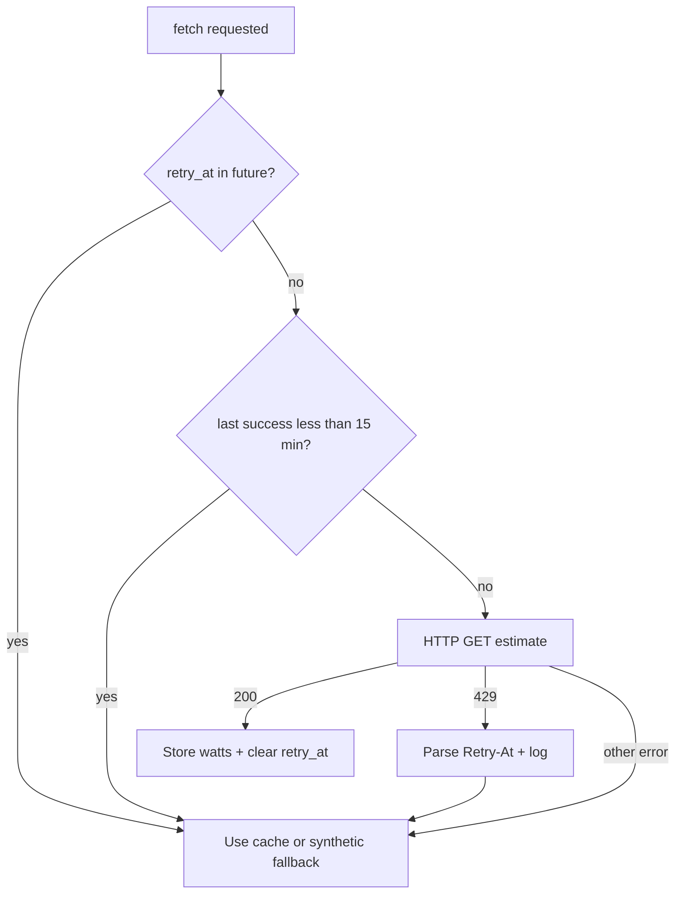

# forecast.solar Retry-At handling + main.py debug log

## Problem

[`data/pv_forecast.py`](data/pv_forecast.py) uses a fixed 15-minute in-memory cache but ignores forecast.solar rate-limit metadata. On HTTP 429 the API returns:

- Header: `X-Ratelimit-Retry-At`
- JSON: `message.ratelimit["retry-at"]` (ISO-8601, e.g. `2026-02-17T22:19:59+01:00`)

Repeated calls before that timestamp extend the ban ([forecast.solar docs](https://doc.forecast.solar/facing429)). Today the code only prints a generic HTTP error and falls back to synthetic PV; [`main.py`](main.py) has no visibility into when retry is allowed.

**Existing bug to fix in the same change:** `_LAST_API_CALL` is set **before** `requests.get()` succeeds (line 26). After a 429, the 15-minute cache still blocks further HTTP attempts even though no fresh data was stored.



## Scope

| In scope | Out of scope |
|----------|--------------|
| Parse and honor `Retry-At` on 429 | File-based / cross-process cache |
| Expose status for `main.py` logging | UI display of retry time |
| Unit tests with mocked responses | `version.py` bump (ask user separately) |
| Fix `_LAST_API_CALL` only-on-success | Changing optimization behavior on fallback |

Optimization continues with cache or synthetic fallback (current behavior); only API call discipline and logging improve.

## Implementation

### 1. Extend [`data/pv_forecast.py`](data/pv_forecast.py)

Add module state (alongside existing `_LAST_API_CALL` / `_CACHED_HOURLY_WATTS`):

- `_RATE_LIMIT_RETRY_AT: datetime | None` — parsed from last 429
- `_LAST_FETCH_SOURCE: str` — one of `"api"`, `"cache"`, `"rate_limited"`, `"fallback"` (for logging)

**New helpers (small, testable):**

- `_parse_retry_at(response) -> datetime | None` — try `X-Ratelimit-Retry-At`, then JSON `message.ratelimit.retry-at`; parse with `datetime.fromisoformat`
- `get_api_status() -> dict` — public read-only snapshot:
  - `retry_at` (ISO string or `None`)
  - `source` (last fetch source)
  - `cache_available` (bool)
  - `using_synthetic_fallback` (bool; true when last vector came from seasonal fallback)

**Refactor `_check_and_fetch_api_data`:**

1. If `_RATE_LIMIT_RETRY_AT` and `now < retry_at`: skip HTTP; set source `"rate_limited"`; return `_CACHED_HOURLY_WATTS` (may be `None`)
2. If 15-min cache valid (based on **last successful** API call): skip HTTP; source `"cache"`
3. Otherwise HTTP GET (do **not** set `_LAST_API_CALL` yet)
4. On **200**: store watts, set `_LAST_API_CALL = now`, clear `_RATE_LIMIT_RETRY_AT`, source `"api"`
5. On **429**: parse retry-at, store in `_RATE_LIMIT_RETRY_AT`, log via `print` (keep existing style) including retry-at timestamp; source `"rate_limited"`; return cache if any
6. On other errors: existing fallback path; do not update `_LAST_API_CALL`

**Update `get_hourly_pv_forecast_for_hours`:** after building the vector, set `_LAST_FETCH_SOURCE` to `"fallback"` when seasonal fallback is used.

Keep existing `[OK]` / `[info] Synthetischer PV-Fallback` prints unchanged for terminal grep compatibility (debug handoff relies on them).

### 2. Log in [`main.py`](main.py)

After `build_live_planning_matrix(...)` (~line 104–106), read status and emit structured logger output:

```python
from data import pv_forecast

status = pv_forecast.get_api_status()
if status["retry_at"]:
    logger.warning(
        "forecast.solar Rate-Limit (HTTP 429): Nächster API-Aufruf erlaubt ab %s "
        "(PV-Quelle: %s, Cache: %s).",
        status["retry_at"],
        status["source"],
        "ja" if status["cache_available"] else "nein",
    )
elif status["using_synthetic_fallback"]:
    logger.warning(
        "forecast.solar: Synthetischer PV-Fallback aktiv (keine API-Daten)."
    )
```

Use `logger.warning` so it appears at default INFO root level and is easy to spot during debug. No change to `run_state` payload unless you later want UI exposure.

Call site stays in `main()` only — `profile_manager` remains unchanged (single import path via existing `pv_forecast` call inside matrix build).

### 3. Tests — new [`tests/test_pv_forecast.py`](tests/test_pv_forecast.py)

Use `unittest.mock.patch("data.pv_forecast.requests.get")` and reset module globals in fixtures (similar pattern to other tests in the repo).

| Test | Assert |
|------|--------|
| 429 with `X-Ratelimit-Retry-At` header | `get_api_status()["retry_at"]` parsed; no HTTP on immediate second call while retry-at in future |
| 429 with JSON body only | same via `message.ratelimit.retry-at` |
| 200 after 429 | `retry_at` cleared; `_LAST_API_CALL` updated |
| Failed request (429/timeout) | `_LAST_API_CALL` **not** updated (regression for existing bug) |
| 15-min cache | second call within 15 min skips HTTP without hitting retry-at |

Patch `config.get` / `config.get_global_timeout` minimally so URL construction works.

### 4. Backlog (optional, at session end)

Add open item to [`backlog/Backlog-Bugfixes.md`](backlog/Backlog-Bugfixes.md):

> **forecast.solar 429 Retry-At** — respect `X-Ratelimit-Retry-At`; log in main.py for debug

Move to **Verifications Pending** after implementation.

## Verification (manual)

1. Mock or trigger 429 (rapid restarts during debug): confirm `main.py` log shows `Nächster API-Aufruf erlaubt ab …`
2. Wait until after retry-at (or mock time): confirm `[OK] PV-Vektor nach Tuning` returns
3. Run `pytest tests/test_pv_forecast.py -q`

## Files touched

- [`data/pv_forecast.py`](data/pv_forecast.py) — core logic (~60–80 LOC net)
- [`main.py`](main.py) — ~10 LOC logging after matrix build
- [`tests/test_pv_forecast.py`](tests/test_pv_forecast.py) — new file (~80–100 LOC)

No changes to `build/lib/` (generated/stale copy).
