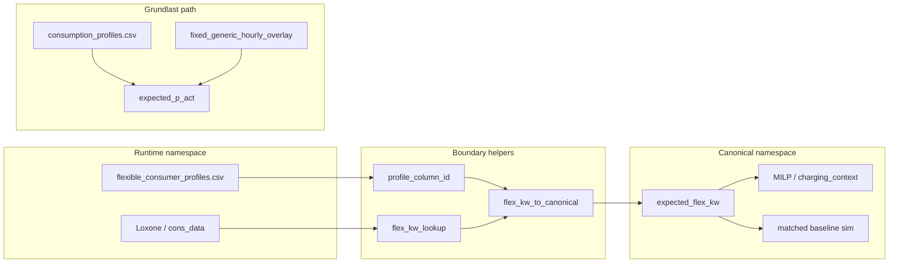

# runtime_consumer_id Bridging + Live Fixed-Generic Grundlast

## Context

Two related gaps block accurate live optimization on NAS (1.98.x):

1. **ID bridging bug** (from chart-debug analysis): `expected_flex_kw` and live flex lookups use mixed **runtime keys** (`eauto`) vs **canonical keys** (`ev`). MILP, charging context, baseline simulation, and target aggregation only read canonical keys → silent zeros → inflated SoC BL Ziel and broken savings.
2. **Backlog feature** ([`backlog/Backlog.md`](backlog/Backlog.md) L49–51): fixed-start generic consumers (`start_shift_h=0`, e.g. daily `runs_per_week=7`) must be added to **Grundlast** in live optimization. Logic already exists in [`house_config/planning_flex_bridge.py`](house_config/planning_flex_bridge.py) but is **skipped** in live when `config.json` has `flexible_consumers`:

```169:175:data/profile_manager.py
def _apply_house_profile_baseload_overlay(...):
    """Hausprofil-Overlay auf Grundlast (Greenfield ohne flexible_consumers)."""
    if config.CONFIG._raw_config.get("flexible_consumers"):
        return baseload
```

**User decision:** enable **`fixed_generic_hourly_overlay` only** (not full thermal overlay) to avoid double-counting MILP thermal consumers (SwimSpa, WP).

---

## Architecture (target state)



---

## Phase A — Central ID bridging (bugfix)

### A1. Shared helpers in [`settings/flexible_consumers.py`](settings/flexible_consumers.py)

Extract and centralize the pattern already used in [`ui/sankey.py`](ui/sankey.py):

- `flex_kw_lookup(flex, consumer) -> float` — try `runtime_consumer_id`, then `consumer["id"]`
- `flex_kw_to_canonical(flex, consumers) -> dict[str, float]` — map any mixed dict to canonical keys
- `profile_column_id(consumer) -> str` — CSV column lookup: `runtime_consumer_id` first, fallback to `id`

No behavior change inside MILP modules (they stay canonical-only).

### A3. Live snapshot boundary — [`data/live_consumption.py`](data/live_consumption.py)

In `apply_live_snapshot_to_matrix()`:

- After building snapshot, normalize: `row["expected_flex_kw"] = flex_kw_to_canonical(snapshot["flex_kw"], config.get_flexible_consumers())`
- Ensures hour-0 matrix row uses canonical keys before MILP/charging/baseline

### A4. Charging & immediate-charge — [`optimizer/charging_context.py`](optimizer/charging_context.py), [`optimizer/charge_immediate.py`](optimizer/charge_imarge.py)

Replace bare `.get(cid)` on live flex dicts with `flex_kw_lookup`:

- `resolve_charging_contexts()` — `live_kw` lookup
- `apply_immediate_charge_to_matrix()` — pop/adjust flex by canonical id (also check runtime key when removing legacy entries)
- `apply_immediate_charge_chart_display()` — live flex for hour 0
- `live_flex_kw_from_matrix()` — return canonical dict (normalize on read)

Alternative: normalize once at start of `prepare_optimization_matrix()` — either approach is fine; pick one entry point to avoid scattered fixes.

### A5. Delivery & remaining kWh — [`optimizer/__init__.py`](optimizer/__init__.py)

In `get_consumer_remaining_kwh()` / `register_consumer_delivery()`:

- Use `flex_kw_lookup` for `live_flex_kw` reads

### A6. Target & baseline aggregation

Use `flex_kw_lookup` or canonical normalization when summing matrix flex:

- [`data/consumer_targets.py`](data/consumer_targets.py) — `resolve_horizon_flex_targets_kwh`, historical row sums
- [`optimizer/simulation.py`](optimizer/simulation.py) — `build_matched_flex_kw_per_hour` (read side only; matrix should already be canonical after A3)

Optional follow-up (lower priority, separate if scope grows): backtesting `HistoricalDataCache.get_window_consumption` mapping when canonical `flex_consumer_ids` meet runtime cons_data columns.

### A7. Hardcoded legacy keys

Audit and fix remaining `"eauto"` hardcodes (e.g. `immediate_charging_labels_from_main_state`) to use consumer config + lookup helper.

---

## Phase B — Fixed-start generic → Grundlast (backlog feature)

### B1. Enable overlay in live path — [`data/profile_manager.py`](data/profile_manager.py)

Refactor `_apply_house_profile_baseload_overlay()`:

1. **Remove** the early return when `flexible_consumers` is present
2. Load `_house_profile` from `config.get_resolved_runtime_settings()` (same as today)
3. Call **`fixed_generic_hourly_overlay(profile, target_hours)`** only (per user choice)
4. Add overlay to CSV baseload: `expected_p_act = baseload + fixed_generic_kw`

Do **not** call `thermal_hourly_overlay` here — SwimSpa/WP stay MILP-flex.

### B2. Selection rule (already implemented)

Consumers included when:

- `type == "generic"` with `schedule`
- `is_fixed_start(start_shift_h)` → `start_shift_h <= 0` ([`house_config/generic_schedule.py`](house_config/generic_schedule.py))

This covers backlog’s “7 Läufe pro Woche + fixed start” as the common daily case; no extra `runs_per_week == 7` filter needed (existing split logic is correct).

### B3. Double-counting guard

- Fixed generics (`waschmaschine`, `kochen`, …) are **not** in [`flexible_consumer_profiles.csv`](runtime/flexible_consumer_profiles.csv) → no flex-profile conflict
- They are **excluded** from MILP flex via `split_planning_generic_consumers()` → no MILP double-count
- Live snapshot hour 0: measured `baseload_kw = house - flex_live` remains correct; overlay applies to forecast hours only (same as current CSV baseload path)

### B4. UI / main parity

Both entry points use `profile_manager.build_live_planning_matrix()` — no separate change needed in [`main.py`](main.py) or [`ui/live_mode.py`](ui/live_mode.py) beyond what A3/B1 provide.

---

## Phase C — Tests

| Test | File | Asserts |
|------|------|---------|
| CSV legacy column → canonical matrix flex | `tests/test_profile_manager_flex_bridge.py` (new) | `ev`/`legacy_id=eauto` reads `eauto` CSV column |
| Live snapshot canonicalization | extend `tests/test_live_consumption.py` | snapshot `{eauto: 1.4}` → matrix `expected_flex_kw["ev"] == 1.4` |
| Charging context live flex | extend `tests/test_charge_immediate.py` or `tests/test_charging_context.py` | runtime-keyed live dict resolves for canonical consumer |
| Matched baseline non-zero flex | extend `tests/test_matched_baseline.py` | matrix with canonical flex → matched baseline SOC lower than zero-flex |
| Fixed generic Grundlast live | `tests/test_profile_manager_baseload_overlay.py` (new) | with `flexible_consumers` present + fixed generic in house profile → `expected_p_act` increased at scheduled hour |
| Regression guard | snapshot test | overlay **not** applied when `start_shift_h > 0` |

Reuse house profile fixtures from [`tests/test_thermal_flex_bridge.py`](tests/test_thermal_flex_bridge.py) / [`tests/test_cons_data_calendar_alignment.py`](tests/test_cons_data_calendar_alignment.py) where possible.

---

## Phase D — Verification & backlog

1. **Re-run chart-debug comparison** against dumps in `chart_debug_review/` — expect 1.98.x matched baseline SoC closer to 1.24.3 (flex competition restored)
2. **Manual:** configure a generic with `runs_per_week: 7`, `start_shift_h: 0`, confirm Chart 1 Grundlast step at `start_hour` in plan zone
3. Update [`backlog/Backlog-Bugfixes.md`](backlog/Backlog-Bugfixes.md) — add SoC BL Ziel / flex-profile regression item (from prior analysis)
4. Move backlog L49–51 to done in [`backlog/Backlog-Erledigt.md`](backlog/Backlog-Erledigt.md) after verification
5. User doc (German, if behavior visible): brief note in [`docs/konfiguration/flexible-verbraucher.md`](docs/konfiguration/flexible-verbraucher.md) that fixed-start generics are included in Grundlast during live optimization

**No `version.py` change** without explicit user approval.

---

## Suggested implementation order

1. A1 helpers (foundation)
2. A2 + A3 (matrix inputs — highest impact for SoC BL Ziel)
3. A4 + A5 (charging/delivery)
4. A6 + A7 (aggregation cleanup)
5. B1 fixed-generic Grundlast
6. Phase C tests throughout (TDD per sub-phase)
7. Phase D verification

Estimated diff: ~200–350 LOC across 6–8 files; keep each commit scoped (bridge vs Grundlast).
