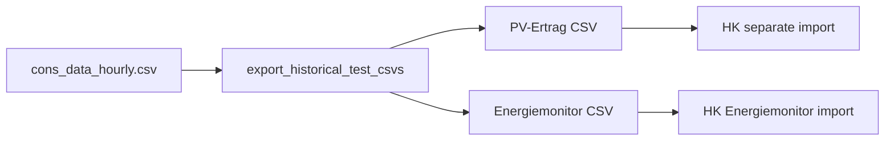

# Add P8 test-export script to Import historical Data plan

Update [`import_historical_data_8fa43e12.plan.md`](.cursor/plans/import_historical_data_8fa43e12.plan.md) only (no code yet until you approve). P5–P7 stay completed; add **P8** for backlog lines 42–44.

## Locked decision (P8)

- **Source:** [`runtime/cons_data_hourly.csv`](runtime/cons_data_hourly.csv) (`pv_kw`, `total_kw`) — Live SE input via `path_cons_data`, not `backtesting_hourly.csv` (no PV column).
- **Outputs (import-compatible, not canonical):**
  1. **PV-Ertrag:** `Datum/Uhrzeit;Leistung Produktion [kW]` (`;`, German `,` decimals) — matches separate-PV import / [`Historical-Data`](Historical-Data/) samples.
  2. **Energiemonitor:** only relevant columns — `Datum;Zeit;Leistung Produktion [kW];Leistung Verbrauch [kW]` (no Energieversorger / Batterie / SOC / Zähler).
- **CLI:** new [`scripts/export_historical_test_csvs.py`](scripts/export_historical_test_csvs.py) — args: `--cons-data` (default from config), `--out-dir`, optional `--from` / `--to`. Require ≥8760 h after filter or fail clearly.
- **Scope:** export helper only; no SE engine changes; no SOC; no auto-upload into Hauskonfigurator.

## Edits to the plan file

1. **Frontmatter:** extend `overview`; add todo `p8-export-test-csvs` (pending).
2. **Body:** new section **P8 — Test CSVs from Live cons_data** with the above; note backlog 2.+1 checkbox for this item.
3. **Out of scope:** keep SOC / grid / battery columns; do not persist PV into `backtesting_hourly.csv`.

## Implementation notes (for when P8 is executed)

- Read via existing [`data/cons_data_store.py`](data/cons_data_store.py) `load_cons_data`.
- Write Loxone-shaped rows (dd.mm.YYYY + HH:MM:SS); reuse patterns from [`data/energiemonitor_csv.py`](data/energiemonitor_csv.py) headers, not `write_canonical_hourly_csv`.
- Smoke: export → `normalize_profile_csv_file` / `import_energiemonitor_to_canonical` round-trip (small test or script docstring example).
- One short note in [`docs/konfiguration/verbrauchs-csv.md`](docs/konfiguration/verbrauchs-csv.md) that this script exists for local import tests.