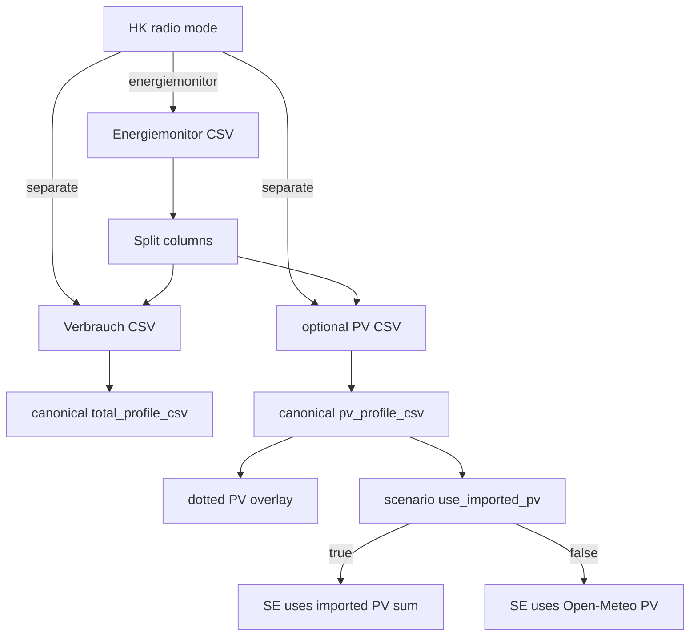

# Import historical Data (Backlog 2.+1)

Continues after completed CSV profiles work ([`csv_historical_profiles_bc091247.plan.md`](.cursor/plans/csv_historical_profiles_bc091247.plan.md) P0–P4). **SOC import/plotting is out of scope** (ignore `Ladestand Batterie`; no SOC CSV UI).

## Locked decisions

- House-level UI only (expand today’s **Jahres-Verbrauchs-CSV** section in [`ui/house_config_profile_form.py`](ui/house_config_profile_form.py)); per-consumer CSV block unchanged.
- Radio: **separate CSVs** (Verbrauch mandatory, PV-Ertrag optional) **or** **Energiemonitor** (one multi-column file).
- Ignore `Leistung Energieversorger` and `Leistung Batterie`.
- Imported PV is one **house-total** series (summary of all PV systems).
- When a scenario sets `use_imported_pv: true`, SE/MILP uses that series instead of weather-modeled PV **sum**; Open-Meteo weather remains for thermal models.
- Flag lives in **scenario `settings`**, edited in Scenario Editor; SE run + results show an explicit notice when any scenario uses it.
- Always plot imported PV as **dotted** overlay (same yellow as calculated PV) when `pv_profile_csv` is set — independent of the calc flag.

## P5 — Parser, schema, Hauskonfigurator UI

### Energiemonitor multi-column loader

New helper (prefer sibling of [`data/loxone_csv_timeseries.py`](data/loxone_csv_timeseries.py) or extend it carefully — do **not** use “last column” fallback):

- Read `;` + German decimals; split `Datum`+`Zeit` (reuse existing timestamp helpers).
- Select by header name (normalize whitespace/`[%]`):
  - `Leistung Verbrauch [kW]` → load series
  - `Leistung Produktion [kW]` → load series (optional; missing → no PV path)
- Resample each to 1h mean; run through existing [`normalize_hourly_power_kw`](house_config/consumption_csv.py) (≥8760 h, W→kW, sign).
- Write two canonical files under `config/uploads/` via existing save helpers.

### House profile schema

In [`house_config/profiles_store.py`](house_config/profiles_store.py) (+ serialize):

| Key | Meaning |
|-----|---------|
| `total_profile_csv` | unchanged — Verbrauch |
| `pv_profile_csv` | optional path to canonical hourly PV kW |
| `historical_csv_source` | `"separate"` \| `"energiemonitor"` (UI mode) |

### UI — rename/expand `_render_consumption_csv_section`

- Title/caption: historical Jahresprofile; explain both modes (German).
- `st.radio`: separate vs Energiemonitor.
- **Separate:** Verbrauch upload/path (required for Ist-vs-Modell); optional PV-Ertrag upload/path + clear.
- **Energiemonitor:** single uploader; on success set both paths (PV only if column present); clear resets both + mode.
- Keep existing Ist-vs-Modell validation for Verbrauch.
- Extract helpers if the section grows past LOC limits.

### Docs / tests

- Update [`docs/konfiguration/verbrauchs-csv.md`](docs/konfiguration/verbrauchs-csv.md) (Energiemonitor columns used, PV optional, SOC not supported).
- Tests: multi-column split, missing Produktion, wrong format rejection, ≥12 months; fixture derived from [`Historical-Data/Energiemonitor - Zentral.csv`](Historical-Data/Energiemonitor%20-%20Zentral.csv) pattern (extend length in test fixture — sample file is short).

## P6 — Scenario flag + SE calculation + notices

### Scenario Editor

- Add checkbox near Hausprofil/PV in [`ui/pages/page_scenario_editor.py`](ui/pages/page_scenario_editor.py) (wire through [`ui/scenario_form_helpers.py`](ui/scenario_form_helpers.py) normalize/snapshot):
  - Label e.g. “Importiertes PV-Profil statt Wetter-PV nutzen”
  - Enabled only when resolved house profile has non-empty `pv_profile_csv`; else caption that no PV CSV is configured.
- Persist `settings.use_imported_pv` (bool, default `false`).
- Schema: [`config/backtesting_scenarios.schema.json`](config/backtesting_scenarios.schema.json).

### SE engine

- Resolution already attaches `_house_profile` / `_planning_pv_systems` via [`house_config/scenario_resolution.py`](house_config/scenario_resolution.py).
- In [`simulation/engine.py`](simulation/engine.py) `HistoricalDataCache.get_pv_for_slots` (and any `pv_kw_for_slots` / synthetic cons_data path used by SE): if `scenario_params["use_imported_pv"]` and house profile has `pv_profile_csv`, return hourly values from that CSV aligned to slots (lookup by timestamp / doy-hour mirror like other profile CSVs); else keep Open-Meteo path.
- Imported series replaces **aggregate** PV for that scenario (not split per PV system).
- Record in SE log **meta** which scenario IDs used imported PV (for results UI).

### Notices

- **During calculation** ([`ui/backtesting.py`](ui/backtesting.py) run controls / status): if any selected scenario has the flag and a PV CSV, show info caption listing those scenario labels.
- **Results**: persistent notice (e.g. above charts/summary) when meta says imported PV was used — list scenario labels; if flag set but CSV missing, show warning and fall back to weather PV.

## P7 — Chart overlays (dotted imported PV)

- Extend [`ConsumptionSeriesBundle`](ui/consumption_display/types.py) with optional `pv_imported: list[float] | None`.
- Adapters ([`ui/consumption_display/adapters.py`](ui/consumption_display/adapters.py)): when house profile has `pv_profile_csv`, load/align series into the bundle (HK modeled + SE cons_data displays).
- [`stacked_monthly_chart`](ui/consumption_display/charts.py) / [`timeseries_chart`](ui/consumption_display/charts.py): add dotted line (`dash="dot"`), same color as calculated PV (`_pv_yellow` / existing PV color), legend e.g. “PV importiert”.
- Keep weather/modeled PV lines as today; imported is **additional**.

## Out of scope

- SOC / `Ladestand Batterie` import or plots.
- Using `Leistung Energieversorger` / `Leistung Batterie`.
- Changing `version.py` (ask separately if a release is desired).
- Replacing live Loxone logger → `cons_data` pipeline.
