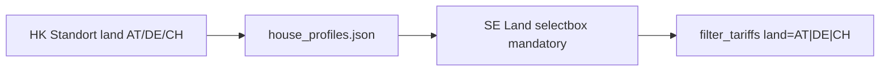
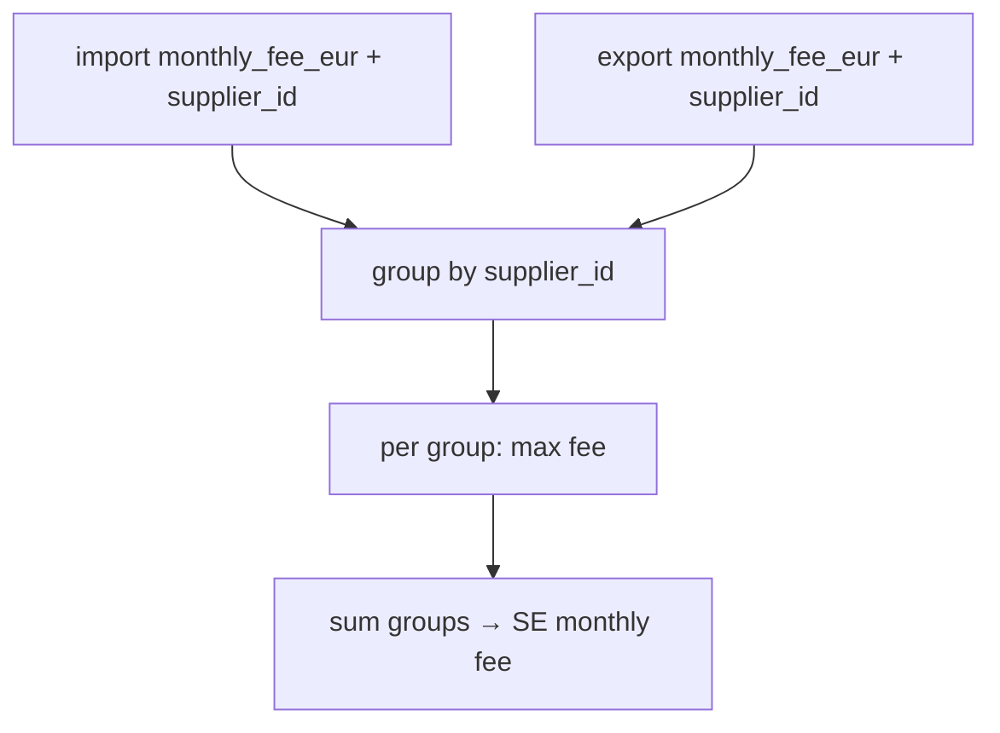

# 2.3 — Mandatory Land + supplier_id monthly fees

Decisions locked: **1A** (explicit `land` on house profile; SE seeded from it; no geo auto-detect), **2A** (`max` once per `supplier_id`), field name **`supplier_id`**.

## `earnie_data_model` — no bump

**Do not** raise `CURRENT_DATA_MODEL` (stays **3**).

Past bumps were **breaking/structural** (v2: move OeMAG shared keys between files; v3: rename `scenario_explorer_conf` + drop path keys). Additive optional fields stay on the same model — same pattern as `monthly_fee_eur` (added on model 3 without a new version).

- Profile `land`: soft-default `AT` when missing in [`profiles_store`](house_config/profiles_store.py); old packs still load.
- Tariff `supplier_id`: **required** in schema and seeded catalogs; legacy packs soft-filled once on normalize (no model bump).
- Schema `const: 3` unchanged; no new bootstrap migrator beyond normalize defaults / soft-fill.

## Part A — Mandatory Land (HK → SE)

### Data model
- Add required-for-new-profiles field `land` enum `AT` | `DE` | `CH` to [`share/config/house_profiles.schema.json`](share/config/house_profiles.schema.json) (and mirrored env schemas if present).
- Persist in [`house_config/profiles_store.py`](house_config/profiles_store.py) normalize/save path alongside lat/lon/timezone.
- HK Standort UI in [`ui/house_config_profile_form.py`](ui/house_config_profile_form.py) `_render_location_fields`: selectbox Land (AT/DE/CH), default `AT` for new profiles / missing field (migration-friendly, not derived from lat/lon).

### SE filter behavior
- In [`ui/tariff_filter_helpers.py`](ui/tariff_filter_helpers.py) / [`ui/pages/page_scenario_editor.py`](ui/pages/page_scenario_editor.py):
  - Remove **Alle** from the Land selectbox options.
  - Seed widget from selected house profile’s `land` when scope loads / profile changes (override session default).
  - Keep user override in session for that editor session, but never allow empty/Alle.
  - `filter_tariffs` always receives a concrete land string.
- If scenario has no profile yet: still require a land pick (default `AT`); caption can note that HK should set Land on the profile.

### Docs / tests
- Update German user docs that describe the Land filter ([`docs/konfiguration/preise.md`](docs/konfiguration/preise.md) / overview if it mentions Alle).
- Tests: profile save/load includes `land`; SE filter helpers reject Alle / always filter by land; scenario editor seed from profile (extend [`tests/test_tariff_filter_helpers.py`](tests/test_tariff_filter_helpers.py), house-config/planning tests as needed).

---

## Part B — required `supplier_id` + fee once per supplier

### Schema + catalog
- Add **required** `supplier_id` (non-empty string slug) to `dach_common` in [`share/config/tariffs.schema.json`](share/config/tariffs.schema.json) (+ env mirrors). Include it in the schema `required` list for tariff objects (alongside `id` / `label` / `land` as applicable).
- [`house_config/tariffs_store.py`](house_config/tariffs_store.py) `_normalize_dach_fields`: copy and **validate** `supplier_id` (strip; reject empty). No silent omit.
- **Seed every** import/export row in [`share/config/tariffs.json`](share/config/tariffs.json) (and env / example / fixture catalogs used in SE/tests). One stable slug per Stromlieferant; no tariff without `supplier_id`.
  - Legacy same-supplier pairs must share an ID, e.g. `awattar_at` + `dynamic_epex` (+ `monthly_sunny_web_recherche` if same) → `awattar_at`; DE aWATTar → `awattar_de`; Tibber → `tibber_de`; etc.
  - Extend [`tools/convert_dach_tariffs.py`](tools/convert_dach_tariffs.py) `_common_fields` to **always** emit `supplier_id` from `stromlieferant` slug.
- Legacy packs missing the key: soft-fill once during normalize from a deterministic slug of the label prefix / known ID map, then persist on next tariffs write (keeps `earnie_data_model` at 3). After normalize, specs always carry `supplier_id`.
- Show `supplier_id` in tariff filter/preview where useful ([`ui/tariff_filter_helpers.py`](ui/tariff_filter_helpers.py)) — optional small display column, not a new filter axis.

### SE cost rule
Change [`simulation/monthly_fees.py`](simulation/monthly_fees.py) `monthly_fee_eur_from_specs`:

- Read `monthly_fee_eur` + **`supplier_id`** from import and export specs (always present after normalize).
- Group by `supplier_id`.
- **Within group:** `max(fees present)`.
- **Across groups:** sum.
- Result: aWATTar import+export `4.79+4.79 → 4.79`; VKW import + OeMAG export → import fee only (OeMAG usually 0).
- No “missing supplier → unique synthetic key” path in fee logic; if a spec somehow lacks `supplier_id`, raise a clear error (defensive).

No change to hourly `sim_cost` / MILP; still only `_build_summary` totals in [`simulation/backtesting_log.py`](simulation/backtesting_log.py).

### Docs / tests
- Update [`docs/referenz/tarife-quellen.md`](docs/referenz/tarife-quellen.md) §4 and [`docs/konfiguration/preise.md`](docs/konfiguration/preise.md): required `supplier_id`; once per supplier, `max` within group.
- Rewrite [`tests/test_monthly_fees.py`](tests/test_monthly_fees.py): same-supplier max; different-supplier sum; assert normalize / schema reject empty missing after soft-fill path; fixture tariffs all include `supplier_id`.

---

## Out of scope
- Reverse-geocoding / lat-lon → country.
- Invoice-grade billing / proration.
- Making Land filter part of scenario JSON payload (stays UI + profile-driven).
- Wiring unwired `planning_tariff_form` Land filter (unless needed for HK tariff tab consistency — only add Land on Standort, not a second filter there).

## Backlog IDs
Treat as open 2.3 items (lines 22–24); after implementation move checked items to [`backlog/Backlog-Erledigt.md`](backlog/Backlog-Erledigt.md) with date.