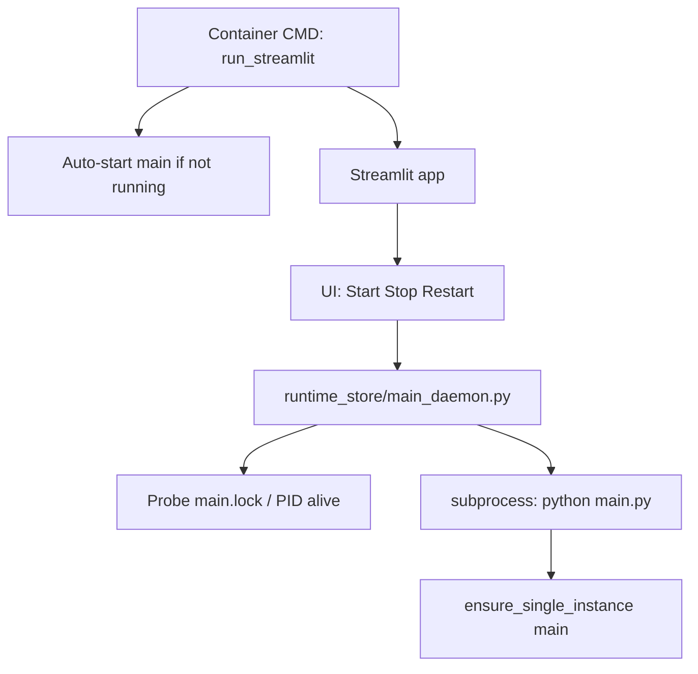

# Make main.py controllable from Streamlit (lifecycle + single container)

## Decisions (locked)

- **Controls:** start / stop / restart only (no “run now”)
- **Deploy:** one container; Streamlit entrypoint supervises `main.py` as a child process

## Current state

- Two compose services share one image: `optimizer-worker` (`python main.py`) + `optimizer-ui` (`scripts.run_streamlit`) — e.g. [docker/compose/dev.yml](docker/compose/dev.yml)
- UI only observes files (`optimizer_run_state.json`); never starts/stops the worker
- Already-running protection exists: [runtime_store/single_instance.py](runtime_store/single_instance.py) → `runtime/main.lock` (PID inside), used only by `main.py` at startup
- Closest UI subprocess pattern: [ui/backtesting_runner.py](ui/backtesting_runner.py)

## Target architecture

- **Production/Docker:** single service exposes UI port; on process start, launcher auto-starts `main.py` if lock free (daemon runs without opening a browser).
- **Dev (venv / VS Code):** still allow external `python main.py`; UI Start refuses if lock held; Stop may terminate the PID from the lock (same process identity).
- **No Docker socket.** Control is always local subprocess + lock/PID.

## Implementation

### 1. Daemon supervisor module

New [runtime_store/main_daemon.py](runtime_store/main_daemon.py) (shared by launcher + UI):

| API         | Behavior                                                                                                                                                                                                                  |
| ----------- | ------------------------------------------------------------------------------------------------------------------------------------------------------------------------------------------------------------------------- |
| `status()`  | `running` / `stopped` / `unknown`; PID from lock if present; whether process is alive (Windows/`os.kill(pid,0)` pattern)                                                                                                  |
| `start()`   | If lock held or PID alive → raise clear error (“already running, PID …”); else `Popen([python, main.py], cwd=project_root, env=…)` with stdout/stderr to existing logging path or inherit; wait briefly and re-check lock |
| `stop()`    | Resolve PID from lock (or last supervised PID); graceful terminate → wait → kill if needed; confirm lock released                                                                                                         |
| `restart()` | `stop()` then `start()`                                                                                                                                                                                                   |

Reuse lock semantics from [runtime_store/single_instance.py](runtime_store/single_instance.py). Add a **read-only probe** helper there (e.g. `probe_instance("main")` → busy?, pid?) so UI/supervisor never take the lock themselves.

Do **not** keep a long-lived `Popen` only in `st.session_state` as source of truth — Streamlit reruns and multi-session would break. Source of truth = lock file + PID liveness.

### 2. Launcher auto-start

Extend [scripts/run_streamlit.py](scripts/run_streamlit.py) (or thin wrapper it calls):

- Before `streamlit run`: if `EARNIE_AUTO_START_MAIN` is unset/true (default **on** in Docker via compose env; default **off** for local VS Code so debug launches of `main.py` stay exclusive), call `start()` when status is stopped.
- Keep separate VS Code “main.py” configs working when auto-start is off.

### 3. Streamlit UI

Add a control panel under **Echtzeit-Umgebung** (always available once planning unlocks — not gated behind Betrieb):

- Prefer a compact block on [ui/pages/page_loxone_debug.py](ui/pages/page_loxone_debug.py) **or** a small new page `page_daemon.py` “Optimierer-Dienst” registered in [ui/navigation.py](ui/navigation.py) — **choose new page** so Live-Konfiguration stays config-only and Loxone-Kommunikation stays marker-focused.
- Show: status, PID, last `completed_at` from `optimizer_run_state.json` (existing sync helpers).
- Buttons: Start / Stop / Restart with disabled states from `status()` and explicit error messages on conflict.
- No Loxone writes from these buttons.

### 4. Docker / compose collapse

- [docker/Dockerfile](docker/Dockerfile): `CMD ["python", "-m", "scripts.run_streamlit"]` (entrypoint bootstrap unchanged).
- All compose files ([dev.yml](docker/compose/dev.yml), [synology.yml](docker/compose/synology.yml), [proxmox.yml](docker/compose/proxmox.yml), [loxberry.yml](docker/compose/loxberry.yml), [greenfield.yml](docker/compose/greenfield.yml)): **one** service (e.g. `earnie` / keep name `optimizer-ui` only if less churn — prefer rename to `earnie` with note in docs). Volumes `config`+`runtime`, port 8501, `EARNIE_AUTO_START_MAIN=1`, `restart: unless-stopped`.
- Remove `optimizer-worker` service; update restart comments (“restart container” instead of “restart worker”).

### 5. Docs (German user docs + German README)

Update in the same change set:

- [docs/einrichtung/betrieb.md](docs/einrichtung/betrieb.md) — one process model in Docker; UI can start/stop daemon; lock check
- [docs/einrichtung/container.md](docs/einrichtung/container.md), greenfield/proxmox/ports docs — single service
- [docs/user-manual/Benutzer-Handbuch-Earnie.md](docs/user-manual/Benutzer-Handbuch-Earnie.md) — UI can manage daemon lifecycle; still only `main.py` writes Loxone
- [README.md](README.md) — mark roadmap item done / describe unified container
- [backlog/Backlog.md](backlog/Backlog.md) — move item to Erledigt when implemented (at session end / when you ask)

### 6. Tests

- Unit tests for probe/start-conflict/stop with mocked lock + fake PID (no real MILP).
- Optional: supervisor start with a short-lived stub script instead of full `main.py`.

## Out of scope

- “Run optimization now” / wake event trigger from UI
- Merging MILP into the Streamlit process
- Docker API / socket control
- Changing `version.py` (ask separately if a release is desired)

## Acceptance

- From Streamlit: Start when stopped → `main.lock` held and cycles appear in `earnie.log` / run state
- Start when already running (UI-started or external) → clear error, no second process
- Stop → process ends, lock released; Cockpit shows `main_down` / stale behavior as today
- Restart works
- Compose up → one container; UI reachable; daemon running without opening UI (auto-start)
- Local VS Code dual-debug still works with auto-start off

