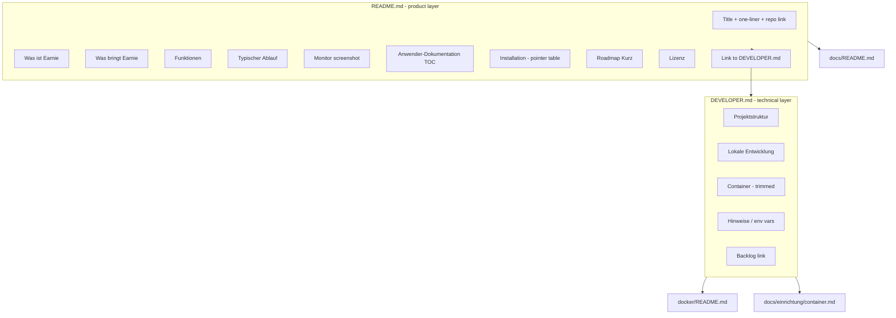

# Version 2.0 — README expansion plan

## Goal

Fulfill backlog item at [backlog/Backlog.md](backlog/Backlog.md) line 24: a **product-first** root README that orients operators and visitors, routes them to [docs/README.md](docs/README.md) for setup/config, and moves technical content out of the way.

## Scope decisions (confirmed)

| Decision | Choice |
|----------|--------|
| Developer content | New [DEVELOPER.md](DEVELOPER.md); README links to it |
| Screenshot | One Monitor (Sunset-2-Sunset) image in product section |
| Language | German for product prose; paths/commands/identifiers verbatim |
| User docs | No rewrite of `docs/einrichtung/*`; link-only from README |
| Version bump | None unless you approve separately |

## Target document layout

## File changes

### 1. Rewrite [README.md](README.md) — product sections

Replace all `!Kapitel…` / `!User…` / `!Stark…` / `!Technische…` placeholders (lines 6–16, 25) with concrete German content.

**Sections to add (in order):**

1. **One-liner** — expand current line 3 into outcome-focused sentence (PV + Speicher + flexible Verbraucher, 15-min Takt, Loxone, Streamlit).
2. **Was ist Earnie?** — 3 short paragraphs: target audience, what the optimizer does (24h plan, prices/PV/SOC), split `main.py` vs Streamlit roles (align with [docs/einrichtung/betrieb.md](docs/einrichtung/betrieb.md)).
3. **Was bringt Earnie?** — 5–6 outcome bullets (cost, storage, flex devices, transparency/S-2, scenario what-if, Loxone-native).
4. **Funktionen** — grouped bullets (Optimierung, Verbraucher inkl. `earnie_role` known/flex/manual, UI pages, Betrieb). Use current terminology: **Monitor / Sunset-2-Sunset**, **Scenario-Exploration** — not legacy “Echtzeit/Historisch”.
5. **Typischer Ablauf** — numbered 7-step operator journey (prerequisites → deployment choice → config → verify → `main.py` → Streamlit → tuning). Each step links to the matching doc page; **no** full command blocks except the single verify hint if needed.
6. **Screenshot** — `` with one-line caption.
7. **Anwender-Dokumentation** — compact link tree mirroring [docs/README.md](docs/README.md) TOC (Einrichtung / Konfiguration / UI / Referenz); keep existing pointer to `docs/README.md` as primary entry.
8. **Installation & Betrieb** — 3-row table (Docker Prod → `docs/einrichtung/container.md`, Lokal Dev → `DEVELOPER.md`, Greenfield → `docs/einrichtung/greenfield-dev-stack.md`).
9. **Roadmap (Kurz)** — 5–7 user-visible themes from open [backlog/Backlog.md](backlog/Backlog.md) (Adaptation, Thermals, smarter recommendations, debug dumps phase 2, Streamlit control of `main.py`, 2.0 stabilization). Exclude internal cleanup (coverage, dead code, outreach). Full list → `backlog/Backlog.md`.
10. **Lizenz** — keep existing block.
11. **Für Entwickler** — single paragraph + link: **[DEVELOPER.md](DEVELOPER.md)**.

**Remove from README:** `## Projektstruktur` through `## Hinweise` (lines 27–129), stray incomplete `5.` on line 123, and the inline `Roadmap → backlog` under Projektstruktur (roadmap lives in product section now).

### 2. Create [DEVELOPER.md](DEVELOPER.md)

Move and lightly edit existing technical content from README:

| Section | Source | Edits |
|---------|--------|-------|
| Intro | new | One line: developer/ contributor entry; link back to README |
| Projektstruktur | README lines 27–48 | Keep tree as-is |
| Lokale Entwicklung | README lines 54–70 | Remove `! Gegen Todo…` comment; keep venv/pytest/main/streamlit block |
| Container | README lines 72–123 | **Trim**: one build example, one push example, one dev compose, Synology/LoxBerry as numbered steps; defer detail to [docker/README.md](docker/README.md) and [docs/einrichtung/container.md](docs/einrichtung/container.md) |
| Hinweise | README lines 125–129 | Keep env/path notes |
| Roadmap | moved | Link only: [backlog/Backlog.md](backlog/Backlog.md) |

Do **not** duplicate the full compose/build matrices already in [docker/README.md](docker/README.md).

### 3. Add screenshot asset

- Create directory: `docs/assets/`
- Target file: `docs/assets/monitor-sunset2sunset.png`
- **Capture during implementation:** run Streamlit Monitor locally (or use a screenshot you provide) showing Sunset-2-Sunset charts/Sankey — crop to a readable width (~1200px), no secrets in image (blur IPs/labels if visible).
- If no runnable stack is available in the session, **stop and ask you** for the PNG rather than committing a placeholder.

### 4. Update cross-references

- [docs/README.md](docs/README.md) line 5: change developer pointer from root README to **[DEVELOPER.md](../DEVELOPER.md)**.
- Grep repo for other `README.md` links that expect developer content at root; update if found (currently only `docs/README.md`).

### 5. Backlog hygiene (after implementation)

- Check off line 24 in [backlog/Backlog.md](backlog/Backlog.md) when done.
- Move completed item to [backlog/Backlog-Erledigt.md](backlog/Backlog-Erledigt.md) per project convention (only if you want that in the same session).

## Content guardrails

- **Do not** duplicate install/config prose from `docs/einrichtung/` or field tables from `docs/konfiguration/`.
- **Do not** edit German user-doc pages beyond the one-line developer link in `docs/README.md`.
- **Do not** change `version.py`.
- Product section target length: ~120–180 lines; README total well under old README + moved content.

## Verification checklist

- [ ] All `!…` placeholders removed from README
- [ ] New visitor understands purpose in first screen (motivation + benefits)
- [ ] Feature list matches 1.99/2.0 (S-2, consumer roles, no legacy UI mode names)
- [ ] Screenshot renders on GitHub (relative path from repo root)
- [ ] `docs/README.md` → `DEVELOPER.md` link works
- [ ] `DEVELOPER.md` container section is shorter than current README block and links to docker/user docs
- [ ] No broken `#lokale-entwicklung` anchors if anything external linked to README headings (grep before/after)

## Out of scope

- PyInstaller / native `.exe` release epic ([docs/spec/epic-deploy-user.md](docs/spec/epic-deploy-user.md))
- Rewriting `docs/ui/*` or adding README screenshot to user-doc pages
- Bilingual README
