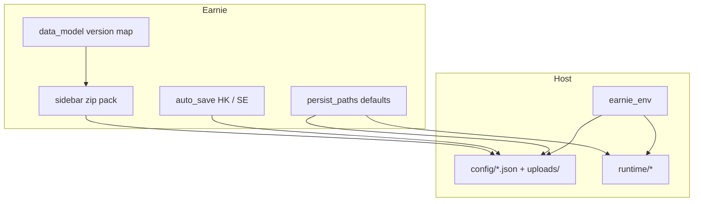

# Version 2.+1 — Save / Load configurations

Scope: full chapter except Streamlit Community Cloud / own-server assessment. Decisions locked: debounced auto-save (remove Speichern buttons); zip packs include the six JSON files **plus** `uploads/` CSVs; Docker keeps container paths `/app/config` and `/app/runtime` (host → `./earnie_env/...`).

## Architecture

Target layout (same shape as `greenfield/`):

- `earnie_env/config/` — live JSON + `.env` + `uploads/`
- `earnie_env/runtime/` — runtime artifacts
- Keep `greenfield/` as a separate stack (unchanged layout)
- Remove `silent-migration-test/` entirely (folder, launch configs, linked scripts/docs) — folds in [Backlog-Bugfixes.md](backlog/Backlog-Bugfixes.md) organizational item

---

## Phase 1 — Move defaults to `earnie_env/`

**Path defaults** in [`runtime_store/persist_paths.py`](runtime_store/persist_paths.py):

- `_DEFAULT_RUNTIME_DIR` → `earnie_env/runtime`
- Preferred config / dotenv / sidecar defaults → `earnie_env/config/...`
- Keep legacy fallbacks: existing `config/…`, root `config.json`, and ENV overrides (`EARNIE_CONFIG_PATH`, `EARNIE_RUNTIME_DIR`, sidecars) so greenfield/NAS/tests keep working
- Fix hardcoded `Path("config") / "uploads"` in [`ui/house_config_io.py`](ui/house_config_io.py) to resolve next to the active config directory (same rule as sidecars)

**Repo move (one-time):**

- Move tracked templates/examples/schemas/minimal files from `config/` → `earnie_env/config/`
- Move `runtime/local_settings.example.json` → `earnie_env/runtime/`
- Update [`.gitignore`](.gitignore) paths (`earnie_env/config/config.json`, `.env`, `earnie_env/runtime/*`, etc.)
- **Docker build + compose:** update [`docker/Dockerfile`](docker/Dockerfile) `cp` sources to `earnie_env/config|runtime/…` (into image `share/config/`); compose volume hosts `./earnie_env/config:/app/config` and `./earnie_env/runtime:/app/runtime` in [`docker/compose/dev.yml`](docker/compose/dev.yml), `synology.yml`, `loxberry.yml`, `proxmox.yml`; leave greenfield compose as-is; refresh [`docker/README.md`](docker/README.md) path mentions
- Update [`.vscode/launch.json`](.vscode/launch.json): default launch → `earnie_env`; keep greenfield + NAS; **delete** all silent-migration-test launch configs
- Delete `silent-migration-test/` tree; remove scripts/docs that only serve that stack (e.g. [`docs/einrichtung/silent-migration-test.md`](docs/einrichtung/silent-migration-test.md) and any `scripts/*silent*` still pointing at it); drop related tests that require that fixture tree
- Update bootstrap / remaining tests that assume `./config` or `./runtime` as CWD defaults
- German user docs under `docs/einrichtung/` and `docs/konfiguration/` (paths + env tables)

**Migration note for existing installs:** document that operators move their live `config/` + `runtime/` into `earnie_env/` (or set ENV to old paths). No automatic silent relocate of production data.

---

## Phase 2 — Data-model version tags

Introduce a single root key on every pack JSON: `"earnie_data_model": <int>` (current = `1`).

| Work               | Detail                                                                                                                                                                                                   |
| ------------------ | -------------------------------------------------------------------------------------------------------------------------------------------------------------------------------------------------------- |
| Constant + map     | New small module e.g. `[runtime_store/data_model.py](runtime_store/data_model.py)`: `CURRENT_DATA_MODEL = 1`, `COMPATIBLE = {1}`, converter registry stub (empty → “conversion later”)                   |
| Writers            | All save paths for the six files ensure the key is written (house profiles, components, scenarios, config, tariffs, deviation_rules). Prefer centralize in existing `write_json_document` / store savers |
| Schemas / examples | Add property to `*.schema.json` and example/minimal files under `earnie_env/config/`                                                                                                                     |
| Import gate        | On zip load: read each file’s `earnie_data_model`; accept if in `COMPATIBLE`; else clear error (no converters yet)                                                                                       |

Do not invent per-file letter versions; one integer for the pack schema family.

---

## Phase 3 — Auto-save (HK + SE)

Replace button-triggered persist with **debounced write on change**; remove Speichern buttons and sticky save bars.

| Surface       | Today                                                                                                                   | Change                                                                                                |
| ------------- | ----------------------------------------------------------------------------------------------------------------------- | ----------------------------------------------------------------------------------------------------- |
| Hausprofil    | `[ui/house_config_profile_form.py](ui/house_config_profile_form.py)` `_perform_house_profile_save` + “Profil speichern” | Build profile dict from widgets each run; if dirty vs last-saved fingerprint → `upsert_house_profile` |
| PV / Batterie | `[ui/planning_pv_form.py](ui/planning_pv_form.py)`, `[ui/planning_battery_form.py](ui/planning_battery_form.py)`        | Same pattern → `upsert_pv_system` / `upsert_battery`                                                  |
| Szenario      | `[ui/pages/page_scenario_editor.py](ui/pages/page_scenario_editor.py)`                                                  | On dirty scenario payload → `upsert_scenario`                                                         |
| Sticky UI     | `[ui/house_config_sticky_save.py](ui/house_config_sticky_save.py)`                                                      | Remove usage; delete or leave unused CSS helper                                                       |

**Mechanism (Streamlit-safe):**

- Helper e.g. `ui/auto_persist.py`: compare stable JSON fingerprint of payload to `st.session_state`; if changed, call existing upsert/save; show subtle `st.caption` / toast “Gespeichert” (no blocking modal)
- Skip write while form is incomplete / validation fails (keep current validation; do not write invalid docs)
- CSV uploads already write immediately — keep that; only ensure uploads dir uses resolved config path

Live-Konfiguration entity-ref / live-scenario buttons stay as-is (out of backlog wording).

---

## Phase 4 — Sidebar zip save / load

New UI block in `[app.py](app.py)` sidebar (expander next to version / Loxone), implemented in e.g. `[ui/config_pack.py](ui/config_pack.py)` + pack IO in `[runtime_store/config_pack.py](runtime_store/config_pack.py)`.

**Export contents:**

- `backtesting_scenarios.json`, `config.json`, `components.json`, `deviation_rules.json`, `house_profiles.json`, `tariffs.json` (from resolved paths)
- All files under config `uploads/` (preserve relative `uploads/…` in the zip)
- Manifest at zip root: `{ "earnie_data_model": 1, "files": [...], "created_at": ... }` (mirrors debug-dump pattern in `[runtime_store/debug_dump_archive.py](runtime_store/debug_dump_archive.py)`)
- Exclude `.env` (secrets stay local)

**Import:**

- Upload zip → validate manifest + per-file `earnie_data_model` via Phase 2 map
- Atomic replace: write to temp dir, then replace each target path (and `uploads/`)
- Reload / `st.rerun` so UI picks up new files; clear relevant session caches if any

**Download:** `st.download_button` with generated bytes.

---

## Phase 5 — Docs + backlog

- German user docs: path layout (`earnie_env`), zip save/load sidebar, auto-save behavior, migration from old `./config`+`./runtime`
- Update `[docs/README.md](docs/README.md)` TOC if a new page is added
- Mark completed checkboxes under Version 2.+1 in [`backlog/Backlog.md`](backlog/Backlog.md); leave Cloud/server item open; check off / archive the silent-migration-test removal item in [`backlog/Backlog-Bugfixes.md`](backlog/Backlog-Bugfixes.md); move done narrative to Erledigt when chapter work finishes (session skill later)

---

## Suggested implementation order

1. Path defaults + physical move + Docker build/compose + gitignore/launch/docs paths; remove `silent-migration-test` (Phase 1) — unblocks everything
2. `earnie_data_model` + writers/schemas (Phase 2)
3. Zip pack export/import + sidebar (Phase 4) — depends on version tags
4. Auto-save HK/SE (Phase 3) — can parallel after Phase 1 but test after path move
5. Final docs polish + tests

## Tests (focused)

- `persist_paths` defaults resolve under `earnie_env/`; ENV/legacy still win
- Uploads dir co-located with config dir
- Config pack round-trip (tmp dirs): export → import → files equal; reject unknown `earnie_data_model`
- Auto-save helpers: dirty fingerprint triggers write; identical payload no-op
- Existing greenfield bootstrap / sidecar tests still pass with explicit ENV paths

