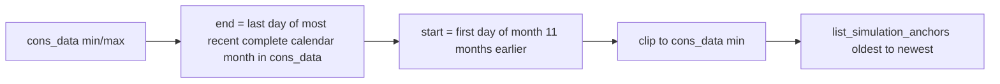

# SE data-model hygiene + month horizon + v3 path-pair retire

Scope: backlog [Backlog.md](backlog/Backlog.md) lines 69–74 **and** the **Config data-model v3 migration** section (path-pair hard deprecate in the same bump). Out of scope: reverse day/SoC iteration, `path_price`, removing empty `flexible_consumers` / root scoring block, full SAM (`2.4`).

## Chosen semantics (SE horizon)

- **End:** last calendar day of the most recent **complete** month that has cons_data (if data ends mid-month, use the previous month’s last day). Fallback if empty: keep today’s behavior only as error/empty-run messaging.
- **Start:** first day of the month **11 months before** that end month (12 inclusive calendar months), then `max(start, cons_data_min)`.
- **“Then backwards”** = how the span is *defined* (from recent month back), **not** reverse day order. Keep chronological anchors so SoC chaining in [`simulation/engine.py`](simulation/engine.py) `run_simulation` stays valid.
- Replace `price_range=last_12_months` calendar-today rolling 365 days and remove `loxone_logs` as a bounds mode.
- Optional CLI/UI month filters: resolve against the **year of cons_data max** (drop hard-coded `BACKTESTING_YEAR` dependency for suggest/parse where it blocks real data).

## Phase A — Docs / schema hygiene

- [`share/config/config.schema.json`](share/config/config.schema.json) (+ site copies under `earnie_env`/`config` if generated from share):
  - Remove `path_consumption` / `path_production` from `scenario_explorer_conf` (keep `path_price`, `path_cons_data`, price fields).
  - Clarify `flexible_consumers`: Legacy overlay; normally `[]`.
  - Clarify root `appliance_recommendation`: scoring thresholds only (not devices).
- German user docs: [`docs/konfiguration/ueberblick.md`](docs/konfiguration/ueberblick.md), [`docs/konfiguration/verbrauchs-csv.md`](docs/konfiguration/verbrauchs-csv.md), [`docs/konfiguration/preise.md`](docs/konfiguration/preise.md) — three CSV layers; SE window from cons_data months.

## Phase B — Soft migrate (window bounds without Loxone path pair)

- Rewrite [`data/data_loader.py`](data/data_loader.py) `resolve_simulation_window` to take cons_data bounds (via [`data/profile_manager.py`](data/profile_manager.py) `get_cons_data_date_bounds` / `cons_data_store`), implement month-aligned span above; **drop** `cons_path`/`prod_path` parameters and `loxone_logs` branch.
- Update [`scripts/run_backtesting.py`](scripts/run_backtesting.py) `resolve_backtesting_window` and all callers that pass `sim_cfg["path_consumption"]` / `path_production` (UI [`ui/backtesting_time_ranges.py`](ui/backtesting_time_ranges.py), [`simulation/backtesting_single_window.py`](simulation/backtesting_single_window.py), diag scripts under `scripts/`).
- [`settings/config_loaders.py`](settings/config_loaders.py) / [`settings/live_scenario.py`](settings/live_scenario.py): stop exposing `PATH_CONSUMPTION` / `PATH_PRODUCTION` (or leave empty unused only if something still breaks — prefer delete).
- Captions/help in `ui/backtesting_time_ranges.py` for new month-aligned meaning.
- Dead code: `get_loxone_time_bounds` / `_load_and_merge_loxone_data` / `create_averaged_profile` if unused after this.

## Phase C — Hard deprecate in v2→v3 migration

Mirror OeMAG pattern in [`runtime_store/bootstrap.py`](runtime_store/bootstrap.py); wire pack load via [`runtime_store/data_model.py`](runtime_store/data_model.py):

1. **Converter / bootstrap mutate `config.json`:**
   - Rename `file_paths_battery_simulation` → `scenario_explorer_conf` if present.
   - Delete `path_consumption` / `path_production` inside that block.
   - Stamp `earnie_data_model` to **3**.
2. Fix `ensure_compatible`: today versions `{1,2,3}` only **stamp** without converting — apply the rename+strip when `version < 3` (in-memory for pack import; bootstrap writes disk).
3. **Fail-fast** in [`settings/legacy_config_gates.py`](settings/legacy_config_gates.py): if `scenario_explorer_conf` still contains `path_consumption` or `path_production` after load, raise (same style as renamed block). Keep existing reject of root `file_paths_battery_simulation`.
4. Templates already omit the pair ([`earnie_env/config/config.example.json`](earnie_env/config/config.example.json)); ensure share/minimal examples match.

## Phase D — Tests

- Window: extend/replace [`tests/test_price_pipeline_p3.py`](tests/test_price_pipeline_p3.py), [`tests/test_backtesting_time_ranges.py`](tests/test_backtesting_time_ranges.py), [`tests/test_run_backtesting_window.py`](tests/test_run_backtesting_window.py) for month-aligned cons_data span + no path pair.
- Migration: new cases beside [`tests/test_data_model_migration.py`](tests/test_data_model_migration.py) — rename block + strip path keys + stamp 3; gate rejects leftover path keys.
- Gate unit tests for `legacy_config_gates`.

## Implementation order

1. Resolver + call-site soft migrate (Phase B) so nothing requires the keys.
2. Schema/docs (Phase A) + hard gate/converter (Phase C).
3. Tests (Phase D); mark backlog hygiene + SE horizon + v3 migration bullets done when green.

## Explicit non-goals

- Do not reverse `list_simulation_anchors` order.
- Do not rename root `appliance_recommendation` or remove `flexible_consumers: []`.
- Do not bump `version.py` (user approval only).
