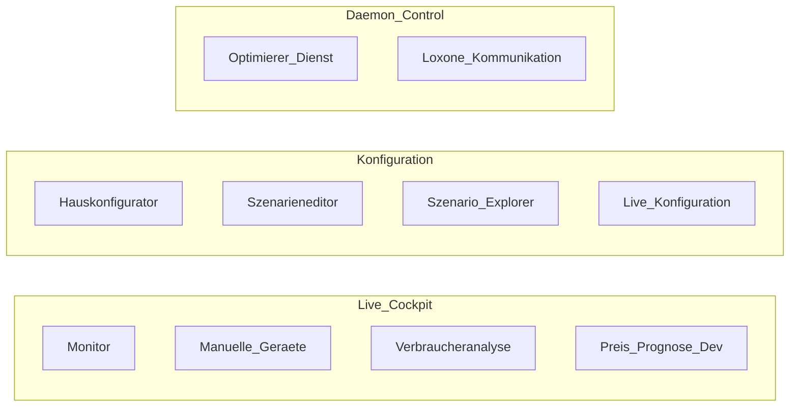

# Sidebar reorder + Info section (2.2.0)

## Locked decisions

| Topic | Choice |
|-------|--------|
| Live-Konfiguration | Hide only when `live_environment` ∉ `EARNIE_UI_MODES`; always usable when shown (onboarding still forces Echtzeit pages). Ignore circular “deactivate unless Live-Konfiguration is done”. |
| Deactivate UX | Keep nav entry; page body shows a German “nicht verfügbar” notice (no data/actions). |
| Live connection | `not is_effective_offline()` — i.e. offline when `EARNIE_OFFLINE=1` or greenfield gated by incomplete live config ([`runtime_store/env_vars.py`](runtime_store/env_vars.py)). No Miniserver probe on every nav build. |
| Contact | `mailto:mail@techcreacon.com` (Topic + Description) + downloadable ZIP (form attachments + config pack); **user attaches ZIP manually** (browsers cannot attach via mailto). |
| Scope | Reorder + Info only. **Do not** implement SE Verbrauchsvergleich 5% warning in this change set. |
| Preis-Prognose (Dev) | Move to **Live-Cockpit**, last item (after Verbraucheranalyse). |
| Section rename | Former **Betrieb** → **Live-Cockpit**; former **Echtzeit-Umgebung** → **Daemon Control**. |
| Monitor title | Browser/`st.set_page_config` and page H1: **Monitor** (not “Earnie Monitor”). |
| Konfiguration order | Hauskonfigurator → Szenarieneditor → **Szenario-Explorer** → **Live-Konfiguration**. |
| Info sidebar | Expander title **Info / About**, rendered **at bottom of sidebar** (after `navigation.run()`). Buttons: **Informationen in ZIP sammeln**, **E-Mail schreiben**; caption hints that ZIP must be attached manually. |

## Target navigation

- Remove section **Analyse** entirely.
- Rename former Planung → `"Konfiguration"`; former Betrieb → `"Live-Cockpit"` in [`ui/navigation.py`](ui/navigation.py).
- **Verbraucheranalyse:** register only if `"live_environment" in enabled_mode_keys` and Live-Cockpit section is shown; place last among core Live-Cockpit pages (before Preis-Prognose). If registered but `is_effective_offline()` → wrap with stub notice.
- **Live-Konfiguration:** in Konfiguration after Szenario-Explorer. Remaining **Daemon Control** pages: Optimierer-Dienst, Loxone-Kommunikation. Restricted onboarding still forces Live-Konfiguration + Daemon Control pages even without the mode key.
- **Szenario-Explorer:** section Konfiguration, **above** Live-Konfiguration.

## Implementation

### 1. Navigation registry — [`ui/navigation.py`](ui/navigation.py)

- Constants: `SECTION_BETRIEB = "Live-Cockpit"`, `SECTION_KONFIGURATION = "Konfiguration"`.
- Order: Live-Cockpit (Monitor → Geräte → optional VA → optional Preis-Prognose) → Konfiguration (Haus → Editor → optional SE → optional Live-Konfig) → Echtzeit (Daemon, Loxone).
- Offline stub for Verbraucheranalyse only.

### 2. Info sidebar — [`ui/info_sidebar.py`](ui/info_sidebar.py), [`app.py`](app.py)

Expander **Info / About** (bottom of sidebar):

1. `render_truth_banner(where="inline")` (version folded in).
2. Contact form: Thema, Beschreibung, Anhänge.
3. **Informationen in ZIP sammeln** — pack uploads + config pack; caption that the ZIP **must be attached to the mail manually**.
4. **E-Mail schreiben** — `mailto:…` with subject/body + reminder to attach ZIP.

Call `render_info_sidebar()` **after** `navigation.run()` (and after setup page on the Loxone-setup path) so it sits at the bottom.

Keep main-area `render_truth_banner(where="main")` unchanged.

### 3. Tests / docs

- Section assertions use `Live-Cockpit`; SE before Live-Konfiguration in Konfiguration order.
- German docs: section **Live-Cockpit**, **Info / About**, contact button labels and manual-attach hint.

## Out of scope

- SE Verbrauchsvergleich >5% warning + contact hint
- SMTP / server-side mail send
- Banner Layer C
- Changing `version.py`
