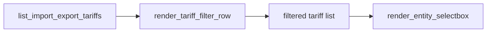

# Tariff filters: Land + type (both UI surfaces)

## Scope

- **In:** Filter by **Land** (`land`: AT/DE/CH) and **Tariftyp** (`type`) on Bezug + Einspeise pickers in [ui/pages/page_scenario_editor.py](ui/pages/page_scenario_editor.py) and [ui/config_forms.py](ui/config_forms.py) (`render_runtime_entity_form_body`).
- **Out:** Region / `einzugsbereich` (later); no changes to [config/tariffs.schema.json](config/tariffs.schema.json), converter, or catalog contents; orphaned [ui/planning_tariff_form.py](ui/planning_tariff_form.py) stays unwired.

## Approach

Shared pure filter + thin Streamlit widget; both pages call the same helper and pass the filtered list into existing `render_entity_selectbox`.

### 1. New helper module [`ui/tariff_filter_helpers.py`](ui/tariff_filter_helpers.py)

- Move/reuse type label maps from `planning_tariff_form.py` (`_IMPORT_TYPE_LABELS` / `_EXPORT_TYPE_LABELS`) into this module (or re-export from there) so both call sites share one source.
- Pure functions (unit-tested):
  - `filter_tariffs(tariffs, *, land=None, tariff_type=None)` — match on `land` / `type`; missing `land` only matches when Land filter is “Alle”.
  - `lands_present(tariffs)` / `types_present(tariffs)` — sorted unique values for select options.
- UI: `render_tariff_filter_row(*, key_prefix, tariffs, kind: "import"|"export", current_id=None) -> list[dict]`:
  - Two selectboxes in one row: **Land** (`Alle` + present lands) and **Typ** (`Alle` + present types with German labels).
  - Typ options derived from tariffs **after** applying Land filter (cascading).
  - Apply both filters; if `current_id` is set and that tariff would be excluded, **union it back** into the options so an existing selection is never silently dropped.
  - Caption when the current selection is outside the active filters (short German hint).

### 2. Wire Szenarieneditor

In [ui/pages/page_scenario_editor.py](ui/pages/page_scenario_editor.py), immediately before Bezug/Einspeise selectboxes (~339–350):

- Call `render_tariff_filter_row` twice (import / export) with scoped keys via `scoped_widget_key(session_scope, ...)`.
- Pass filtered lists into `render_entity_selectbox` and into caption lookups (keep full catalog only for resolving the selected tariff meta if needed).

### 3. Wire Live-Konfiguration

In [ui/config_forms.py](ui/config_forms.py) `render_runtime_entity_form_body`:

- Render filter rows **outside** `st.form("runtime_entity_form")` so Land/Typ update on change without waiting for “Entitäts-Referenzen speichern”.
- Inside the form, use the filtered lists + `current_id=refs.get("import_tariff_id")` / export analog for selection preservation.

### 4. Tests

Add [`tests/test_tariff_filter_helpers.py`](tests/test_tariff_filter_helpers.py) covering:

- Filter by land, by type, combined
- Empty / missing `land` behavior with “Alle”
- Current-id union when selection would be filtered out
- Cascading type list (types only from land-filtered set)

### 5. Docs (German)

One short note in [docs/konfiguration/ueberblick.md](docs/konfiguration/ueberblick.md) (tariff dropdown section): filters Land + Typ in Szenarieneditor and Live-Konfiguration; Region not yet available.

## Defaults locked

| Decision | Choice |
|----------|--------|
| Region | Deferred |
| Surfaces | Szenarieneditor + Live-Konfiguration |
| Country field | Existing `land` |
| Filter defaults | Both “Alle” |
| Selection safety | Keep current tariff visible if filters would hide it |

## Not in this change

- `version.py` bump (ask only if you want a release)
- Backlog archive move (on session end / after verification)
