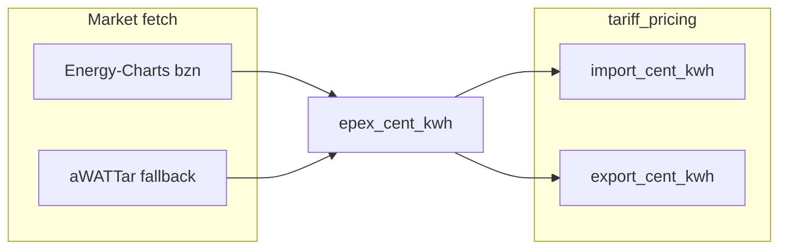

# 2.3.a — Tariff hygiene: research proposals

## Context in this repo today

- Catalog: [`earnie_env/config/tariffs.json`](earnie_env/config/tariffs.json) (`earnie_data_model: 3`) with shared `oemag_monthly_feed_in_rates` + `monthly_float_reference_cent_kwh` (7.15).
- Pricing: [`data/tariff_pricing.py`](data/tariff_pricing.py), [`data/monthly_float_rates.py`](data/monthly_float_rates.py).
- Market fetch: AT live/backtesting still **aWATTar-centric**; DE/CH already use **Energy-Charts** via [`data/data_loader.py`](data/data_loader.py) (`ENERGY_CHARTS_PRICE_URL`).
- Docs: OeMAG notes live in [`docs/konfiguration/preise.md`](docs/konfiguration/preise.md); backlog’s `docs/referenz/` anchors do **not** exist yet (only Loxone/ports).

---

## Critical distinction (do not conflate)

| Concept | Law | Publisher | What it is | Used for |
|--------|-----|-----------|------------|----------|
| **OeMAG Marktpreis** | §13 ÖSG 2012 | [oem-ag.at/marktpreis](https://www.oem-ag.at/marktpreis) | Ex-post monthly PV feed-in payment; corridor 60–100% of quarterly §41 price minus balancing energy (2026 PV: −0.408 ct) | Catalog `oemag_monthly_feed_in_rates`, tariff `at_oemag_gesetzlicher_marktpreis` |
| **Referenzmarktwert PV** | §13 EAG | [e-control.at/referenzmarktwert](https://www.e-control.at/referenzmarktwert) | Generation-weighted mean of AT Day-Ahead prices for PV (Jun 2026: **5.55 ct/kWh**) | Market premium; **VKW PV-Einspeisetarif Flex** |
| **Referenzmarktpreis** | §12 EAG | [e-control.at/referenzmarktpreis1](https://www.e-control.at/referenzmarktpreis1) | Unweighted yearly (or monthly) DA mean (2025: 9.89 ct/kWh) | Not the OeMAG payout curve |

**Proposal:** Keep OeMAG curve as today; **add** a second shared root array `econtrol_referenzmarktwert_pv_monthly` for RefMarkt-linked export tariffs. Document both under new [`docs/referenz/oemag-referenzmarktwert.md`](docs/referenz/oemag-referenzmarktwert.md) (German user doc) with links to the two official pages above.

---

## 1) Provider-independent EPEX

### Sources found

| Source | Cost / access | AT DA | Fit for Earnie |
|--------|---------------|-------|----------------|
| **Official EPEX** SFTP / MATS API | Paid subscription ([EPEX Market Data](https://www.epexspot.com/en/marketdataservices), [EEX Webshop](https://webshop.eex-group.com/epex-spot-public-market-data); [SFTP specs PDF](https://www.epexspot.com/sites/default/files/download_center_files/EPEXSPOT_SFTP_file_specifications_2025-10a.pdf)) | Yes | **Out of scope** for community OSS (licensing + cost) |
| **Energy-Charts** `GET /price?bzn=AT` | Free, no token; Fraunhofer ISE, CC BY 4.0 ([api.energy-charts.info](https://api.energy-charts.info/); used by [evcc](https://github.com/evcc-io/evcc/blob/master/templates/definition/tariff/energy-charts-api.yaml)) | Yes | **Primary recommendation** — already implemented for DE/CH |
| **aWATTar** `api.awattar.at/v1/marketdata` | Free, fair use | Yes | Keep as **fallback**; provider-tied |
| **ENTSO-E Transparency** | Free + registration + API token ([transparency.entsoe.eu](https://transparency.entsoe.eu/)) | Yes | Optional later; token UX friction for users |
| **APG** markt.apg.at | Public charts | Yes | Manual/reference only, not a clean API |

### Chosen approach

Unify **AT** live + backtesting on the same path as DE/CH:

1. Default market provider for zone `AT`: Energy-Charts (`bzn=AT`).
2. Fallback: aWATTar AT (existing).
3. Do **not** integrate paid EPEX SFTP/API in 2.3.a.
4. Attribute Energy-Charts (CC BY 4.0) in docs/README / preise.md.
5. Pricing formulas stay in `tariff_pricing.py` (EPEX cent in → import/export cent out); only the **fetch** layer becomes provider-independent.

---

## 2) Review / refresh current tariffs (OeMAG + catalog)

### OeMAG curve vs official table (2026)

Catalog Jan–Jun 2026 matches [OeMAG Marktpreis 2026](https://www.oem-ag.at/marktpreis) (8.842 / 8.457 / 5.720 / 6.772 / 6.772 / 6.772).

### Likely 2025 hygiene issues (audit against OeMAG primary table)

Secondary compilations ([smartmeter-portal OeMAG 2026 overview](https://www.smartmeter-portal.at/einspeisetarife-pv-oemag-2025/), [stromrechner](https://www.stromrechner.at/einspeisetarif)) disagree with catalog for late 2025 — treat as **must-verify against OeMAG “Marktpreise 2025” PDF/table**, not against blogs alone:

| Month 2025 | Catalog today | Common secondary | Action |
|------------|---------------|------------------|--------|
| Aug | 5.9 | ~5.892 | Rounding OK or align to 3 decimals |
| **Sep** | **7.1** | **~5.892** | Likely wrong — re-copy from OeMAG |
| **Nov / Dec** | **8.7** | **~9.167** | Likely wrong — re-copy from OeMAG |

Also fix Aug 2025 catalog if OeMAG publishes 5.892 (catalog has 5.9).

### RefMarkt (E-Control) — new shared series

Publish monthly PV RefMarkt into catalog (manual update once per month is “good-enough €”; no scraping required for v1). Seed at least 2025–mid-2026 from the E-Control page/chart. Example published point: **Jun 2026 PV = 5.55 ct/kWh** ([e-control referenzmarktwert](https://www.e-control.at/referenzmarktwert)).

### Docs anchors (backlog request)

Add German page under `docs/referenz/`:

- OeMAG Marktpreis (ÖSG) vs RefMarkt (EAG) vs Referenzmarktpreis
- How Earnie uses each (`oemag_monthly_*` vs new `econtrol_referenzmarktwert_pv_*`)
- Links to official pages; note 15-min market vs hourly aggregation still used for RefMarkt until EAG amendment (stated on E-Control page)

Update TOC in [`docs/README.md`](docs/README.md). Keep calculation detail in `preise.md`, legal/reference detail in `docs/referenz/`.

### Comprehensive German Quellenverzeichnis (new todo `docs-quellen-de`)

Deliver a dedicated German user-doc page (e.g. [`docs/referenz/tarife-quellen.md`](docs/referenz/tarife-quellen.md) or fold into the OeMAG/RefMarkt page if that stays short enough) that documents **all sources behind 2.3.a decisions**, in the same spirit as this plan’s “Key references” / research tables — not only legal definitions:

1. **Day-Ahead / EPEX sources** — why official EPEX is out of scope; Energy-Charts as primary (API, CC BY 4.0); aWATTar as fallback; ENTSO-E as optional later; each with URL and Earnie role.
2. **OeMAG Marktpreis** — [oem-ag.at/marktpreis](https://www.oem-ag.at/marktpreis); mapping to `oemag_monthly_feed_in_rates`; note on 2025 hygiene audit vs primary table.
3. **E-Control Referenzmarktwert / Referenzmarktpreis** — both official URLs; distinction; mapping to new RefMarkt series and VKW Flex.
4. **VKW products** — Dynamisch / Flex import & export product pages; formulas (EPEX ± fee, RefMarkt − 0.6); Vorarlberg scope; net/VAT caveat for Dynamisch Aufschlag.
5. **Catalog / data-model notes** — month-constant unify intent; pointer to `preise.md` for calculation formulas.

Language: **German** (user docs). Keep identifiers, URLs, JSON keys, and API paths verbatim. Link from [`docs/README.md`](docs/README.md) TOC and from [`docs/konfiguration/preise.md`](docs/konfiguration/preise.md).

---

## 3) Add VKW variable tariffs

Official product pages:

| Product | URL | Formula (energy only) | Maps to Earnie type |
|---------|-----|----------------------|---------------------|
| **Strom Dynamisch** (import) | [vkw.at/produkte/strom/strom-dynamisch](https://www.vkw.at/produkte/strom/strom-dynamisch) | EPEX Spot AT Day-Ahead (15-min) + Aufschlag | `spot_hourly` |
| **Strom Flex** (import) | [vkw.at/produkte/strom/strom-flex](https://www.vkw.at/produkte/strom/strom-flex) | Monthly Phelix-AT Base Month Future | Skip in 2.3.a (needs futures feed) or later `monthly_table` manual |
| **PV-Einspeisetarif Dynamisch** | [vkw.at/pv-einspeisetarif-dynamisch](https://www.vkw.at/pv-einspeisetarif-dynamisch) | EPEX − **0.60** ct netto | export `spot_hourly`, `settlement_fee_cent_kwh: 0.6` |
| **PV-Einspeisetarif Flex** | [vkw.at/pv-einspeisetarif-flex](https://www.vkw.at/pv-einspeisetarif-flex) | RefMarkt PV − **0.60** ct | export month-constant from **RefMarkt** curve − 0.6 |

Secondary markup report for private Dynamisch: **+1.20 ct/kWh** ([smartmeter-portal VKW Dynamisch](https://www.smartmeter-portal.at/dynamischer-stromtarif/vkw-strom-dynamisch/)); business page shows **+1.90 ct** in one snippet — **confirm net/VAT on official price sheet before shipping** and set `prices_include_vat` / `settlement_fee_cent_kwh` accordingly. Scope note in `notes`: Vorarlberg only (not Kleinwalsertal).

**Catalog IDs (proposed):**

- `at_vkw_strom_dynamisch` — import `spot_hourly`, settlement ≈ 1.2 (after VAT clarification), `land: AT`
- `at_vkw_pv_dynamisch` — export `spot_hourly`, settlement 0.6
- `at_vkw_pv_flex` — export month-constant driven by RefMarkt − 0.6 (new shared RefMarkt series; not OeMAG scale)

Do **not** model Strom Flex / EEX futures in this chapter.

---

## 4) Unify `monthly_float` and `monthly_table`

Already stated in backlog; research confirms UI already collapses both to “Monatspreis”.

**Chosen data-model approach:**

1. Single export type for month-constant payouts (name e.g. `monthly_fixed` or keep `monthly_table` as the only type).
2. Every such tariff owns `monthly_rates[]` (no live scale-from-shared-curve at resolve time).
3. Shared curves (`oemag_*`, new `econtrol_referenzmarktwert_pv_*`) remain **seed generators** / maintenance helpers: when refreshing catalog, rewrite owned rates for tariffs that track that curve (OeMAG 1.0×, Energie AG float scale, VKW Flex = RefMarkt − 0.6).
4. Migrate existing `monthly_float` rows → owned tables; remove scale-only duplicates if any; keep `export_cent_kwh` month-lookup path (already shared).
5. Schema + `tariffs_store` + docs; calculation paths can stay distinct until migration complete, then one branch.

---

## Suggested implementation order for 2.3.a

1. **Docs + data hygiene:** RefMarkt vs OeMAG page; **German Quellenverzeichnis** (`docs-quellen-de`); correct 2025 OeMAG months from primary OeMAG table; add RefMarkt monthly array.
2. **VKW catalog rows** (Dynamisch import/export + Flex export) using existing types + new RefMarkt curve.
3. **AT Energy-Charts as default fetch** (aWATTar fallback); update `preise.md` market-zone table.
4. **Unify month-constant export type** (schema migrate + trim).

Out of scope for “good-enough €”: paid EPEX API, ENTSO-E token UX, VKW Strom Flex futures, automated scraping of E-Control/OeMAG HTML.

---

## Key references

- [E-Control Referenzmarktwert §13 EAG](https://www.e-control.at/referenzmarktwert)
- [E-Control Referenzmarktpreis §12 EAG](https://www.e-control.at/referenzmarktpreis1)
- [OeMAG Marktpreis](https://www.oem-ag.at/marktpreis)
- [EPEX Market Data Services](https://www.epexspot.com/en/marketdataservices) / [EEX Webshop](https://webshop.eex-group.com/epex-spot-public-market-data)
- [Energy-Charts API](https://api.energy-charts.info/) (CC BY 4.0)
- [ENTSO-E Transparency](https://transparency.entsoe.eu/) (token)
- [VKW Strom Dynamisch](https://www.vkw.at/produkte/strom/strom-dynamisch) · [PV Flex](https://www.vkw.at/pv-einspeisetarif-flex) · [PV Dynamisch](https://www.vkw.at/pv-einspeisetarif-dynamisch)
