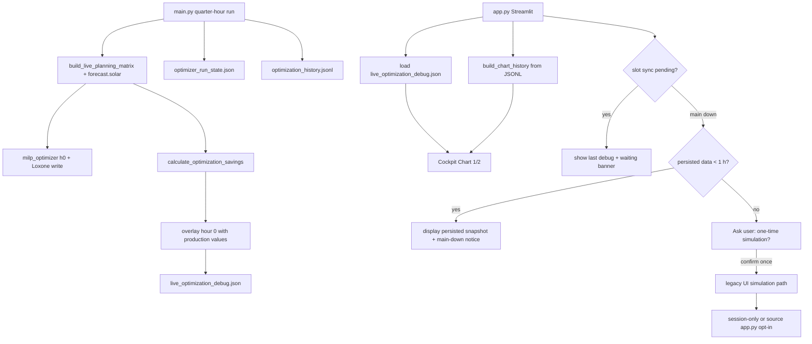

# UI display from main.py only (no default Live-MILP)

## Spec / design contradiction (must change together)

Your proposal **directly contradicts** the current documented architecture in several places:

| Source | Current design | Your target |
|--------|----------------|-------------|
| [docs/einrichtung/betrieb.md](docs/einrichtung/betrieb.md) | "Die App **simuliert** den 24-Stunden-Horizont" | App **displays** main.py output |
| [docs/ui/betriebsmodi.md](docs/ui/betriebsmodi.md) | "Gegenwart und Vorausschau aus der **Live-MILP**" | Gegenwart/Vorausschau aus **main.py-Persistenz** |
| [docs/spec/ui-sunset2sunset.md](docs/spec/ui-sunset2sunset.md) §6 | Multiple rows name "Live-MILP + main.py-Overlay" | Single source: Produktiv-Durchlauf (+ JSONL history) |
| [optimizer/schedule.py](optimizer/schedule.py) + [ui/main_py_sync.py](ui/main_py_sync.py) | After **30 s** without slot sync → UI runs its **own** simulation (`fallback`) | No auto-simulation; use persisted data up to **1 h** old; opt-in only when main is down **and** data is outdated |
| [docs/spec/ui-menu-structure.md](docs/spec/ui-menu-structure.md) §6 | Manuelle Geräte: `build_live_planning_matrix()` live | **Last-known** matrix from main.py (degraded) |
| [runtime_store/live_optimization_debug.py](runtime_store/live_optimization_debug.py) | "Nur app.py schreibt" | **main.py schreibt**, app.py liest |

**What already aligns:** History (gray zone) is already replayed from `optimization_history.jsonl` without UI simulation. `main.py` already runs `calculate_optimization_savings()` every quarter-hour but only stores compact `savings_snapshot` — not the row arrays charts need.

**Conclusion:** This is an intentional **architecture revision**, not a small bugfix. Specs and user docs listed above must be updated in the same change set.

---

## Target data flow

**Freshness rule:** Persisted display data is considered usable when its `completed_at` (from `live_optimization_debug.json` or `optimizer_run_state.json`) is **≤ 1 hour** old. Below that threshold the UI renders normally (with a non-blocking notice that main.py is not running). Above it, the opt-in simulation dialog applies.

---

## Implementation plan

### 1. main.py persists full display payload

**File:** [main.py](main.py) (after existing `calculate_optimization_savings` block ~L277–295)

After `savings_info` is computed:

1. Build production overlay on hour 0 using existing [`optimizer.overlay_main_run_on_rows`](optimizer/__init__.py) with the run payload being assembled (same logic UI used post-simulation).
2. Call [`live_optimization_debug.build_debug_payload`](runtime_store/live_optimization_debug.py) with:
   - `source` changed to `"main.py"` (adjust payload builder — today hardcodes `"app.py"`)
   - `kind="live"`, `quarter_hour_slot`, `sync_reason="main_synced"`
   - `simulation_rows` = overlaid optimized rows
   - `simulation_rows_raw` = pre-overlay rows (optional, for debug parity)
3. **Extend payload** with `planning_matrix` (full matrix or first N slots) for Manuelle Geräte degraded mode — appliance logic only needs `slot_datetime` + `k_act` ([optimizer/appliance_recommendation.py](optimizer/appliance_recommendation.py)).
4. Persist via [`save_debug_snapshot`](runtime_store/live_optimization_debug.py).

Update module docstring: main.py writes live snapshot; app.py reads; opt-in UI sim may write a separate session-scoped copy or overwrite with `source: app.py` (document clearly).

### 2. New loader: UI reads display bundle from disk

**New helper** (suggest `runtime_store/live_display_loader.py` or extend `live_optimization_debug.py`):

- `load_live_display_snapshot() -> dict | None`
- Validate `schema_version`, `quarter_hour_slot`, `completed_at` / `main_run_completed_at`
- `snapshot_age_seconds(completed_at) -> float | None` and `is_persisted_display_fresh(completed_at, *, max_age_sec=3600) -> bool` — shared 1-hour threshold constant (e.g. `PERSISTED_DISPLAY_MAX_AGE_SECONDS = 3600` in `optimizer/schedule.py` or loader module)
- Reconstruct what [`ui/live_mode.py`](ui/live_mode.py) today puts in session state: `savings_info`-shaped dict, DataFrames, `planning_window` metadata (derive from matrix slot datetimes or add `planning_window` to payload)

**File:** [ui/simulation_results.py](ui/simulation_results.py)

- Add `build_optimization_display_bundle_from_snapshot(snapshot, chart_context)` — reuse existing chart/table builders without re-running MILP.

### 3. Refactor Cockpit live path (remove default simulation)

**File:** [ui/live_mode.py](ui/live_mode.py)

Replace `_live_optimization_prepare_fragment` logic:

| State | Behavior |
|-------|----------|
| `main_synced` (slot match) | Load fresh `live_optimization_debug.json`; build bundle; **no** `build_live_planning_matrix`, **no** `calculate_optimization_savings`, **no** forecast.solar |
| `wait_main` (within sync window) | Show existing sync notice; display **last** debug snapshot if present (waiting banner) |
| `main_down` + **fresh** persisted data (≤ 1 h) | Load and display last snapshot; show non-blocking notice ("main.py nicht aktiv — Anzeige basiert auf letztem Lauf um …") — **no** opt-in dialog |
| `main_down` + **outdated** persisted data (> 1 h) or no snapshot | Show warning + **one button** "Einmalige Simulation starten" (session flag `live_opt_in_simulation_confirmed`) |
| Opt-in confirmed | Run **existing** simulation path once (matrix + MILP + forecast.solar); do **not** auto-repeat on reruns unless user confirms again |

Remove or gate [`persist_simulation_debug`](ui/simulation_results.py) from normal UI path — only called from opt-in branch (or stop writing entirely if session-only).

Remove `_apply_main_run_to_live_df` from default path (overlay already applied by main.py in persisted rows).

### 4. Redefine sync / "main not running" detection

**File:** [optimizer/schedule.py](optimizer/schedule.py)

Change `live_simulation_readiness()` return semantics:

- **`main_synced`**: `completed_at_in_current_slot` — unchanged
- **`wait_main`**: within first `APP_MAIN_SYNC_MAX_WAIT_SECONDS` (30 s) of slot, no current-slot completion — **no fallback simulation**
- **`main_down`**: replace auto-`fallback` — e.g. last successful `completed_at` older than one optimization interval (15 min), or no run_state / `success: false`
- **`persisted_fresh`** (sub-state of `main_down`): when `main_down` is true **but** snapshot/run_state `completed_at` is ≤ `PERSISTED_DISPLAY_MAX_AGE_SECONDS` (3600 s = **1 hour**), UI **uses persisted data** and does **not** prompt for opt-in simulation
- **`persisted_stale`**: when `main_down` and snapshot age **> 1 hour** (or missing) → opt-in simulation dialog
- **Remove** `fallback` reason that triggers automatic UI MILP

Suggested return shape: extend tuple with freshness flag, e.g. `(ready, reason, retry_sec, fallback_sec, persisted_fresh: bool)` — or derive freshness in UI from snapshot timestamp via shared helper.

Optional enhancement: check `runtime/main.lock` ([runtime_store/single_instance.py](runtime_store/single_instance.py)) as secondary signal — lock absent + stale `completed_at` strengthens `main_down`.

**File:** [ui/main_py_sync.py](ui/main_py_sync.py) — update help text: no "Fallback mit Altplan nach 30 s" that implies re-simulation; instead "Zeigt letzten Plan bis main.py synchronisiert".

### 5. Manuelle Geräte — degraded last-known

**File:** [ui/pages/page_devices.py](ui/pages/page_devices.py)

- Replace `_load_planning_matrix()` live build with loader reading `planning_matrix` from latest debug snapshot.
- Same **1-hour freshness rule** as Cockpit: if snapshot ≤ 1 h old, show recommendations from persisted matrix (with caption if main.py is down); **no** live refresh, **no** forecast.solar.
- If snapshot > 1 h old: show degraded caption ("Daten veraltet — main.py seit … nicht aktiv") and last-known matrix if present; no opt-in simulation on this page (Cockpit handles the opt-in path; devices stay read-only/degraded).
- If no snapshot at all: short message "Warte auf ersten main.py-Durchlauf" (no matrix build).

### 6. Remove forecast.solar from normal UI import graph

After refactor, these UI paths must **not** import/call `profile_manager.build_live_planning_matrix` or `pv_forecast` in default operation:

- [ui/live_mode.py](ui/live_mode.py)
- [ui/pages/page_devices.py](ui/pages/page_devices.py)

Opt-in simulation may still use them (explicit user action only).

**Unchanged:** Backtesting, Szenario-Explorer, price forecast dev page — separate modes, out of scope unless you want them restricted too.

### 7. Tests

| Test area | Action |
|-----------|--------|
| `tests/test_schedule.py` | Update readiness: no auto-fallback; add `main_down` + `persisted_fresh` / `persisted_stale` at 1 h boundary |
| `tests/test_live_display_loader.py` | Freshness helper: 59 min → fresh, 61 min → stale |
| `tests/test_main_py_sync_ui.py` | Update messages |
| New `tests/test_live_display_loader.py` | Load snapshot → bundle |
| `tests/test_main_*.py` | Assert main.py writes debug snapshot on successful run |
| Appliance tests | Feed matrix from fixture snapshot instead of live build |

### 8. Documentation updates (German user docs + spec)

- [docs/einrichtung/betrieb.md](docs/einrichtung/betrieb.md) — App displays main.py data; `live_optimization_debug.json` written by main.py
- [docs/ui/betriebsmodi.md](docs/ui/betriebsmodi.md) — replace "Live-MILP" with Produktiv-Snapshot
- [docs/spec/ui-sunset2sunset.md](docs/spec/ui-sunset2sunset.md) — bump version (e.g. 0.8.0), revise §6 data table
- [docs/spec/ui-menu-structure.md](docs/spec/ui-menu-structure.md) §6 — devices use persisted matrix
- [docs/ui/charts.md](docs/ui/charts.md) — if it mentions Live-MILP source

### 9. Backlog entry

Add to [backlog/Backlog-Bugfixes.md](backlog/Backlog-Bugfixes.md) (or agreed chapter): "UI: no standalone Live-MILP / forecast.solar; display from main.py; opt-in simulation when worker down" — links 429 root cause.

---

## Risks and open points

- **Payload size:** Full horizon `simulation_rows` + `planning_matrix` in JSON — acceptable for ~45 h; monitor file size on NAS bind mounts (atomic write already handled).
- **1-hour grace window:** While main.py is stopped briefly (restart, deploy), charts and Geräte-Empfehlungen remain usable without forecast.solar or opt-in simulation. After 1 h without a new run, user must explicitly opt in to a one-time UI simulation or restart main.py.
- **Config change mid-slot:** UI fingerprint cache today includes `simulation_settings_fingerprint()` — stale snapshot after config edit until next main.py run is acceptable; show caption when settings fingerprint differs (optional follow-up).
- **Event-trigger runs:** main.py event runs also write snapshot — UI should treat any fresh `completed_at` in current slot as synced regardless of trigger type.
- **SA₁→SA₂ segment:** Still served from same persisted horizon rows (main already simulates full window) — no separate UI MILP needed.

---

## Out of scope (unless you ask)

- Removing adaptive PV tuning from main.py (separate backlog item)
- Changing backtesting / Szenario-Explorer simulation paths
- Cross-process file-based forecast.solar cache (unnecessary once UI stops calling API)
