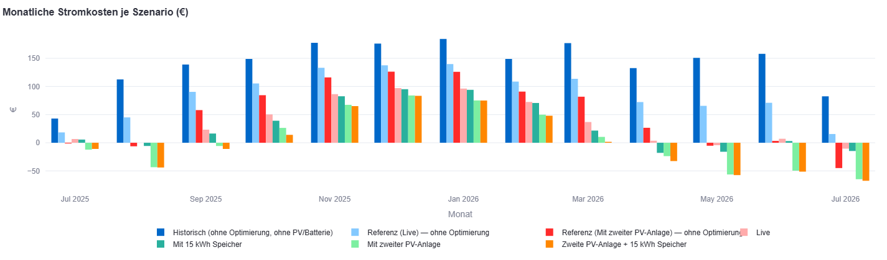
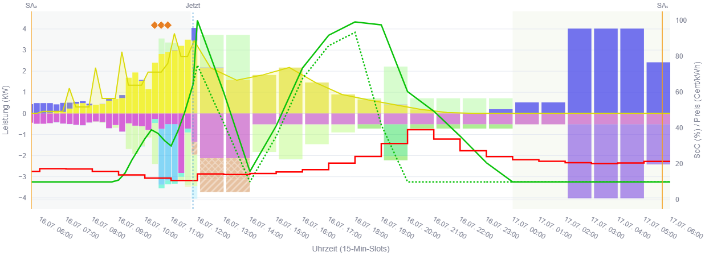

# Earnie

**Earnie** optimiert den Energiefluss in einem Smart-Home: Speicher, PV und Verbraucher mit wählbaren Schaltzeiten werden im 15-Minuten-Takt so optimiert, dass Stromkosten sinken und der Eigenverbrauch steigt. Seine Stärke spielt **Earnie** vor allem im Zusammenhang mit sogenannten [SPOT-Tarifen (im DACH-Raum)](https://www.epexspot.com/) aus. Eine umfangreiche Oberfläche zeigt genau, was **Earnie** gemacht und geplant hat.
Und wenn Sie vorab wissen wollen, wie hoch das Einsparpotenzial ist, kann **Earnie** das für Sie vorab auch für ein ganzes Jahr hochrechnen - Und das auch ganz ohne Smart-Home.
Earnie funktioniert unabhängig von Energie- und / oder Systemlieferanten für maximale Unabhängigkeit.

GitHub-Repository: [JochenTCC/Earnie](https://github.com/JochenTCC/Earnie).

## Was ist Earnie?

**Earnie** richtet sich an Hausbesitzer, die Kosten beim Stromverbrauch minimieren möchten, insbesondere bei [SPOT-Tarifen](https://www.epexspot.com/). Er optimiert in einem variablen Zeitfenster (von max. 48h) die Verbräuche und Erträge so, dass die Kosten minimal sind. Das funktioniert am besten bei Häusern mit einer PV-Anlage, Batteriespeicher und Verbrauchern, die per Smart-Home gesteuert werden können (also smarter Wechselrichter, smarte Wallbox für das E-Auto, smarte Wärmepumpe und andere Geräte). Bisher kommuniziert **Earnie** mit diesen Systemen über eine [Loxone](https://www.loxone.com/dede/)-Haus-Automation — das kann aber auch um beliebige andere Systeme erweitert werden. Für andere Geräte, die noch nicht smart sind, kann **Earnie** Empfehlungen für den besten Start-Zeitpunkt geben.
Der große Hebel für Einsparungen ist das geschickte Timing all dieser Verbraucher und der intelligente Einsatz des Batteriespeichers als Puffer.

*Was-Wäre-Wenn-Analyse: Vorab schon sehen, was eine andere Konfiguration sparen könnte*

Statt fester Regeln (wie bei anderen Lösungen) berechnet **Earnie** einen **24-48 Stunden-Plan** unter Berücksichtigung von Strompreisen, PV-Prognose, Wettervorhersagen für den Standort des Hauses, Speicherzustand und Gerätebedarf. Ein dauerhaft laufender Daemon (`main.py`) setzt den Plan in [Loxone](https://www.loxone.com/dede/) um; eine übersichtliche Web-Oberfläche zeigt Soll/Ist und hilft bei Konfiguration und Analyse.

| Komponente                                 | Rolle                                                                                           |
| ------------------------------------------ | ----------------------------------------------------------------------------------------------- |
| `main.py`                                  | Liest [Loxone](https://www.loxone.com/dede/), optimiert, schreibt Steuerwerte — läuft dauerhaft |
| **[Streamlit](https://streamlit.io/)-App** | Cockpit, Planung, Simulation — optional parallel; steuert die Anlage nicht                      |

Details: [Betrieb](docs/einrichtung/betrieb.md)

## Was bringt Earnie?

- **Günstiger laden und heizen** — Nutzung günstiger Stunden und PV-Überschuss statt Flatrate-Denken
- **Speicher sinnvoll nutzen** — SOC-Ziele und Entladestrategie im Tagesverlauf, nicht nur „voll/leer“
- **Flexible Geräte intelligent einplanen** — EV, Wärmepumpe, SwimSpa-Filter, manuelle Geräte mit Empfehlungen
- **Transparenz** — Monitor (Sunset-2-Sunset): Vergangenheit, Live-Snapshot und Vorausschau in einem Cockpit
- **What-if ohne Risiko** — Szenario-Exploration vergleicht Varianten, ohne den Produktivbetrieb zu ändern und unnötige oder falsche Investitionen zu tätigen oder sich für den falschen Stromtarif zu entscheiden

## Funktionen

### Optimierung und Steuerung

- Ganzheitliche Optimierung im 15-Minuten-Takt. für Speicher und Verbraucher, deren Aktivierung von Earnie oder dem Benutzer gewählt werden kann.
- Dynamische Strompreise (z. B. [aWATTar](https://www.awattar.at/)) und Preis-Prognose (über die veröffentlichten Preise hinaus)
- PV-Erzeugungsprognose über [Open-Meteo](https://open-meteo.com/)-Wetterdaten und Grundlast-Modell mit Berücksichtigung der Temperaturen

### Verbraucher

- E-Auto über Wallbox (Smarthome sagt an, wann das E-Auto voll sein soll, Earnie kümmert sich um den Rest) 
- Wärmepumpe (mit Wärmemodell des Hauses, das den Wärmebedarf anhand der Wetterdaten voraussagt und in die Optimierung mit einfließen lässt)
- Pool (auch mit Wärmemodell, wie bei der Wärmepumpe) - Filter können auch bedarfsgerecht aktiviret werden
- Generische Geräte (Waschmaschine, Trockner, Geschirrspüler, ...)

### Oberfläche (Weboberfläche über [Streamlit](https://streamlit.io/))

- **Monitor** (mit vollem Optimierungs-Horizont) — Energiefluss, SOC-Verlauf der Batterie, Verbraucherverhalten, Lade-Kontrolle der Batterie von Earnie
- **Hauskonfigurator / Szenarieneditor** — Umfangreiche Konfiguration des Hauses mit allen Verbrauchern zur Planung und Szenario-Exploration
- **Manuelle Geräte** — Laufzeiten mithilfe von Earnie planen und Empfehlungen annehmen
- **Szenario-Explorer** — Szenarien vergleichen (Was-Wäre-Wenn Analysen)
- **Verbraucheranalyse** — autonom vs. Earnie-initiiert

### Betrieb

- [Docker](https://www.docker.com/) auf [Synology](https://www.synology.com/) / [LoxBerry](https://www.loxberry.com/) / [Proxmox](https://www.proxmox.com/) LXC oder PC (weitere Systeme folgen bei Bedarf)
- Persistente Laufzeitdaten für Nachvollziehbarkeit und Debug-Dumps

*Earnie Monitor: Kompletter Optimierungs-Horizont mit Energiefluss, SOC und Verbraucherverhalten.*

## Typischer Ablauf

1. **Voraussetzungen klären** — [Loxone](https://www.loxone.com/dede/)-Miniserver, PV + Speicher, verschiebbare Verbraucher, optional dynamischer Tarif
2. **Deployment wählen** — Container ([Synology](https://www.synology.com/) / [LoxBerry](https://www.loxberry.com/) / [Proxmox LXC](docs/einrichtung/proxmox-lxc.md)) oder lokaler Betrieb → [Container](docs/einrichtung/container.md) · [Betrieb](docs/einrichtung/betrieb.md)
3. **Konfiguration anlegen** — `config/config.json` aus Vorlage, Loxone-Zugang, Merker-Namen → [Erste Schritte](docs/README.md#erste-schritte)
4. **Was-wäre-wenn-Analyse** — Mit Erstkonfiguration klären, ob sich ein Gesamtsystem und Earnie im produktiven Einsatz lohnen
5. **Verbindung zu Smarthome** — `python -m scripts.verify_loxone_setup`
6. **Produktiv starten** — `python main.py` dauerhaft (**nur eine Instanz**)
7. **Monitor öffnen** — [Streamlit](https://streamlit.io/); Port je Stack: [Streamlit-Ports](docs/referenz/streamlit-ports.md) (Prod **8501**, lokal venv typisch **8531**)
8. **Feintuning** — Hausprofil, Szenarien, flexible Verbraucher über Planungs- und Betriebsseiten

Optional: [Greenfield Dev-Stack](docs/einrichtung/greenfield-dev-stack.md) (Ersteinrichtung)

## Anwender-Dokumentation

- **Benutzer-Handbuch (Einstieg aus Anwendersicht):** [docs/user-manual/Benutzer-Handbuch-Earnie.md](docs/user-manual/Benutzer-Handbuch-Earnie.md)
- **Technische Anwender-Doku** (Einrichtung, Konfiguration, UI, Loxone): **[docs/README.md](docs/README.md)**

| Bereich                | Kapitel                                                                                                                                                                                                          |
| ---------------------- | ---------------------------------------------------------------------------------------------------------------------------------------------------------------------------------------------------------------- |
| **Handbuch**           | [Benutzer-Handbuch Earnie](docs/user-manual/Benutzer-Handbuch-Earnie.md)                                                                                                                                         |
| **Einrichtung**        | [Loxone-Anbindung](docs/einrichtung/loxone-anbindung.md) · [Betrieb](docs/einrichtung/betrieb.md) · [Container](docs/einrichtung/container.md) · [Proxmox LXC](docs/einrichtung/proxmox-lxc.md)                                                                   |
| **Konfiguration**      | [Überblick](docs/konfiguration/ueberblick.md) · [PV & Batterie](docs/konfiguration/batterie-pv.md) · [Flexible Verbraucher](docs/konfiguration/flexible-verbraucher.md) · [Preise](docs/konfiguration/preise.md) |
| **Benutzeroberfläche** | [Betriebsmodi](docs/ui/betriebsmodi.md) · [Charts](docs/ui/charts.md) · [Loxone-Kommunikation](docs/ui/loxone-kommunikation.md)                                                                                  |
| **Referenz**           | [Loxone-Signale](docs/referenz/loxone-signale.md)                                                                                                                                                                |

## Installation und Betrieb

| Weg                              | Für wen                                                                      | Detail                                                         |
| -------------------------------- | ---------------------------------------------------------------------------- | -------------------------------------------------------------- |
| **Docker (empfohlen Prod)**      | [Synology](https://www.synology.com/), [LoxBerry](https://www.loxberry.com/), [Proxmox](https://www.proxmox.com/) LXC | [docs/einrichtung/container.md](docs/einrichtung/container.md) · [proxmox-lxc.md](docs/einrichtung/proxmox-lxc.md) |
| **Lokal (Dev / ohne Container)** | Entwickler, Tests                                                            | [DEVELOPER.md](DEVELOPER.md)                                   |

## Roadmap (Kurz)

- **2.0** — Stabilisiertes Datenmodell; klarer Projekteinstieg (dieses README)
- **Adaptation** — PV- und thermische Parameter-Anpassung über die Zeit
- **Thermals** — Gekoppelte Haus-/Speicher-/Solar-Modelle
- **Smartere Geräte-Empfehlungen** — adaptive Leistung und Laufzeit für Haushaltsgeräte
- **Streamlit-Steuerung von** `main.py` — Start/Stop/Neustart in der UI; ein Docker-Container (`earnie`) mit Auto-Start

Earnie wird weitgehend mit Hilfe von [Cursor](https://cursor.com/) entwickelt.

Vollständige Roadmap → **[backlog/Backlog.md](backlog/Backlog.md)**

## Lizenz

Die Software ist **Source-Available** und auf **private, nicht-kommerzielle Nutzung** beschränkt. Vollständige Bedingungen: **[LICENSE.md](LICENSE.md)**.

## Für Entwickler

Unterstützung ist sehr willkommen - vor allem bei der Einbindung weiterer Systeme und beim Ausprobieren :-).

Projektstruktur, lokale Entwicklung, Container-Build und technische Hinweise: **[DEVELOPER.md](DEVELOPER.md)**
