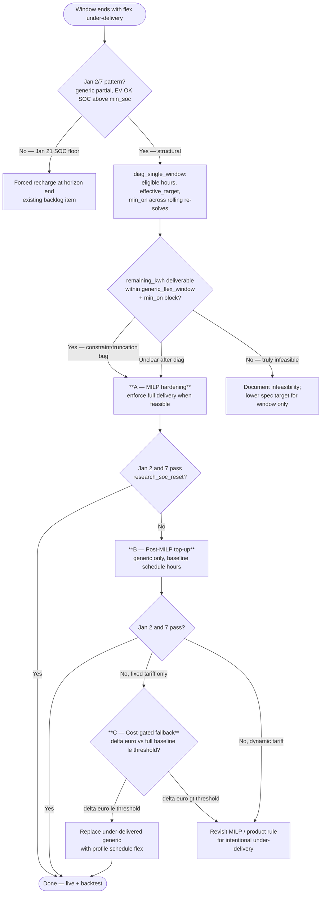

# Backtesting plausibility — `s2-kein-pv` Jan 2 & Jan 7 (structural)

Developer research note for greenfield Scenario Exploration (SE) Phase B.

**Date:** 2026-07-13  
**Backtest:** January 2025, `fixed_24h`, greenfield env  
**Scenario:** `s2-kein-pv` — 5 kWh battery, no PV, `mein_haushalt`, `profile_spec`, tariffs `fixed_25ct` / `fixed_37ct`

Related: [scenario-exploration-consumption.md](scenario-exploration-consumption.md), `backlog/Backlog.md` Phase B.

---

## Executive summary

Two plausibility failures on **2025-01-02** and **2025-01-07** share an identical signature: **−4.002 kWh flex** vs `profile_spec` reference, with **baseload and EV on target**. The gap is **one shortened `standard` run** (−3 kWh) and **one missing `waschmaschine` hour** (−1 kWh).

This is a **structural** issue specific to **battery without PV** (`s2-kein-pv`). It is **not** caused by sequential SOC carry-over and **does not** recover with per-window SOC reset at 50%.

A third failure on **2025-01-21** is a **different** class (SOC floor carry-over); see [Distinction from Jan 21](#distinction-from-jan-21).

---

## What failed

Both windows show the same plausibility signature:

| Window end | Ref flex (kWh) | Opt flex (kWh) | Δ flex | Baseload Δ |
| ---------- | -------------- | -------------- | ------ | ---------- |
| **2025-01-02 07:00** | 25.842 | 21.840 | **−4.002** | 0.0 |
| **2025-01-07 07:00** | 25.842 | 21.840 | **−4.002** | 0.0 |

Plausibility tolerance: 0.5 kWh or 5% — both exceed it on **flex only**. Baseload and total thermal overlay match the spec.

Month context (`s2-kein-pv`): **28/31** windows OK, **3** failures (Jan 2, Jan 7, Jan 21). Other scenarios (`live`, `s1-kein-pv-keine-battery`, `s3-no-battery`): **31/31** OK.

---

## Per-consumer breakdown (identical on both days)

From `scripts/analyze_plausibility_failures.py` and `greenfield/runtime/backtesting_hourly.csv`:

| Consumer | Spec target | Delivered (`s2-kein-pv`) | Δ | Hours on |
| -------- | ----------- | ------------------------ | - | -------- |
| **ev** | 16.84 kWh | 16.84 kWh | 0 | 2 (full) |
| **standard** | 6.00 kWh | **3.00 kWh** | −3.00 | **1** (not 2) |
| **waschmaschine** | 3.00 kWh | **2.00 kWh** | −1.00 | **2** (not 3) |

The −4.002 kWh gap is exactly **one shortened `standard` run** (3 kW × 1 h missing) plus **one missing `waschmaschine` hour** (1 kW × 1 h). EV deadline charging is unaffected.

Profile flex registration (`mein_haushalt`):

| Consumer | Type | `start_shift_h` | `min_on_quarterhours` | Nominal power |
| -------- | ---- | --------------- | --------------------- | ------------- |
| `standard` | generic | 6 | 8 (2 h) | 3 kW |
| `waschmaschine` | generic | 8 | 12 (3 h) | 1 kW |
| `ev` | ev | — | deadline-driven | schedule |

---

## Why this is structural, not SOC carry-over

| Check | Result |
| ----- | ------ |
| **Independent windows @ 50% SOC** (`scripts/research_soc_reset_plausibility.py`) | Jan 2 & Jan 7 **still fail** with the same −4 kWh pattern |
| **SOC on failed windows** | Jan 2: 38.8–50.0%; Jan 7: 37.4–45.8% — **not** at `min_soc` (10%) |
| **Forced grid recharge at horizon end** | Would not apply (SOC above floor) |
| **Jan 21** (carry-over case) | Recovers with SOC reset; Jan 2/7 do **not** |

**Conclusion:** these two failures are **not** caused by the sequential SOC depletion cascade. They reproduce with a fresh 50% start every window.

---

## Scenario specificity (battery without PV)

Same windows, same `mein_haushalt` profile spec, same flex targets:

| Scenario | Flex delivered (Jan 2 & 7) | Plausibility |
| -------- | -------------------------- | ------------ |
| **`s2-kein-pv`** | 21.84 kWh | **FAIL** |
| **`live`** (with PV) | 25.84 kWh | OK |
| **`s1-kein-pv-keine-battery`** | 25.84 kWh | OK |

Only **battery + no PV** under-delivers generic flex. PV (`live`) or no battery (`s1`) deliver the full spec.

Window snapshots (`greenfield/runtime/backtesting_window_snapshots.jsonl`, `kind: consumption_tolerance`) on failed windows typically show:

- Flex loads run under **`Entladesperre aktiv`** (grid-only; battery blocked from discharging)
- Small **`Zwangsladen`** pulses for EV prep (~0.3–0.6 kW), not full generic runs
- **`standard`**: only one 3 kW hour (e.g. 20:00) instead of two
- **`waschmaschine`**: two 1 kW hours instead of three

---

## Likely mechanism (ranked)

1. **Rolling 24h MILP + multi-hour generic blocks**  
   `standard` needs 2 h @ 3 kW; `waschmaschine` needs 3 h @ 1 kW. Without PV surplus, the home battery and generic flex compete for the same grid capacity at fixed 25 ct. The hourly re-optimization appears to **truncate** runs rather than skip consumers entirely.

2. **No price signal to prioritize flex**  
   Under `fixed_25ct`, there is no arbitrage incentive to complete shiftable loads; EV wins via hard deadline constraints; generic consumers get partial delivery.

3. **MILP “best effort” cap** (`optimizer/milp_consumers.py`)  
   `effective_target = min(target, max_deliverable)` — if eligible hours are underestimated, the solver satisfies a **lower** cap while plausibility still expects the full `profile_spec` target.

4. **Ruled out for these windows**  
   CBC gap (10% in greenfield), SOC carry-over, bad baseload/reference targets.

---

## What does not fix Jan 2 / Jan 7

- Per-window SOC reset
- Forced grid recharge at `min_soc` (SOC not at floor on these days)
- Reference / plausibility target changes (baseload and EV targets already match)

---

## Distinction from Jan 21

| Issue | Windows | Cause | Fixed by SOC recharge? |
| ----- | ------- | ----- | ---------------------- |
| **Structural** | Jan 2, Jan 7 | Battery + no PV → partial `standard` / `waschmaschine` | **No** |
| **SOC carry-over** | Jan 21 | Sequential drain to `min_soc`; `standard` 0 kWh | **Yes** (intended) |

Jan 21 with 50% initial SOC **passes** (full flex delivery). Jan 2/7 fail regardless.

---

## Suggested next steps

1. **Single-window diag:** `scripts/diag_single_window.py` — `s2-kein-pv` vs `live` on `2025-01-02 07:00`; compare MILP delivery constraints and eligible hours per generic consumer.
2. **Review** whether `generic_flex_window` + rolling horizon leaves only 1 eligible hour for `standard`'s 2 h block in no-PV + battery scenarios.
3. **Implement** per [Fix strategy — decision flow](#fix-strategy--decision-flow) (MILP hardening first; top-up only if diag blocks MILP).
4. **Re-test** after MILP changes with `scripts/research_soc_reset_plausibility.py` to keep structural vs carry-over cases separate.
5. **Re-run** greenfield Jan backtest after forced-recharge-at-horizon-end (expected: Jan 21 improved; Jan 2/7 unchanged).

---

## Fix strategy — decision flow

Three candidate fixes for Jan 2 / Jan 7 (structural under-delivery). **Jan 21** (SOC carry-over) is out of scope here — use forced grid recharge at horizon end instead.

### Decision flow



### Option comparison

| | **A — MILP hardening** | **B — Post-MILP top-up** | **C — Cost-gated baseline fallback** |
| --- | --- | --- | --- |
| **Intent** | Solver must deliver full `profile_spec` target when physically feasible | After each hour's MILP, fill generic gap on baseline schedule slots | If completing flex is economically neutral, use profile schedule instead of partial MILP |
| **Layer** | `optimizer/milp_consumers.py`, `optimizer/generic_flex_context.py` | New helper after `milp_optimizer` / in `simulate_horizon` | Same hook as B, gated by window cost sim |
| **Live runtime** | Yes | Yes | Yes (if threshold logic is sound) |
| **Fixes root cause** | Yes (if truncation is the bug) | No — compensates | No — compensates + hides truncation |
| **Risk** | May over-constrain in edge cases; needs diag first | Schedule shape fixed; timing not re-optimized | Blurs "optimized" vs baseline in logs; threshold tuning |
| **Jan 21** | Unchanged | Unchanged | Unchanged |
| **Priority** | **1 — preferred** | **2 — if A insufficient** | **3 — interim / fixed-tariff only** |

### A — MILP hardening (preferred)

**When:** Diag shows `effective_target < spec_target` or delivered energy below `remaining_kwh` while eligible hours × `max_kw` ≥ target and `min_on` block could fit.

**Touch points:**

| Module | Change |
| --- | --- |
| `optimizer/milp_consumers.py` | Delivery constraint: `>= effective_target` → `>= target` when `max_deliverable >= target`; audit `filter_feasible_consumers` "Best-Effort" path |
| `optimizer/generic_flex_context.py` | Confirm `consumer_generic_eligible_indices` spans full `duration_h` for rolling 24h windows |
| `optimizer/milp.py` | Log `effective_target` vs `remaining_kwh` per consumer per solve (observability) |

**Hypothesis to verify:** Rolling hourly re-solve allows `min_on` blocks to **start** but not **complete** across solves — generic flex ends with 1 h @ 3 kW instead of 2. Fix may require carry-over of "on" state or a single contiguous-block constraint within the daily window.

**Acceptance:**

- `scripts/research_soc_reset_plausibility.py` — Jan 2 & 7 pass for `s2-kein-pv`; Jan 21 still fails without SOC recharge (unchanged).
- `live`, `s1`, `s3` scenarios: still 31/31 (no regression).
- `scripts/diag_single_window.py --anchor "2025-01-02 07:00:00"` — `standard` 6 kWh, `waschmaschine` 3 kWh delivered.

### B — Post-MILP top-up (fallback)

**When:** A is blocked (e.g. CBC infeasible with hard equality) or diag proves feasible delivery but MILP still truncates after A.

**Algorithm (per window, per generic consumer):**

1. After simulation hour `t`, compare `session_delivered_kwh` (or chart sum) to `remaining_kwh` target.
2. If `gap_kwh > epsilon` and consumer is `generic` (not EV):
   - Build candidate hours from `expected_flex_kw` profile shape (`build_matched_flex_kw_per_hour` pattern) restricted to `consumer_generic_eligible_indices`.
   - Assign `gap_kwh` to unfilled baseline slots (earliest first within window).
3. Re-run battery/grid balance for topped-up hours (`_simulate_single_hour` path) — do **not** re-solve MILP.

**Touch points:** `optimizer/simulation.py` (post-hour hook), `optimizer/delivery_tracking.py`, reuse `house_config/generic_schedule.py` for slot eligibility.

**Acceptance:** Same as A. Log top-up events (`kind: flex_topup`) for deviation list visibility.

**Out of scope:** EV consumers — deadline logic stays in MILP.

### C — Cost-gated baseline fallback (last resort)

**When:** B insufficient and scenario uses **fixed import tariff** (`fixed_25ct` / `fixed_37ct`); product accepts "complete flex when cost-neutral."

**Gate (per 24h window):**

```
cost_partial  = window import € with MILP flex (actual delivered)
cost_full     = window import € with full profile-schedule flex (same baseload, same battery rules)
if cost_full - cost_partial <= threshold_euro → use profile schedule for all under-delivered generic consumers
```

| Parameter | Suggested start | Notes |
| --- | --- | --- |
| `threshold_euro` | `0.05` | ~2 kWh @ 25 ct; tune after Jan backtest |
| Tariffs | fixed import only | Skip gate on dynamic — under-delivery may be intentional |
| Cost sim | `hourly_cost_euro_from_rows` on rows with baseline battery sim | Must include Entladesperre / EV prep, not import price alone |

**Risks:** Under `fixed_25ct`, gate almost always passes — C collapses to "always baseline for generic" on under-delivery. Acceptable for greenfield SE credibility; **not** a substitute for A on live dynamic tariffs.

**Acceptance:** Jan 2 & 7 plausibility pass; document in snapshot `kind: flex_baseline_fallback` when triggered.

### Recommended implementation order

| Phase | Action | Est. scope |
| --- | --- | --- |
| **0 — Diag** | Run `diag_single_window` `s2-kein-pv` vs `live` on `2025-01-02 07:00`; capture `effective_target`, eligible indices, per-hour `remaining_kwh` | Script output / log only |
| **1 — A** | MILP hardening per diag | `milp_consumers.py` + tests |
| **2 — Verify** | `research_soc_reset_plausibility.py` + Jan greenfield backtest | CI / manual |
| **3 — B** | Top-up only if phase 1 fails | `simulation.py` + tests |
| **4 — C** | Optional; fixed-tariff greenfield only; config flag `flex_completion_cost_threshold_euro` | Sidecar or greenfield `config.json` |

**Do not:**

- Change plausibility tolerances or `spec_flex_targets` to match under-delivery.
- Apply C to EV flex — breaks deadline semantics.
- Use per-window SOC reset as a fix for Jan 2/7 (ruled out above).

### Test matrix (regression)

| Case | Scenario | Window | Expected after fix |
| --- | --- | --- | --- |
| Structural | `s2-kein-pv` | 2025-01-02, 2025-01-07 | Plausibility **pass** |
| SOC carry-over | `s2-kein-pv` | 2025-01-21 | Pass **with** horizon-end recharge; fail without |
| Control | `live`, `s1`, `s3` | all Jan | 31/31 unchanged |
| Independent window | `s2-kein-pv` @ 50% SOC reset | Jan 2, 7 | Pass (proves fix is structural, not sequential artifact) |

---

## Phase 0 diag results (2025-01-02 07:00)

**Command:**

```text
scripts/diag_single_window.py --greenfield --anchor "2025-01-02 07:00:00" \
  --flex-diag --compare s2-kein-pv,live --initial-soc 50 \
  --write-json greenfield/runtime/phase0_jan2_flex_diag.json
```

**Delivered flex (confirms spec signature):**

| Consumer | Target | `s2-kein-pv` | `live` | Diff |
| -------- | ------ | ------------ | ------ | ---- |
| `ev` | 16.842 | 16.840 | 16.840 | 0 |
| `standard` | 6.000 | **3.000** | 6.000 | −3 |
| `waschmaschine` | 3.000 | **2.000** | 3.000 | −1 |
| **Total flex** | 25.842 | **21.840** | 25.840 | −4 |

PV in window: `s2-kein-pv` 0 kWh; `live` 30.83 kWh.

### Root cause confirmed — rolling horizon + `generic_flex_window`

At hour 0, both scenarios have full delivery capacity (`effective_target == remaining`, `gap=0`).

**`s2-kein-pv` failure sequence:**

| Hour | Time | Event |
| ---- | ---- | ----- |
| 13 | 01-01 20:00 | `standard` runs **1 h @ 3 kW** only (needs `min_on=2 h`); `Entladesperre aktiv` |
| 14 | 01-01 21:00 | `waschmaschine` starts 1 h; `standard` still has 3 kWh remaining |
| 17–23 | 01-02 00:00–06:00 | **`standard`: `eligible=0`, `effective_target=0`, `gap=3.0`** — no generic window slots left in rolling horizon after midnight |
| 17–22 | overnight | `waschmaschine`: `rem=2`, `eligible=1` (06:00 only), `eff=1.0`, `gap=1.0` — cannot fit `min_on=3 h` block |
| 23 | 01-02 06:00 | `waschmaschine` +1 h (total 2 h); EV finishes |

**`live` success sequence:**

| Hour | Time | Event |
| ---- | ---- | ----- |
| 5–7 | 01-01 12:00–14:00 | `standard` completes **2 h block** during PV surplus (`Automatikbetrieb`) |
| 7–8 | 01-01 14:00–15:00 | `waschmaschine` completes **3 h block** during PV |
| 11+ | 01-01 18:00+ | EV charges from battery/PV |

### Conclusions for Phase 1 (MILP hardening)

1. **Not an `effective_target` cap at hour 0** — caps only appear after partial delivery shrinks the rolling horizon.
2. **Primary bug: partial `min_on` block** — `standard` starts at 20:00 but delivers 1 h instead of 2 h; remainder becomes undeliverable when `generic_flex_window` slots expire at midnight.
3. **`waschmaschine` secondary gap** — 2 h delivered across non-contiguous evening slots + 1 h at 06:00; `min_on=3 h` not satisfied as a single block.
4. **Cost-gated baseline fallback is wrong primary fix** — the issue is MILP scheduling infeasibility late in the window, not an economic trade-off under `fixed_25ct`.
5. **Recommended Phase 1 changes:**
   - Enforce contiguous `min_on` completion for generic consumers (do not start a block unless remaining horizon can finish it).
   - Or: carry generic "on" state across hourly re-solves within the same calendar day.
   - Review whether `generic_flex_window` should include early-morning slots on the window-end day for consumers with evening schedules.

**Artifact:** `greenfield/runtime/phase0_jan2_flex_diag.json` (full per-hour `remaining_kwh`, `delivery_diag`, `flex_kw`).

---

## Phase 1 implementation (2026-07-13)

**Approach:** Option A — MILP hardening via rolling `min_on` continuation (not cost-gated fallback).

### Changes

| Module | Change |
| --- | --- |
| `optimizer/generic_flex_run.py` | Tracks open `min_on` blocks across hourly re-solves |
| `optimizer/milp_consumers.py` | `force_on_at_start` / `on_before_horizon` in `add_min_on_time_constraints`; `add_generic_block_start_guard` |
| `optimizer/milp.py` / `milp_horizon.py` | `consumer_continue_on` parameter threaded through MILP build |
| `optimizer/simulation.py` | `simulate_horizon` maintains and passes continuation state |
| `optimizer/__init__.py` / `charging_session.py` | Live path: persist `generic_flex_run` in `flexible_consumers_state.json` |
| `main.py` | Passes `get_generic_flex_continue_on()` into `milp_optimizer` |
| `tests/test_generic_flex_run.py` | Unit tests for state, guards, rolling 2 h block |

### Verification

```text
scripts/diag_single_window.py --greenfield --anchor "2025-01-02 07:00:00" --compare s2-kein-pv,live
# s2-kein-pv: standard 6.0, waschmaschine 3.0, ev 16.84 (was 3.0 / 2.0 / 16.84)

scripts/research_soc_reset_plausibility.py
# s2-kein-pv Jan 2025: 31/31 OK (was 28/31; Jan 2, 7, 21 recovered)
```

Jan 21 also passes with independent 50% SOC windows (SOC carry-over class unchanged in mechanism; full flex now deliverable).

---

## Key artifacts

| Path | Role |
| ---- | ---- |
| `greenfield/runtime/backtesting_log.json` | Plausibility results |
| `greenfield/runtime/backtesting_hourly.csv` | Per-scenario hourly flex |
| `greenfield/runtime/backtesting_window_snapshots.jsonl` | Critical window dumps |
| `greenfield/config/backtesting_scenarios.json` | Scenario matrix |
| `greenfield/config/house_profiles.json` | `mein_haushalt` consumers |
| `scripts/analyze_plausibility_failures.py` | Per-window failure breakdown |
| `scripts/research_soc_reset_plausibility.py` | Independent-window SOC reset test |
| `scripts/diag_single_window.py` | Single-window MILP/SOC trace |
