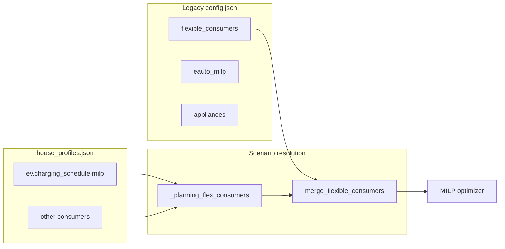
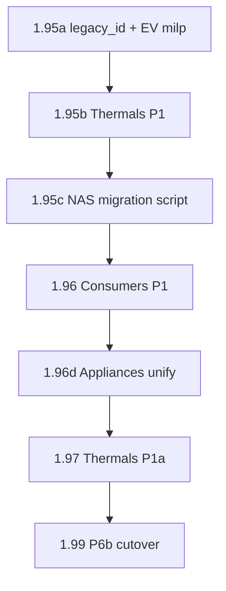

# NAS Prod Consumer Migration (1.95–1.99)

**Status:** Implementation plan (2026-07-14)  
**Backlog:** `backlog/Backlog.md` → Versions **1.95**, **1.96**, **1.97**, **1.99**  
**Prerequisite (done):** **1.93** unified scenario model + P6a silent migration test

## Goal

End state for **real 2.0**: prod `flexible_consumers: []`, no `appliances[]`, no root `eauto_milp`; all MILP-flex and planning consumers in `house_profiles.json` (`example_efh`); live Loxone bindings on **bridged** MILP entries; Chart 1 / Sankey / MILP share one resolved flex list.

**Decisions (locked in):**

- **Canonical planning IDs** (`ev`, `wp_heating`, `swimspa`, …) + **`legacy_id`** on bridged MILP entries for cons_data / Loxone / `flexible_consumers_state.json` continuity.
- **Full appliances unify** by 2.0: retire `appliances[]`; Waschmaschine / Trockner / Geschirrspüler → `type: generic` house-profile consumers.
- **`eauto_milp` → EV data model:** `charging_schedule.milp` on house-profile `type: ev`; optimizer reads per-consumer params, not root config.

## Current gap (NAS mirror)

`silent-migration-test/config/config.json` still holds all four MILP flex entries; `house_profiles.json` is partial/divergent (`ev` vs prod `eauto`, `wp_heating` vs `waermepumpe`, extra `herd_kochen`). P6a entity migration (`MIGRATION_REVIEW.md`) did not touch flex.



## Prod consumer matrix

| Legacy source | Canonical house-profile | `legacy_id` | Phase | Blocker |
|---------------|-------------------------|-------------|-------|---------|
| `eauto` + root `eauto_milp` | `type: ev`, id `ev`; `charging_schedule.milp` | `eauto` | **1.95a/c** | Generalize MILP id checks |
| `waermepumpe` | `wp_heating` (`thermal_annual`) | `waermepumpe` | **1.97** | Thermals P1a |
| `swimspa` | `type: thermal_rc` | `swimspa` | **1.95b** | Thermals P1 schema + bridge |
| `swimspa_filter` | bridge-only | `swimspa_filter` | **1.95b** | Filter bridge |
| `waschmaschine`, `trockner`, `geschirrspueler` | `type: generic` | same ids | **1.96d** | Appliances unify |
| `herd_kochen` (profile only) | — | — | **Remove** | Not in prod |

**Stays in `config.json`:** `system.event_triggers`, `loxone_blocks` (system/Loxone wiring only).

**Gates before prod cutover:** **Consumers P1 (1.96)** Chart/Sankey; **Thermals P1a (1.97)** retire `waermepumpe`.

---

## Phase 1 — 1.95a: `legacy_id` bridge + EV MILP on consumer

### 1a — `legacy_id` infrastructure

- `settings/flexible_consumers.py` — optional `legacy_id`; `runtime_consumer_id(consumer)`.
- `house_config/planning_flex_bridge.py` — `merge_flexible_consumers` deep-merge when `legacy_id` matches base `id` (live fields: `loxone_inputs`, `loxone_outputs`, `thermal_control`, `filter_schedule`, `charging_schedule.loxone`, `chart_color_index`, `path_log`).
- Live/cons_data: `integrations/loxone_client.py`, `data/cons_data_house_profile.py`.
- Tests: `tests/test_house_config.py` — merge overlay; cons_data id resolution.

### 1b — Move `eauto_milp` into EV data model

**Schema** (`house_profiles.schema.json`) — under `ev_charging_schedule`:

```json
"milp": {
  "live_modus_a_min_remaining_kwh": 2.8,
  "tie_break_on_epsilon": 0.001,
  "tie_break_time_epsilon": 0.0001
}
```

- `house_config/ev_profile.py` — validate `milp` in `normalize_ev_charging_schedule`.
- `planning_ev_to_milp` — copy `charging_schedule.milp` onto bridged entry.
- `optimizer/eauto_milp.py` — detect EV by `uses_power_setpoint` + `charging_schedule` / `milp`; `milp_params_from_consumer(consumer)`; no hardcoded `id == "eauto"`.
- `optimizer/milp.py`, `optimizer/milp_horizon.py` — per-consumer milp params; tie-break keyed by canonical `consumer["id"]`.
- **2.0 gate:** deprecate/remove root `eauto_milp` in `config.schema.json`; migration copies values to profile; update greenfield/example/minimal configs.
- Docs: `docs/konfiguration/flexible-verbraucher.md`, `docs/konfiguration/ueberblick.md`.
- Tests: `tests/test_eauto_milp_mode.py` with `id: ev`.

---

## Phase 2 — 1.95b: Thermals P1 (isolated single-node models)

**Follow-up (1.26.0 P0 smoke, decision #11):** legacy RC / `thermal_control` from `flexible_consumers` — not in 1.26.0 P3b.

### Schema + store

- `house_profiles.schema.json`, `house_config/profiles_store.py` — new `type: thermal_rc` (volume, setpoint, tolerance, heat_loss, efficiency); planning-only, no Loxone in JSON.
- `ui/house_config_profile_form.py` — fields for `thermal_rc` (minimal editor parity).

### Bridge

- `planning_thermal_rc_to_milp(consumer)` — `daily_target_source: thermal`, `thermal_control` from profile + binding overlay.
- `planning_filter_to_milp(bindings)` — `daily_target_source: loxone_remaining_hours`, `filter_schedule`; `swimspa_filter` bridge-only (no house-profile row).
- Extend `collect_planning_flex_consumers`; wire `scenario_resolution.py`.

### SwimSpa Fall B bindings (from 1.94)

| Field | Value |
|-------|--------|
| Total meter | `Ernie_Swim-Spa-P_act` |
| Subtract | `subtract_consumer_ids: ["swimspa_filter"]` |
| Heating indicator | `thermal_control.loxone.heating_active_name`: `homie_bwa_spa_heating` |
| History (optional) | `heating_active_csv`, `filter_active_csv`; `power_csv` = total meter |

Jets/other pumps on shared meter stay **unmodelled** (residual).

### Thermal model

- `optimizer/thermal_model.py` — variable heat paths (against infinity); replace single-path special case.
- `data/thermal_power.py` — Fall B indicator attribution in calibration/backtest.

### Freezer (second reference model)

- Second `thermal_rc` fixture in tests (no NAS prod row).
- **Acceptance:** calibration/backtest vs historical Loxone CSV logs (`data/thermal_backtest.py`, `scripts/tune_thermal_model.py`).

### Tests

- `tests/test_thermal_power.py`, new bridge tests, `tests/test_loxone_client.py` SwimSpa regressions.

**Note:** Chart/Sankey parity for bridged flex is **not** a 1.95 deliverable — gate is **Consumers P1 (1.96)**.

---

## Phase 3 — 1.95c: NAS data migration script

**Script:** `scripts/migrate_flex_consumers.py` (or `migrate_prod_consumers()` in `house_config/migrate_runtime_entities.py`):

- Input: prod `config.json`, `house_profiles.json`, profile `example_efh`.
- Output: updated sidecars, trimmed `config.json`, `MIGRATION_REVIEW.md` flex section (per-consumer: migrated / partial / blocked).

**Actions:**

- `eauto` → `ev` + `legacy_id: eauto`; root `eauto_milp` → `charging_schedule.milp`.
- SwimSpa/filter bindings per table above.
- Remove `herd_kochen`.
- Strip flex entries as each bridge lands; do **not** empty `waermepumpe` until **1.97**.

Apply to `silent-migration-test/config/` first; validate silent-test launch (`MIGRATION_REVIEW.md`).

---

## Phase 4 — 1.96: Consumers P1 (unified flex discovery)

**Problem:** MILP/backtesting use `_planning_flex_consumers` + merge; Chart 1 / Sankey still use `config.get_flexible_consumers(optimizer_only=True)` → bridged generics excluded.

### P1a — Resolved flex registry

- Export shared helper from `simulation/engine.py` `_flexible_consumers_from_scenario()` (or wrapper in `planning_flex_bridge.py`).
- Extend `settings/flexible_consumers.py` `consumer_has_daily_target()` (or chart bypass): `generic_flex_window`, `daily_target_source: thermal_annual`, EV `charging_schedule`.

### P1b — Backtesting Chart 1

- `ui/backtesting_display_bundle.py` / `OptimizationDisplayBundle` — pass resolved flex into chart path.
- `ui/chart_consumer_stack.py` — `ordered_active_consumers_for_stack` / flow-balance use bundle list; fallback: any `{name} (kW)` column with horizon sum > 0.
- **Acceptance:** greenfield `live` / `mein_haushalt` → distinct **Standard**, **Waschmaschine**, **EV** down-segments; no fake PV-export for omitted flex.

### P1c — Live cockpit + Sankey

- Sunset-2-Sunset Chart 1 when `house_profile_id` set (same registry as backtesting).
- `ui/sankey.py` — resolved list, not config-only filter.
- `ui/charts.py`, `ui/simulation_results.py`.

### P1d — Tests & docs

- `tests/test_chart_consumer_stack.py` (empty `flexible_consumers`, bridged generics); display bundle / flow-balance regression.
- `docs/spec/scenario-explorer-consumption.md` — UI discovery vs MILP path; cross-link migration checklist.

---

## Phase 5 — 1.96d: Appliances full unify (2.0 gate)

**Scope extension (user decision):** retire `appliances[]`; not in original Consumers P1 backlog but required for real 2.0.

- Data: `waschmaschine`, `trockner`, `geschirrspueler` as `generic` consumers (Phase 3); Loxone `loxone_power_name` on bridge for WM/Trockner.
- `ui/pages/page_devices.py` — resolve from house profile generics.
- `optimizer/appliance_schedule.py`, `runtime_store/appliance_schedules.py` — key by canonical id; legacy id map on load.
- `ui/chart_consumer_stack.py` — drop parallel `get_appliances()` path.
- `settings/appliances.py` — deprecate; 2.0 startup error if `appliances[]` present.
- Docs: `docs/konfiguration/flexible-verbraucher.md` — remove `appliances[]` section.
- Tests: migrate `tests/test_appliance_config.py`, `tests/test_appliance_chart_stack.py`.

---

## Phase 6 — 1.97: Thermals P1a (Haus Wärme MILP flex bridge)

**Goal:** Daily kWh from HDD/climate (`daily_electric_kwh`); MILP chooses **when** for 1–4 h ON pulses at `nominal_power_kw`. Replaces fixed `thermal_daily_pwm_hourly_profile` overlay when `optimizer_flex: true`.

**Out of scope:** building RC, room feedback, sub-hourly pulses, setpoint-only control (Thermals P2+ / Heat pump Prio3).

### Bridge (`planning_flex_bridge.py`)

- `planning_thermal_to_milp(consumer)` — `signal_type: binary`, `daily_target_source: thermal_annual`, `min_on_quarterhours: 4`, optional `thermal_flex_window` (default full day).
- `split_planning_thermal_consumers` or extend collectors; merge via `merge_flexible_consumers`.
- `scenario_resolution.py` — append to `_planning_flex_consumers`.

### Daily target (`data/consumer_targets.py`)

- Branch `daily_target_source == thermal_annual`: target kWh = `daily_electric_kwh(...)[day_index]`; horizon midnight split like `planning_flex_daily_targets`.

### MILP (`optimizer/milp_consumers.py`, new `optimizer/thermal_flex_context.py`)

- Per calendar day: `sum(on[t] * nominal_kw) >= daily_target_kwh(day)`.
- Max contiguous ON: 4 h; optional max pulses/day ≤ 4.
- Values: 0 or `nominal_power_kw` only.

### Overlay / double-counting

- `consumption_profiles.py`, `profile_manager._apply_house_profile_baseload_overlay` — skip `thermal_annual` when bridged to MILP.
- `simulation/engine.py` — thermal energy in flex totals, not baseload adjustment.

### Schema + UI

- `house_profiles.schema.json` — `optimizer_flex: true` (default when `nominal_power_kw > 0`), optional `thermal_flex_window`.
- `ui/house_config_profile_form.py`.

### Prod migration

- Remove `waermepumpe` from `flexible_consumers[]`; `wp_heating` + `legacy_id: waermepumpe` + Loxone on bridge.
- Extend `migrate_flex_consumers` / `migrate_runtime_entities.py` for `waermepumpe` mapping.

### Acceptance

- Unit: daily kWh preserved; pulse runs ∈ [1, 4] h; only 0 or nominal kW.
- Backtesting **dynamic** tariff: heating shifts vs fixed PWM reference (same daily kWh).
- Backtesting **fixed** tariff: Δ€ from timing ≈ 0.
- No baseload+flex double count.
- Chart 1: distinct **Haus Wärme** flex segment (**Consumers P1** done).
- `tests/test_price_pipeline_p3.py`, new `tests/test_thermal_flex_bridge.py`.

---

## Phase 7 — 1.99: P6b live cutover (non-silent)

**Prerequisite:** Phases 1–6 complete; silent stack validated on NAS parallel folder.

### Operational runbook

1. **Stop legacy worker** on NAS (`docker/earnie/`).
2. On **new stack:** remove silent mode (`loxone_silent_mode: false` or delete from `local_settings.json`); restart worker.
3. **Switch daily use** to new stack (UI port); keep old `docker/earnie/` stopped but intact for rollback window.
4. **Rollback:** stop new containers → start legacy compose on `docker/earnie/` → UI on 8501.

### Config end state (prod)

- `flexible_consumers: []`
- No `appliances[]`
- No root `eauto_milp`
- EV MILP tuning only in `house_profiles.json`

### Data path note

- Live `cons_data` **`pv_kw`:** Loxone-measured append in `main.py` until this cutover; SE/backtesting use Open-Meteo only (Unified Open-Meteo solar, done).

### Manual acceptance

- SwimSpa: heating indication (`homie_bwa_spa_heating` / Fall B chart attribution) working properly.
- EV: Modus A/B / preset behavior unchanged vs legacy thresholds.
- WP: MILP pulse timing vs prior historical-flex or PWM reference.
- Chart 1 / Sankey: all prod flex segments visible (Consumers P1).
- Appliance chart segments (if 1.96d done).

### Release

- Propose `version.py` → **`2.0.0`** after acceptance (user approval only).

---

## Execution order



**Parallelizable:** 1.95b thermal model can overlap 1.95a tests. 1.96d can start after 1.95c data rows exist.

---

## Risk notes

- **`merge_flexible_consumers`** skips same-id planning rows today — `legacy_id` overlay mandatory before emptying flex.
- **Dual heating** until P1a — keep `waermepumpe` in flex or accept PWM-only overlay; do not empty flex until P1a validated.
- **cons_data columns** — `runtime_consumer_id()` consistent across read/write during transition.
- **EV milp + legacy_id** — MILP variables use canonical `id`; `legacy_id` only for cons_data/Loxone/state.
- **Appliances unify** — UI + runtime persistence; 2.0 gate, not optional cleanup.
